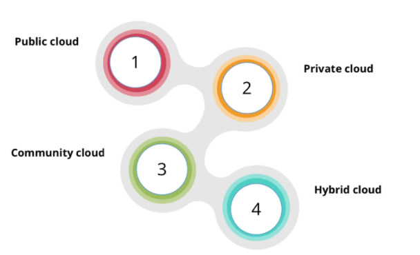
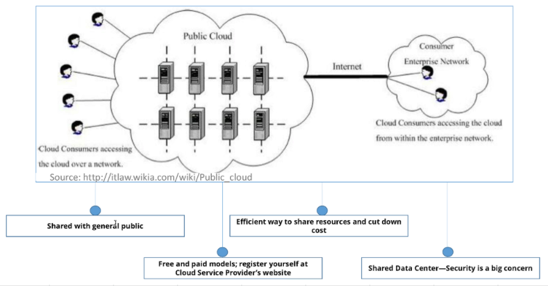
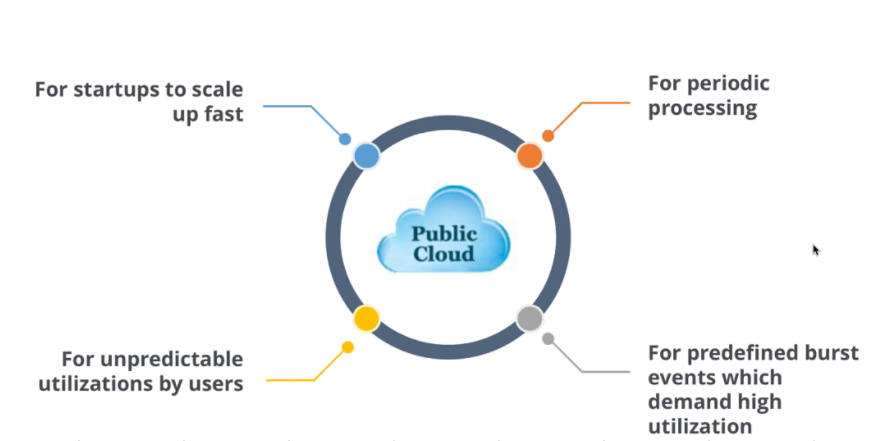
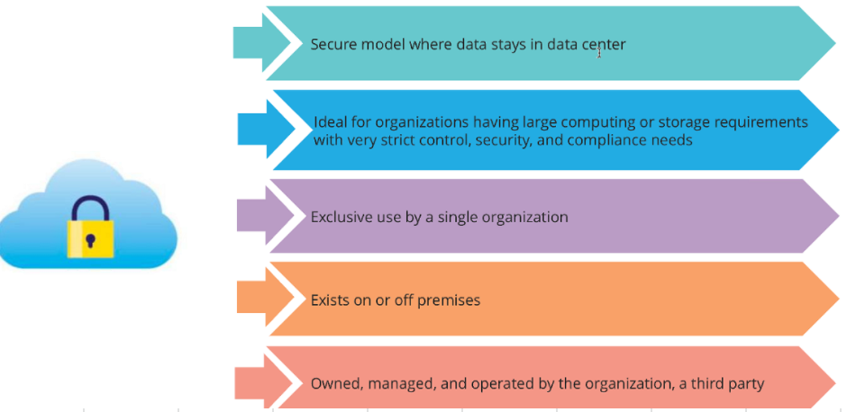
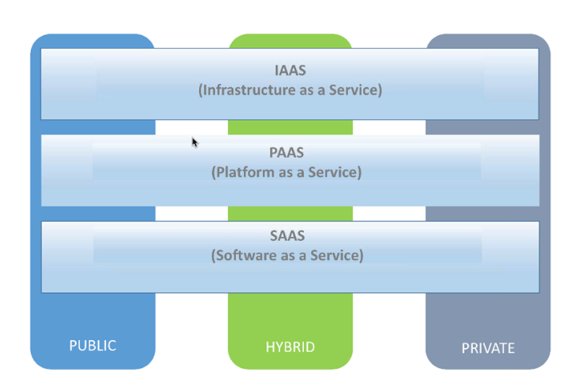
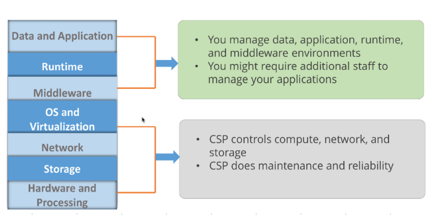
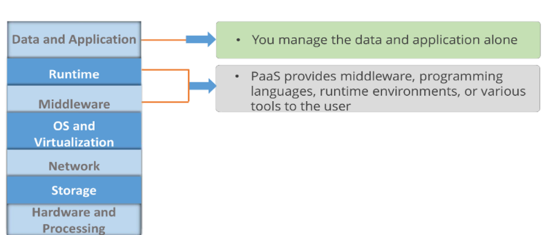
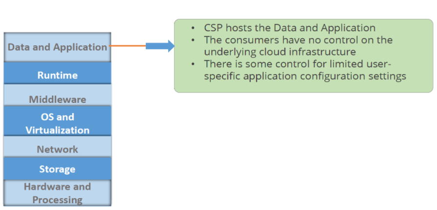

# Cloud
- [Deployment models](#deployment-models)
  - [Public cloud](#public-cloud)
    - [Reasons to choose public cloud](#reasons-to-choose-public-cloud)
  - [Private cloud](#private-cloud)
- [Service models](#service-models)
  - [Infrastructure As A Service](#infrastructure-as-a-service)
  - [Platform As A Service](#platform-as-a-service)
  - [Software As A Service](#software-as-a-service)

## Deployment models

### Public cloud

#### Examples
- AWS
- AZURE
- Google (G-Suite and Google Cloud platform)

#### Reasons to choose public cloud

### Private cloud

#### Examples
- Vmware
- Cisco
- IBM
 
## Service models

### Infrastructure As A Service

#### Examples
- Amazon Web Services (AWS)
- Cisco Metapod
- Microsoft Azure
- Google Compute Engine (GCE)

### Platform As A Service

#### Examples
- AWS Elastic Beanstalk
- Windows Azure
- Heroku
- Force.com
- Google App Engine
- Apache Stratos
- OpenShift

### Software As A Service

#### Examples
- Google Apps
- Dropbox
- Salesforce
- Cisco WebEx
- Concur
- GoToMeeting
