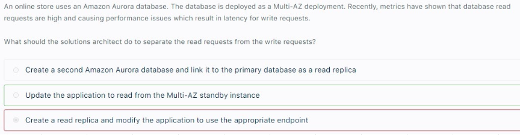
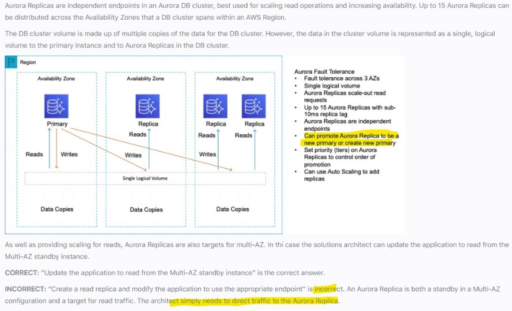
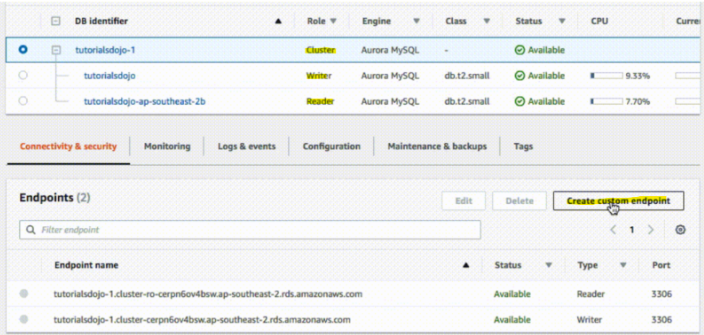
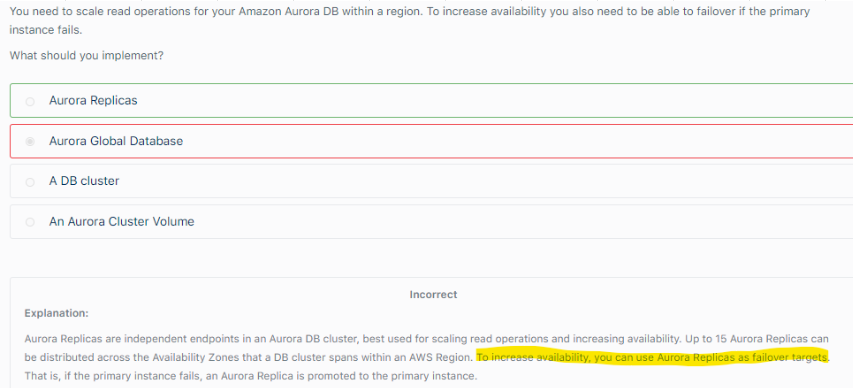
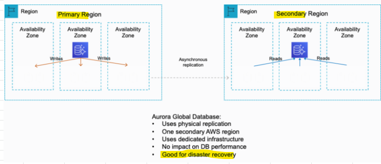
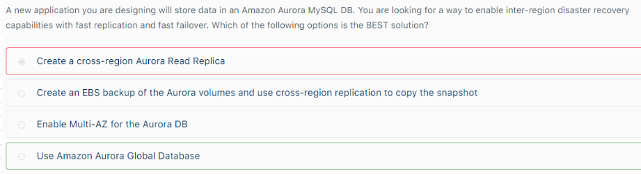

# Aurora
## 1. Overview		
- Supports PostgreSQL and MySQL		
- Cloud optimized and 5X performance		
- Aurora can have 15 replicas (MYSQL has 5)		

## 2. Read Scaling- Read Replicas		
- 6 copies of data across 3 AZs		
- Self healing with peer to peer replication		
- One Aurora performs writes (Master) + upto 15 read replicas for reads in a region (3 AZs)		
-  Supports Cross Region replication, 
Cross Region Read replicas: Good for DR"		

## 3. DR- Aurora Multi AZ		
- Utilizes Stand by instance in case of failover		
- We can configure application to read from Stand by Aurora Instance in order to offloads read form main DB Aurora instance		
- DR- Failover is instantaneous		

## 4. Read Scaling with Multi AZ deployment		
- During Installation, Choose Multi AZ deployment and create Read replicas in different AZs		
- To configure MultiAZ after installation, set up Autoscaling to add replicas		

## 5. Aurora Security		
Similar to RDS encryption and Security		

**If in a question, there is an option to choose between Aurora and RDS: choose Aurora**
## MultiAZ Or ReadReplica
1. Separating Reads from Write requests, deciding between Multi AZ or Read replica											
"If you already have Mult AZ configured than utilize STAND BY instance to offload reads from main instance, instead of creating new read replicas.
Using existing Stand by instance is cost efficient in this scenario"											

# Aurora Cluster Endpoints
## 1. Writer Endpoint			
- Used for writing to DB			
- Writer Endpoint points to Master			
## 2. Reader Endpoint			
- Used for running queries on DB			
- Reader Endpoints points to Read replicas			
- Reader Endpoint performs Load balancing across multiple read replicas			
## 3. Custom Endpoint			
- Provides Load balanced DB connections based on criteria			
-  Example: Define a custom endpoint to connect to instances that use a particular
a. AWS Instance type
b. DB parameter group"			
-  Inform Users about Cutsom endpoint, example: 
a. User should use LOW Latency Endpoint for Report generation
b. Direct production Traffic to High Capacity Instances"			

# Failovers with Aurora											
- Failover with Aurora DB when read replica is available											
"If you have an Amazon Aurora Replica in the same or a different Availability Zone, when failing over, Amazon Aurora flips the canonical name record (CNAME) for your DB Instance to point at the healthy replica, which in turn is promoted to become the new primary. 

Start-to-finish, failover typically completes within 30 seconds."											
											
- Failover with Aurora Serverless											
If you are running Aurora Serverless and the DB instance or AZ become unavailable, Aurora will automatically recreate the DB instance in a different AZ.											
											
- Failover with Aurora when there is no read replica and also when not running Aurora Serverless											
"If you do not have an Amazon Aurora Replica (i.e. single instance) and are not running Aurora Serverless, 
Aurora will attempt to create a new DB Instance in the same Availability Zone as the original instance. 
This replacement of the original instance is done on a best-effort basis and may not succeed, 
for example, if there is an issue that is broadly affecting the Availability Zone"	

# Aurora											
## 5. Aurora Serverless			
- Automated Database instantiation			
- AutoScaling based on actual usage			
- No capacity planing needed			
- Pay per second			
- Good for intermittent and unpredictable workloads			
## 6. Aurora Global DB			
- One Primary Region			
- Upto 5 secondary regions (read only)			
- Replication lag among regions is < 1 second			
- Upto 16 Read replicas per secondary region			
- DR with RTO of < 1 minute			
## 7. Enhanced Monitoring			
-  Shows Metrics for 
a. Free Memory
b. Active memory"			
- Auroa has Enhanced monitoring view to show metrics within Aurora managment console			

# Aurora Global DB											
- Amazon Aurora Global Database is designed for globally distributed applications, allowing a single Amazon Aurora database to span multiple AWS regions											
- It replicates your data with no impact on database performance, enables fast local reads with low latency in each region, and provides disaster recovery from region-wide outages.											
- Aurora Global Database uses storage-based replication with typical latency of less than 1 second, using dedicated infrastructure that leaves your database fully available to serve application workloads.											
- In the unlikely event of a regional degradation or outage, one of the secondary regions can be promoted to full read/write capabilities in less than 1 minute.											

## 1. Inter Region DR: Which is better Aurora Multi AZ or Global DB or Cross Region Aurora Read replica?											
Choose Global DB as Multi AZ offers DR within the Region											
Choose Global DB as Cross Region Aurora Read replica would not provide the fast storage replication and fast failover capabilities of the Aurora Global Database and is therefore not the best option.											
											
## 2. Aurora Globa DB Vs DynamoDB Global Table											
- Amazon Aurora Global Database provides read access to a database in multiple regions											
- Amazon Aurora Global Database offers failover to your read-only DBs and promote them to writable											
- Amazon Aurora Global Database does not provide active-active configuration with bi-directional synchronization.											
											
- Amazon DynamoDB global tables provide a fully managed solution for deploying a multi-region, multi-master database											
- Amazon DynamoDB global tables provides an active-active configuration where reads and writes can take place in multiple regions with full bi-directional synchronization											
