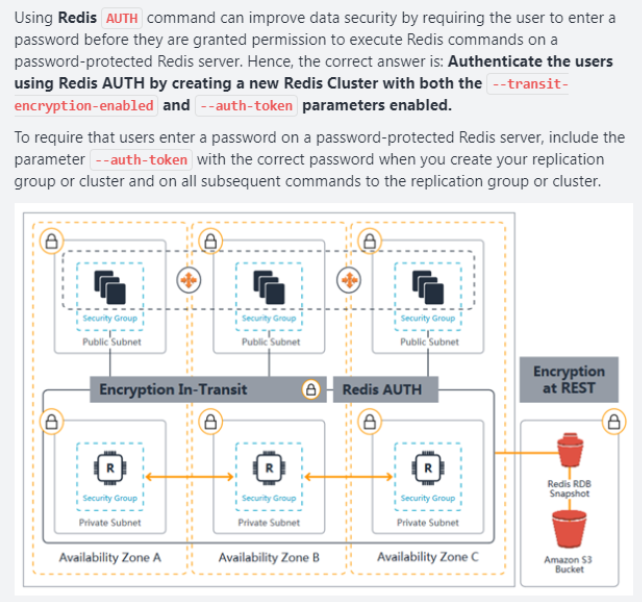
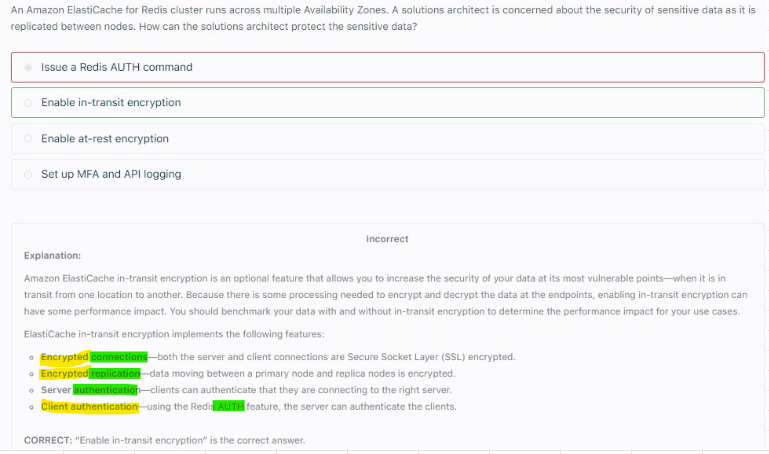
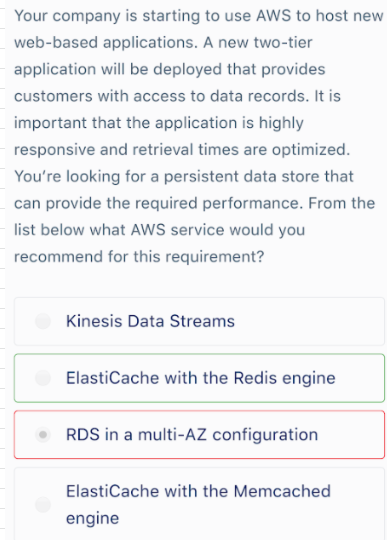
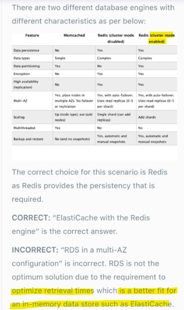

# ElasticCache											
## 1. Overview		
- Write scaling using Sharding		
- Read Scaling using Read replicas		
- DR/Failover with Multi AZ capability		
-  AWS manages 
a. OS maintenance/Patching
b. Monitoring
c. Failure Recovery
d. Backups"		
## 2. DB Cache		
- Caches Data from RDS DBs		
- Offloads read from RDS DB		
- Cache must have an INVALIDATION Strategy		
## 3. Session store		
- Elastic Cache is used to store session Data		
- When User hits another EC2 (via LB), the old session is not invalidated		
*We can also use Sticky sessions in ALB to store session information as well		
## 4. Write Through		
- Adds or Update data in cache when data is written or updated in DB		
- No STALE data in cache		
## 5. Security				
- Supports SSL encryption				
- IAM Authentication is NOT supported				
- REDIS AUTH: Enables us to set Extra level of security for our cache by setting "PASSWORD/TOKEN" when creating REDIS Cluster				
- Memcached supports SASL based authentication				
## 6. Redis		
- Redis (Remote Dictionary Server), is a fast, open-source, in-memory key-value data store for use as a database, cache, message broker, and queue.		
- Multi AZ with auto fail-over		
- Read Replicas for read scaling and HA		
- Data durability using AOF persistence		
v. Doesnot supports Mulitple CPU cores or threads		
v- Redis is HIPAA eligible		
## 7. Memcached		
- Memcached is a high-performance distributed memory cache service		
- Multi node for Partitioning of Data: Sharding		
- Multi Threaded Architecture		
- No backup and restore and Non Persistent		
v. Supports Mulitple CPU cores or threads		
v- Memcached is not HIPAA eligible		
## 8. Redis and Memcached both are IN MEMORY databases that can be used as a DB cache										
## 9. Autocompletion										
- ElasticCache REDIS has a good use case for Autocompletion										
										
## 10. In Transit Encryption with Redis										
-  In transit together with REDIS-AUTH: transit-encryption-enabled and auth-token
- At rest: Encrypted Redis DB snapshot backed up at S3"										

## 11. Redis is HIPAA compliant					
					
## 12. Persistance, Highly responsive and Optimized Retrieval times					

