# RDS
## 1. RDS Backups		
- Automated Backups		
  - Daily Full backup		
  - Ability to restore at any point of time (oldest backup to 5 mins ago)		
c. Default 7 days retention (upto 35 days)		
- DB snapshots		
  - Manuall Triggered		
  - Retention as long as you want		
## 2. Read Scaling- Read Replicas		
- ASYNC replication, reads are eventually Consistent		
  - WITHIN AZ read replica		
  - CROSS AZ or Multi AZ read replica		
c. CROSS REGION read replica		
- Replicas can be promoted to be a standalone DB		
- Cross AZ or Multi AZ read replica provides HA read replica		
- You cannot create an encrypted read replica from an unencrypted master		
## 3. DR- RDS Multi AZ		
- Disaster Recovery (DR)		
  - Multi AZ deployment of RDS enables SYNC replication to Stand by RDS DB (different AZ)		
  - One DNS, automatic failover		
- DR with Read replicas (within AZ or Cross Region)		
  - As read replica can also be promoted to a standalone DB, so read replica in another AZ or Region can also be used for DR		
## 4. RDS Vs DB on EC2		
- Can not SSH to your instances		

## "As read replica can also be promoted to a standalone DB, so read replica in another AZ or Region can also be used for DR		"											
										
## RDS is "Managed", DynamoDB is "FULLY Managed"											
# DB Subnet Group											
- DB Subnet Group is a collection of subnets (typically PRIVATE)											
- The DB instance is assigned this subnet											
- DB Subnet Group cannot be made publically available											
- If we need to make RDS DB publically available then RDS DB should be configured separetely											
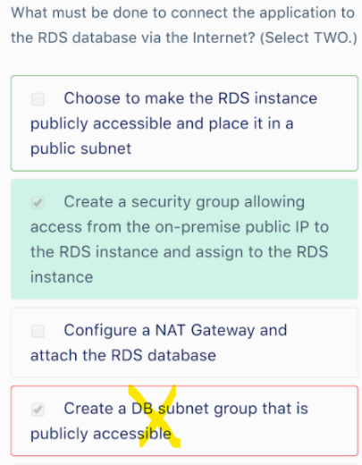

# ReadReplicas-more
## 1. How to create an encrypted cross-region Read Replica?											
  - Encrypt a snapshot from the master DB instance (ou can enable encryption for the master DB by creating a new DB from a snapshot with encryption enabled)
  - Create a new encrypted master DB instance from the encrypted snapshot, and then 
c. Create an encrypted cross-region Read Replica"											
											
## 2. Read Replica and Encryption keys											
  - When Master DB and replica are in same REGION: A Read Replica of an Amazon RDS encrypted instance is also encrypted using the same key as the master instance
  - When in different Regions, a different key can be used"											
											
## 3. HA Read Replica: Read replica as a Multi-AZ DB instance											
An Amazon RDS PostgreSQL database is configured as Multi-AZ. A solutions architect needs to scale read performance and the solution must be configured for high availability. What is the most cost-effective solution?											
"You can create a read replica as a Multi-AZ DB instance. 
Amazon RDS creates a standby of your replica in another Availability Zone for failover support for the replic  - 
Creating your read replica as a Multi-AZ DB instance is independent of whether the source database is a Multi-AZ DB instance."											
											
## 4. When would Amazon RDS automatically perform a failover to the standby replica?											
-  Loss of availability in primary Availability Zone.
- Loss of network connectivity to primary.
- Compute unit failure on primary.
- Storage failure on primary"											
											
## 5. Which EVENT may force RDS DB to be taken offline during a maintenance window?											
Security Patching											
** Enabling Multi AZ or Promoting a Read replica or Updating DB parametr groups, do not take place in Maintenance window											
											
## 6. Offloading Reads											
We have 3 Options for Offloading Reads from Master DB instance											
- Read Replica											
- Use Standby instance in another AZ when working with Multi AZ deployment											
- Deploy Elastic cache in EACH AZ											
											
## 7. Cost Effectivenes of Offloading Read Options: Which is more COST EFFECTIVE, Read Replica or RDS Multi AZ for Offloading Reads?											
"If you already have Mult AZ configured than utilize STAND BY instance to offload reads from main instance, instead of creating new read replicas.
Using existing Stand by instance is cost efficient in this scenario"											
											
if deployment is in not in MultiAZ, Read replica is more Cost effective 											
											
Question											
"One of the applications you manage on RDS uses the MySQL DB and has been suffering from performance issues. 
You would like to setup a reporting process that will perform queries on the database but you’re concerned that the extra load will further impact the performance of the DB and may lead to poor customer experience."											
											
Reporting Process											
The reporting process will perform queries on the database but not writes. Therefore you can use a read replica which will provide a secondary read-only database and configure the reporting process to use the read replica.											
											
Multi-AZ is used for implementing fault tolerance. With Multi-AZ you can failover to a DB in another AZ within the region in the event of a failure of the primary D  - However, you can only read and write to the primary DB so still need a read replica to offload the reporting job											
											
## Distractor		
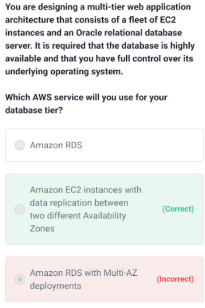

# MultiAZ-DR-HA
## 1. Read replicas are primarily used for horizontal scaling. The best solution for high availability is to use a Multi-AZ read replica.
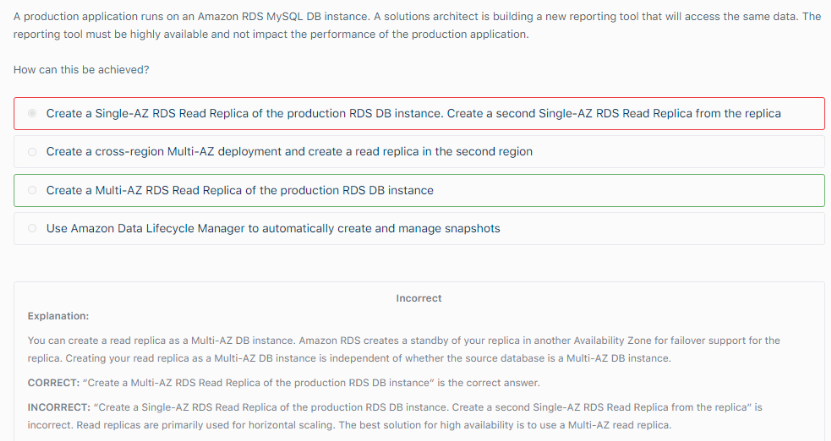

## 2. Restoring RDS Database: Apply DEFAULT Security group to the new DB instance
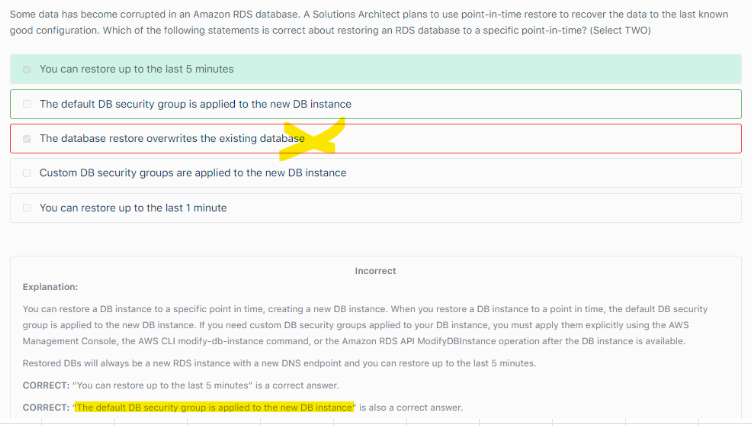

## 3. HA Read Replica: Read replica as a Multi-AZ DB instance											
An Amazon RDS PostgreSQL database is configured as Multi-AZ. A solutions architect needs to scale read performance and the solution must be configured for high availability. What is the most cost-effective solution?											
"You can create a read replica as a Multi-AZ DB instance. 
Amazon RDS creates a standby of your replica in another Availability Zone for failover support for the replic  - 
Creating your read replica as a Multi-AZ DB instance is independent of whether the source database is a Multi-AZ DB instance."											
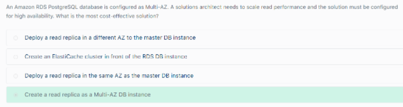

# RDS
## 5. RDS Encryption			
- At rest: KMS AES-256			
  - Transparent Data Encryption, TDE for Oracle and SQL server			
- SSL for inflight encryption (Use Certificates and setup SSL)			
"  - We can enforce SSL in PostgreSQL and MySQL as below
PostgreSQL: rds.force_ssl=1
MySQL: GRANT usage ON *.* TO 'mysqluser'@'%' REQUIRE SSL;"			

## 6. RDS Security			
- Network Security			
"  - Deploy RDS DB in private Subnet (~DB Subnet group)
  - Configure Security group to restrict access"			
-  Access Management
  - IAM Policies
  - IAM based Authentication for Login (MySQL and PostgreSQL)"			

## 7. RDS Enhanced Monitoring			
- By default, Enhanced Monitoring metrics are stored for 30 days in the CloudWatch Logs			
- The Granularity property can be set to one of the following values: 1, 5, 10, 15, 30, or 60 min.			
-  Monitors:
  - RDS processes
  - RDS Child processes
c. OS processes"			

## 8. MySQL Secure Access with short lived credentials: AWSAuthenticationPlugin			
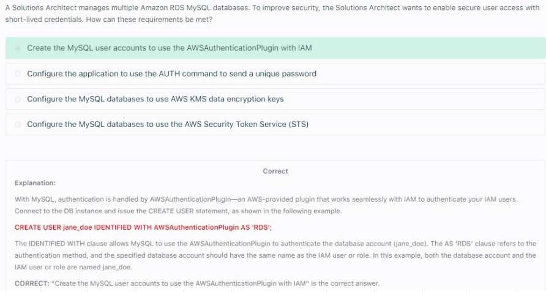

## 9. 2. Storage Engine for MySQL: InnoDB
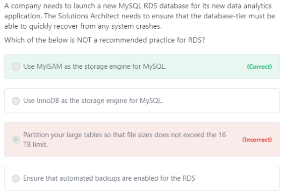

"Using MyISAM as the storage engine for MySQL is not recommended. 
The recommended storage engine for MySQL is InnoDB and not MyISAM. 

The MyISAM storage engine does not support reliable crash recovery and may result in lost or corrupt data when MySQL is restarted after a crash, preventing Point-In-Time-Restore or Snapshot restore from working as intended.

The rest of the options are best practices in the AWS MySQL RDS documentation. Again, InnoDB is the recommended storage engine for MySQL. However, in case you require intense, full-text search capability, use MyISAM storage engine instea"											

# RDS In Transit Encryption											
An application is hosted in an Auto Scaling group of EC2 instances and a Microsoft SQL Server on Amazon RDS. There is a requirement that all in-flight data between your web servers and RDS should be secured											
											
"You can use Certificates and setup Secure Sockets Layer (SSL) to encrypt connections between your client applications and your Amazon RDS DB instances running Microsoft SQL Server. 
SSL support is available in all AWS regions for all supported SQL Server editions."											
											
"When you create an SQL Server DB instance, Amazon RDS creates an SSL certificate for it. 
The SSL certificate includes the DB instance endpoint as the Common Name (CN) for the SSL certificate to guard against spoofing attacks."											
											
"There are 2 ways to use SSL to connect to your SQL Server DB instance:
- Force SSL for all connections — this happens transparently to the client, and the client doesn't have to do any work to use SSL.
- Encrypt specific connections — this sets up an SSL connection from a specific client computer, and you must do work on the client to encrypt connections."											
											
You can force all connections to your DB instance to use SSL, or you can encrypt connections from specific client computers only. To use SSL from a specific client, you must obtain certificates for the client computer, import certificates on the client computer, and then encrypt the connections from the client computer.											
											
If you want to force SSL, use the rds.force_ssl parameter. By default, the rds.force_ssl parameter is set to false. Set the rds.force_ssl parameter to true to force connections to use SSL. The rds.force_ssl parameter is static, so after you change the value, you must reboot your DB instance for the change to take effect.											
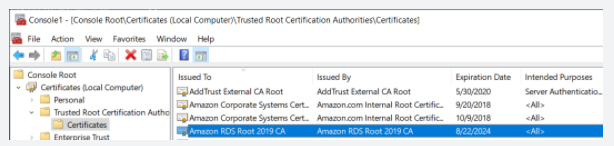

*IAM DB Authentication WILL NOT help with the In Flight encryption											

# Enhanced Monitoring										
- OS Processes										
- RDS Processes										
- RDS Child Processes	
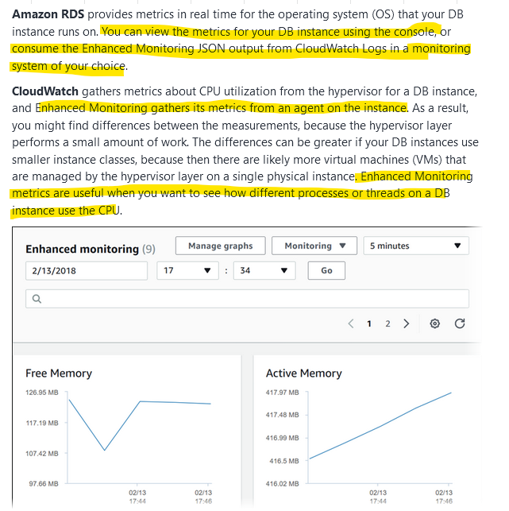

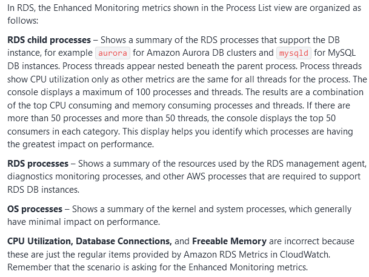

# RDS Event subscription										
"RDS Events example:
- Backing up DB Instance
- Creating Automated snapshot
- Automated Snapshot created
- Finished DB Instance backup"
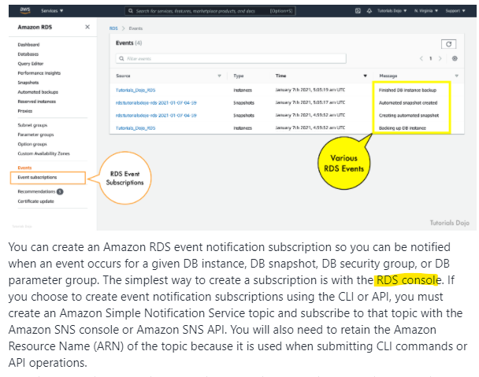

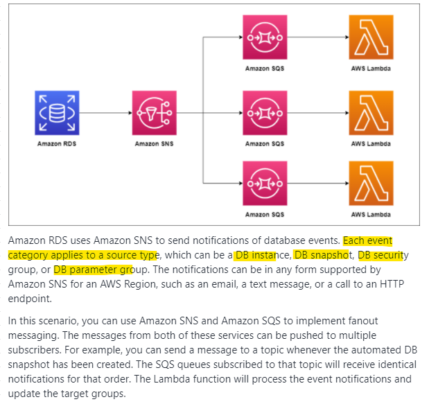

## There is nothing like RDS Alarm		
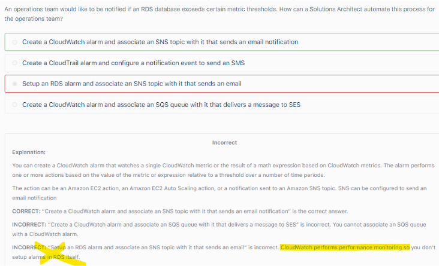
