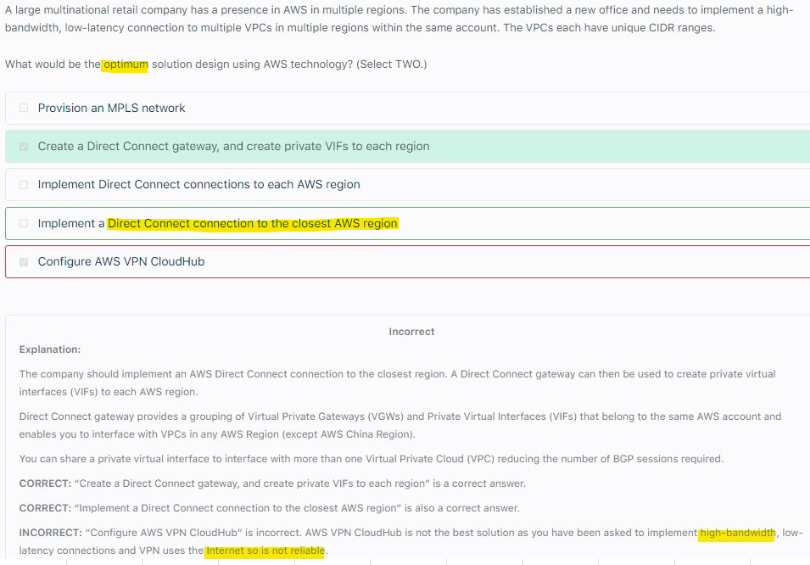

# Hybrid Connections
## 1. Client VPN			
- Enables us to Connect a local machine to AWS VPC (EC2 instance via Private IP) over the VPN			
- Install VPN software on Client machine and generate certificates for mutual authentication			
- Import these certificates to AWS ACM			
- Create a Security group to allow access for resources in our VPC			
- On AWS, Create Client VPN Endpoint
  - Add certificates (Server and Client certificates from AWS ACM)
  - Provide CIDR block of computers that want to connect to our VPC
  - Attach Security group created above
  - Associate Subnet to Client VPN endpoint (as per AZ)
  - Add Authorization Rule to allow traffic to VPC
- Set up VPN connection over SSL/TLS over 443			

## 2. Site to Site VPN			
- Configure Gateway Device/Software (OpenSwan) at Customer's Onpremise			
- Create VPG (Virtual Private Gateway) in AWS VPC			
- Create Customer Gateway in AWS VPC			
  - Provide STATIC, Internet ROUTABLE IP address of Customer Gateway device configured at Customer's Onpremise			
- Create Site to Site VPN connection in AWS VPC			
- Offers IPSec			

## 3. VPN Cloud Hub			
- Low cost Hub and Spoke model			
- Provides secure connection between Customer's sites			
- CloudHub is not a AWS services but an Architecture pattern (based on Site to Site VPN connection)			
- One VPN gateway connects to Multiple Customer gateways (1:n)			

# Hybrid Connections/OnPremise To AWS											
## 1. Direct Connect			
- Create  VPG (Virtual Private Gateway) in AWS VPC			
- Setup at Direct Connect Location			
  - Connection to Customer's On premise			
  - AWS Direct connect endpoint connecting to VPG created above			
- Connection Speed
  - Dedicated connection (1Gbps/10Gbps)
  - Hosted Connection (50/500Mbps or 10 Gbps)
- **Encryption: AWS Direct connect + VPN provides IPSec-encrypted private connection**
### Setup

- Private VIF: provides connections to VPC via VGW in the SAME Region											
- Public VIF: provides connection to AWS Public services in ANY Region (it is NOT using Internet)											
### High Availability		

### Primary and Backup path (IPSec)			

- Encrypted (IPSec) Primary Path for a DX connection: Set up VPN over DX conenction											
- Encrypted (IPSec) Secondary / Back up Path over the Internet via Site to Site VPN connection: 											
  - IPSec VPN connection with same BGP (Border Gateway Protocol) is a good option to provide BACK UP connection for DX connection	
## 2. Direct Connect Gateway			
- Setup Direct connect between 100s of VPCs in many different Regions but under same account			
### Accessing VPCs in Multiple Regions				

## 3. Transit Gateway			
- Transitive peering between 1000s of VPC or on premise, hub and spoke connections			
- Enables us to use RAM across different accounts			
- Supports IP Multicast			
- We can use Transit gateway in 2 configurations			
  - Transit Gateway without DX
  - Transit Gateway with DX (via DX gateway)
- Transit Gateway with DX (via DX gateway) offers FULL TRANSITIVE ROUTING			
- Cutsomer Gateway connects to Transit Gateway to access VPC resources											
- Offers Transitive peering											

									

## 4. Transit Gateway + DX  Gateway
- Offers FULL Transitive Routing	
- You can manage a single connection for multiple VPCs or VPNs that are in the same Region by associating a Direct Connect gateway to a transit gateway.		
- The solution involves the following components:											
  - A transit gateway that has VPC attachments.											
  - A Direct Connect gateway											
  - An association between the Direct Connect gateway and the transit gateway.											
  - A transit virtual interface that is attached to the Direct Connect gateway.											

## VPN Cloudhub doesnot offers Low Latency and it is over internet, so not reliable either											

## Use Private IP addresses to avoid Internet.
- When using Private IP, create Private VIF across DX to connect to your AWS resources using private IP addresses											

## Encryption on DX connection
- Encryption on DX connection (Customer Gateway and VPG should be in place) can be done only by enabling VPN which will implicitly offer IPSec encryption

