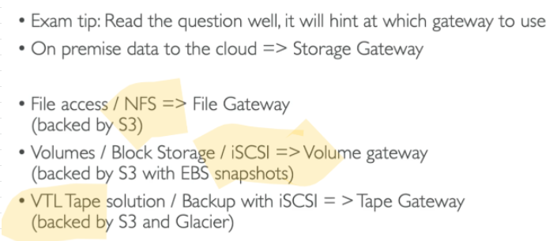

# Hybrid Storage											
## 1. Overview			
- Works towards the idea of Hybrid Cloud			
- Part of Storage is On premise			
- Part of Storage is In Cloud			
## 2. FsX							
### FsX for Windows			
- Fully managed windows file system shared drive			
- Supports SMB and NTFS			
- Can be accessed On premise over DX/VPN connection			
- Can be configured to Multi AZ (HA)			
- Daily Back up to S3			
- Amazon FSx for Windows File Server provides fully managed, highly reliable file storage that is accessible over the industry-standard Server Message Block (SMB) protocol. 
- It is built on Windows Server, delivering a wide range of administrative features such as user quotas, end-user file restore, and Microsoft Active Directory (AD) integration. 
- Offers
  - single-AZ and multi-AZ deployment options, 
  - fully managed backups, and 
  - encryption of data at rest and in transit

#### Integrate with Microsoft AD		

### FsX for Lustre			
- Parallel Distributed File system for Large scale computing			
- Linux + Cluster			
- Can be accessed On premise over DX/VPN connection			
- **ML and HPC**
- Seamless intergration with S3			
### Integration with S3
- Amazon FSx works natively with Amazon S3, making it easy to access your S3 data to run data processing workloads. 
- Your S3 objects are presented as files in your file system, and you can write your results back to S3. 
- This lets you run data processing workloads on FSx for Lustre and store your long-term data on S3 or on-premises data stores"	

### Hot Storage
- FSx for Lustre provides the ability to both
  - process the 'hot data' in a parallel and distributed fashion as well as easily 
  - store the 'cold data' on Amazon S3 (refer above picture)

- EMR does not offer the same storage and processing speed as FSx for Lustre. 
- So it is not the right fit for the given high-performance workflow scenario											

# Storage Gateway											
## 1. File Gatweway		
- Configure File Gateway at On premise Data center		
- Supports S3 Standard, S3 IA and S3 One Zone IA		
- File Gateway will connect to S3		
- File Gateway supports NFS and SMB		
- Most recently files are cached at File Gateway		
- File Gateway also offers cache mode (Volume gateway also has cache mode)		

## 2. Volume Gateway		
- Configure Volume Gateway at On premise Data center		
- Supports S3 Standard, S3 IA and S3 One Zone IA		
- Volume Gateway will connect to S3		
- Volume Gateway supports iSCSI protocol		
- S3 content are backed up on EBS volumes to enable customer to restore their Block data when needed		
### Cached Volume
Low Latency access to most Recent Data
### Storage Volumes
Entire dataset is On premise, scheduled backups to S3
## 3. Tape Gateway		
- Configure Tape Gateway at On premise Data center		
- Supports S3 Standard and Glacier		
- Tape Gateway will connect to S3		
- Tape Gateway supports iSCSI protocol		
Tape Gateway can move your virtual tapes archived DIRECTLY in Amazon S3 Glacier or Amazon S3 Glacier Deep Archive storage class, enabling you to further reduce the monthly cost to store long-term data in the cloud by up to 75%.		
### VTL
- Virtual Tape Library 
Tape data stored in S3
### Archived Taped
Tape data stored in Glacier
## 4. Storage gateway Hardware Appliance		
-  Can be ordered from amazon.com		
- Helpful for NFS backups for small datacenter		

## Protocol and Storage Gateway	options	

