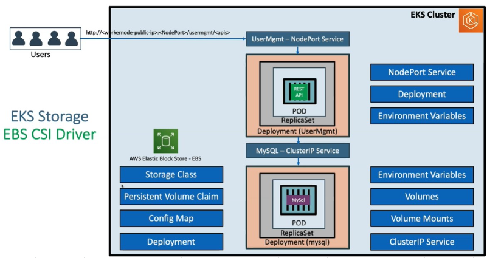
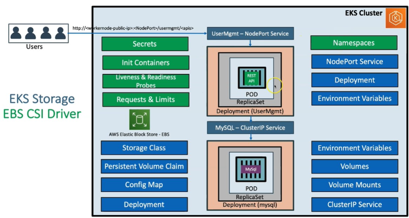

# Connect AWS EBS with `MYSQL Database`
1. Attach IAM role to EKS cluster
   - This role will enable our eks cluster to perform different tasks related to EBS setup on AWS from "k8s" 
2. Install EBS-CSI driver (github manifest) 
3. Create Storage class / Persistent Volume (Volume that will store our data) 
4. Create Persistent Volume "Claim" (request to get access to Persistent Volume) 
   - PVclaim status stays "pending"
5. Create a Config Map to create database. 
6. Create Deployment file for mysql databse container 
   - Basic Info 
     - Replica: 1
     - ContainerName: mysql 
     - Imagetouse: mysq1:5.6 
    - Env 
      - Specify password: password 
      - Port: 3306 
    - Volume Setup 
      - persistentVolumeClaim: `PVclaim` name created above 
      - configMap: `ConfigMap` name created above 
    - Mount Volumes 
      - mount PVclaim
      - mount ConfigMap
      - **PVclaim** status changes to "bound"
7. Create Cluster IP service to expose mysql databse internally to our application 

## More options
- Secrets
- Init containers
- Liveness and Readiness probes
- Requests and Limits

