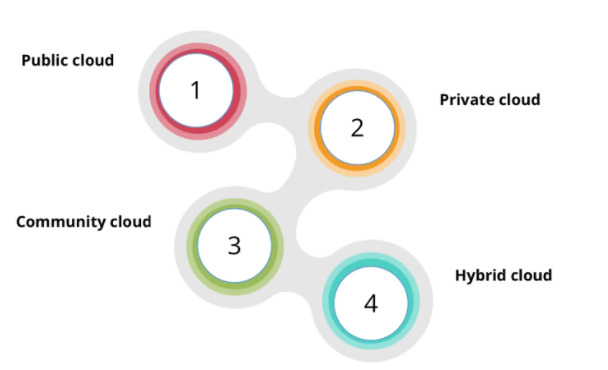
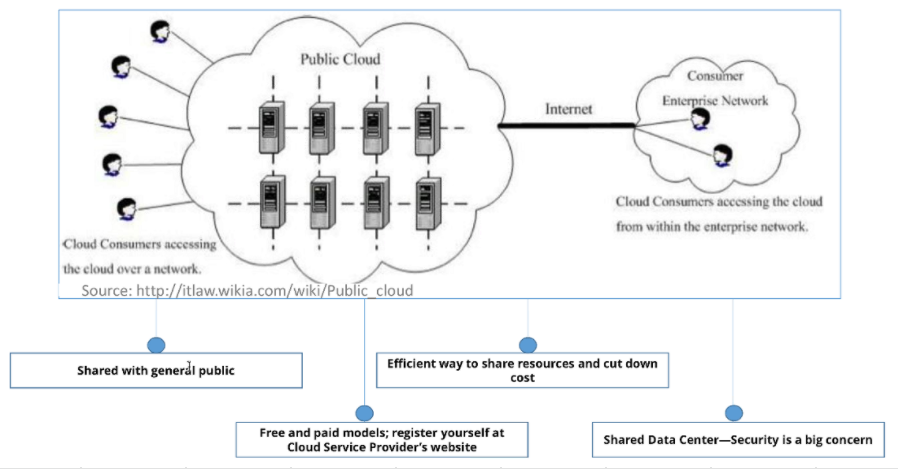
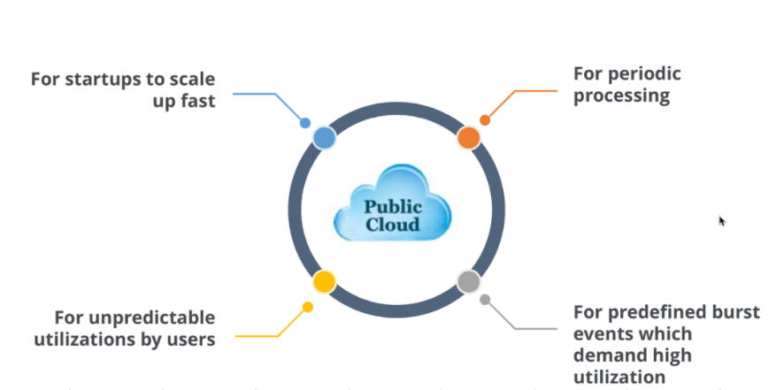
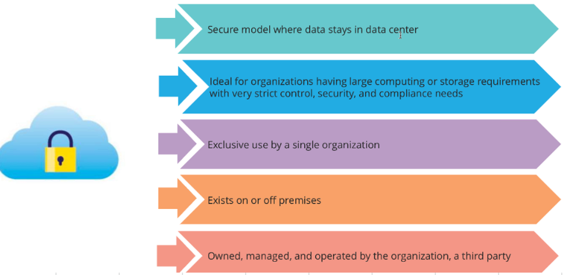
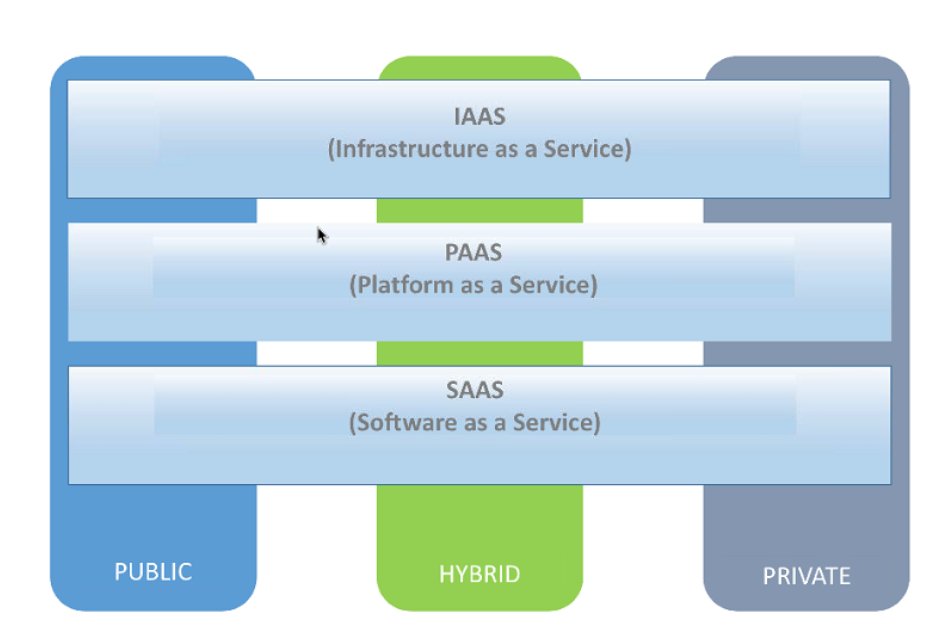
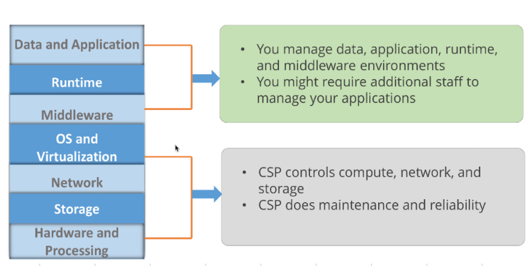
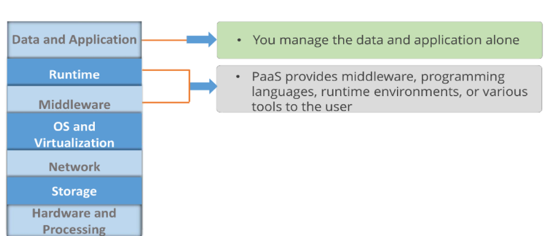
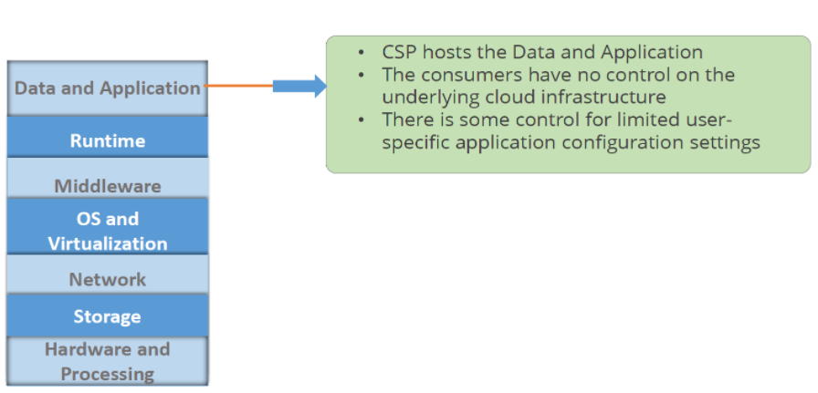

# Cloud
- [Cloud computing](#cloud-computing)
- [Deployment models](#deployment-models)
  - [Public cloud](#public-cloud)
    - [Reasons to choose public cloud](#reasons-to-choose-public-cloud)
  - [Private cloud](#private-cloud)
- [Service models](#service-models)
  - [Infrastructure As A Service](#infrastructure-as-a-service)
  - [Platform As A Service](#platform-as-a-service)
  - [Software As A Service](#software-as-a-service)
  - [Container As A Service](#container-as-a-service)
  - [Function As A Service](#function-as-a-service)
- [Shared responsibilty](#shared-responsibilty)
## Cloud computing
- Cloud computing is a way of using information technology (IT) that has these `five` equally important traits
- First, customers get computing resources that are `on-demand and self-service`.
  - Through a web interface, users get the processing power, storage, and network they need with no need for human intervention.
- Second, customers get access to those resources `over the internet`, from anywhere they have a connection.
- Third, the cloud provider has a `big pool` of those resources and allocates them to users out of that pool.
  - That allows the provider to buy in bulk and pass the savings on to the customers.
  - Customers don't have to know or care about the exact physical location of those resources.
- Fourth, the `resources are elastic`, which means they’re flexible, so customers can be.
  - If they need more resources they can get more, and quickly.
  - If they need less, they can scale back.
- finally, customers `pay only for what they use`, or reserve as they go.
  - If they stop using resources, they stop paying.
## Deployment models

### Public cloud

#### Examples
- AWS
- AZURE
- Google (G-Suite and Google Cloud platform)

#### Reasons to choose public cloud

### Private cloud

#### Examples
- Vmware
- Cisco
- IBM
 
## Service models

### Infrastructure As A Service

#### Examples
- Amazon Web Services (AWS)
- Cisco Metapod
- Microsoft Azure
- Google Compute Engine (GCE)

### Platform As A Service

#### Examples
- AWS Elastic Beanstalk
- Windows Azure
- Heroku
- Force.com
- Google App Engine
- Apache Stratos
- OpenShift

### Software As A Service

#### Examples
- Google Apps
- Dropbox
- Salesforce
- Cisco WebEx
- Concur
- GoToMeeting
### Container As A Service
### Function As A Service 
## Shared responsibilty

