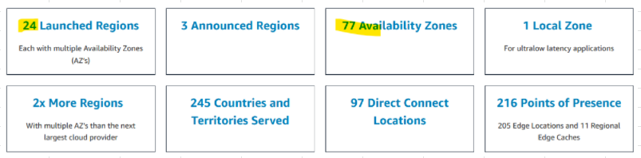
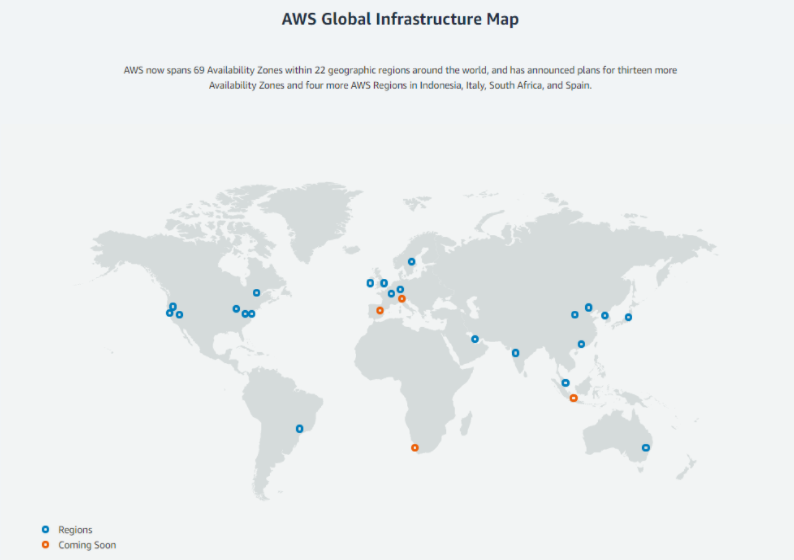
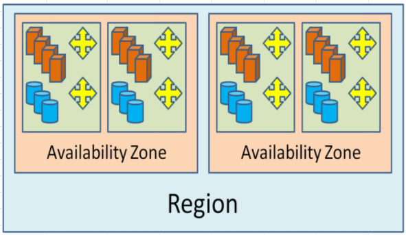
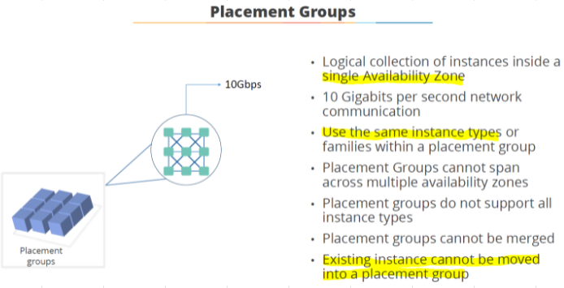
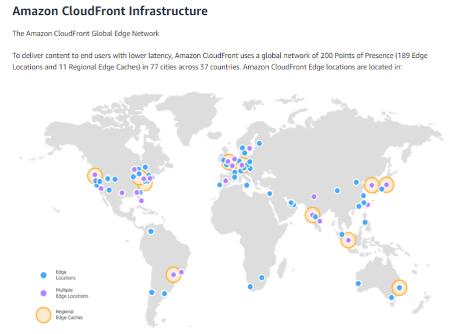
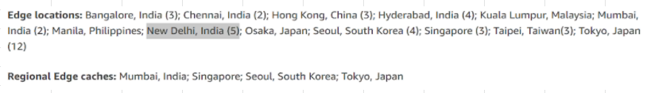

# [Global infrastructure](https://aws.amazon.com/about-aws/global-infrastructure/)

- [Regions](#regions)
- [Availability zones](#availability-zones)
  - [Placement group](#placement-group)
- [Edge locations](#edge-locations)
  - [Cloudfront infra](#cloudfront-infra)

## Regions
- Most AWS services are region scoped
- IAM, Billing are **Global** services

## Availability zones
- Each AZ is one or more discrete datacenter
- Each AZ is separated from other AZ (isolated from disaster)										
- AZs are connected with **HIGH Bandwidth, ULTRA low latency** networking										
- Each Region has many AZ usually 3 (min 2, max 6)
- AZs are denoted by letter "a", "b" and so on. Example: **us-east-2a**

### Placement group
- Within an AZ, there are placement groups

## [Edge locations](https://aws.amazon.com/cloudfront/features/)
### Cloudfront infra

