# EC2

## 1. Connect to EC2		
- Windows SSH		
- Linux		
- EC2 Instance Connect		
- Session Manager		
## 2. Security Group		
- All Inbound Blocked		
- All Outbound Authorized to all IP addresses		
## 3. IPs		
- Public IP		
- Private IP (retained when instance is stopped)		
- Elastic IP (5 per account)
- Elastic IP is assiciated with the Private IP on the instance
## 4. User Data		
- Scripts entered as User data are executed as the root user, hence do not need the sudo command in the script.		
## 5. Default Addressing Protocol		
- By default, a new EC2 instance uses an IPv4 addressing protocol	
## 6. FTP		
- The FTP protocol uses TCP via ports 20 and 21	
## 7. Instance Meta data		
- http://169.254.169.254/latest/meta-data/
- Instance Metadata Query tool		
## 8. Instance Launch Types		
- OnDemand 
  - It has vCPU limit per region for an account
- Reserved		
  - Standard Reserved		
  - Convertible Reserved		
  - Scheduled Reserved		
- Dedicated Host		
- Dedicated Instance		
- Spot Instance
## 9. Instance lifecycle
- **EC2 Hibernate** You are charged for EC2 instance when instance is in STOPPING state preparing for Hibernate
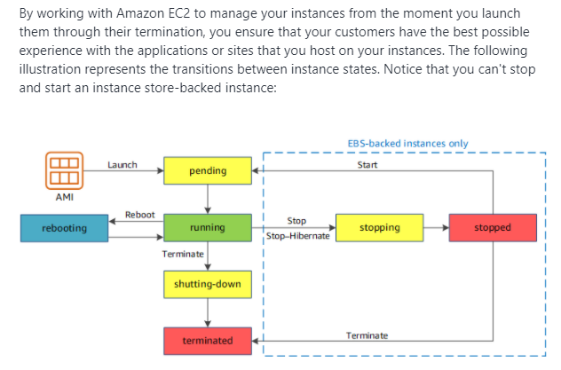

## 10. Instance lifecycle states
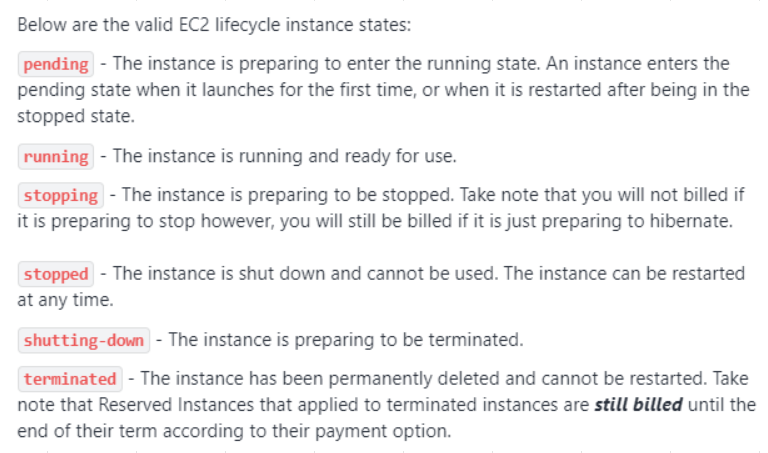

## 11. Dedicated host Vs instance
- Dedicated Instances may share hardware with other instances from the **same AWS account** that are not Dedicated Instances.
- Dedicated Instances are obviously **more Cost effective** (per Instance billing) compared Dedicated Host (per Host billing)
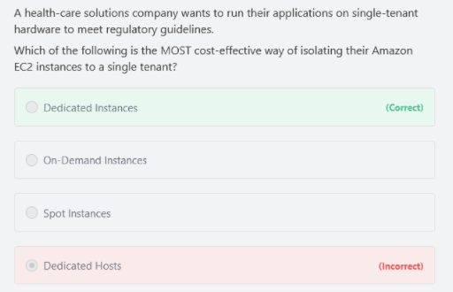

- A host is a machine or VM that applications "run on" and **each HOST one can run N instances** of the application
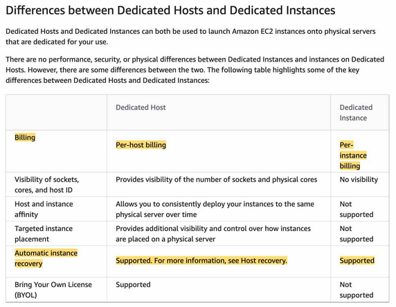

## 12. Spot instance
- 
- Terminating spot instance
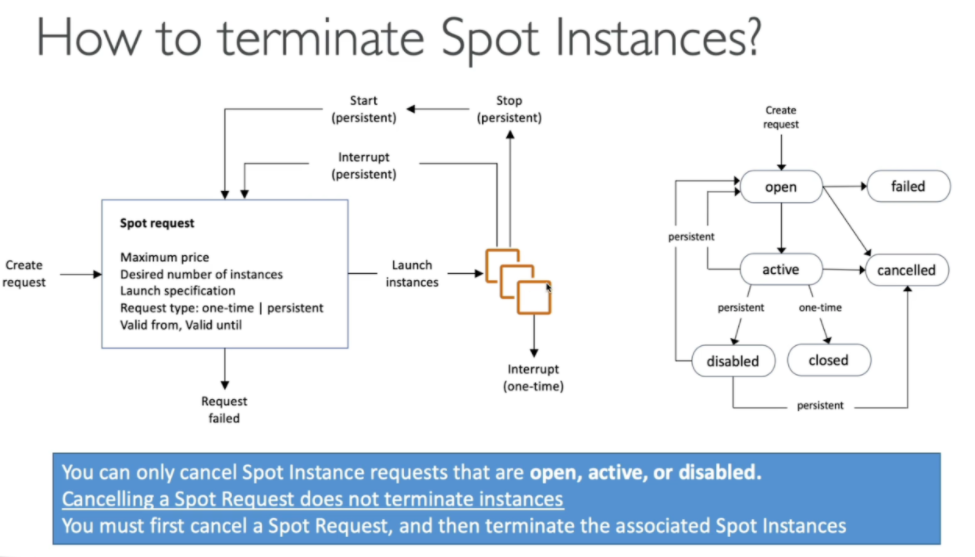

## 13. Instance family		
- M/T/R/X/D/H/I/G/P/F/C
- M/T: General Purpose Instances
- C: Compute Optimized										
- R/X: Memory Optimized									
- D/H/I: Storage Optimized				
- G/P/F: Accelerated Computing Instances
- T2/T3 burstable/unlimited Burst		
- An instance family has many instance types
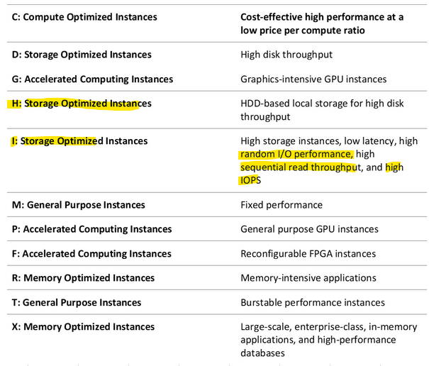
								
- Instance **Family support Encryption** but not all Instance TYPES in that family might support encryption
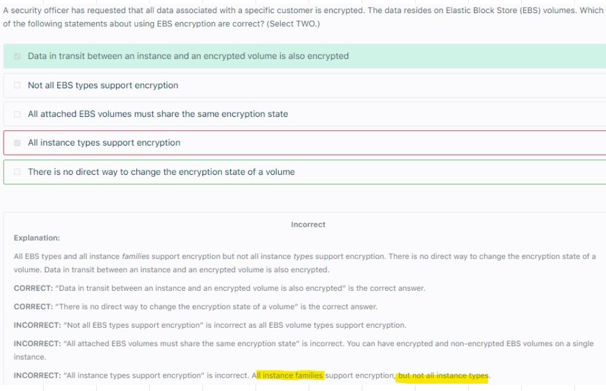

- Choose the Instance which supports your **workload**
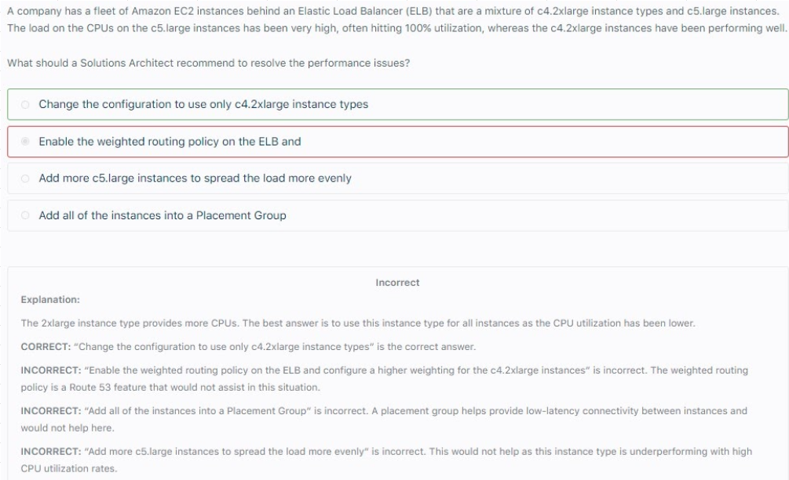

## 14. AMI		
- Create Instance from AMI		
- Copy AMI to Different Account (Cross Account AMI copy)		
- Copy AMI to Different Region		
## 15. Placement Groups		
- Cluster		
- Spread (multiple AZ but within same REGION)
- Partition

## 16. ENI		
- ENI is a Network Adaptor		
- ENI is attached to EC2 instance		
- Gives Public and Private IP to an EC2		
- Attaching ENI to Instance:
  - Hot Attach: When it is running
  - Warm Attach: When it is Stopped
  - Cold Attached: When Instance is being Launched	

## 17. ENI Vs ENA Vs EFA
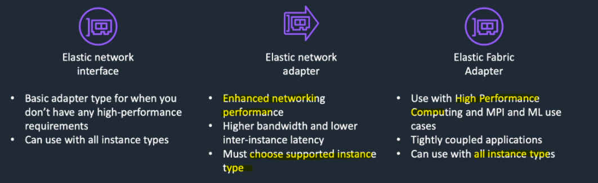

## 18. Enhanced_networking
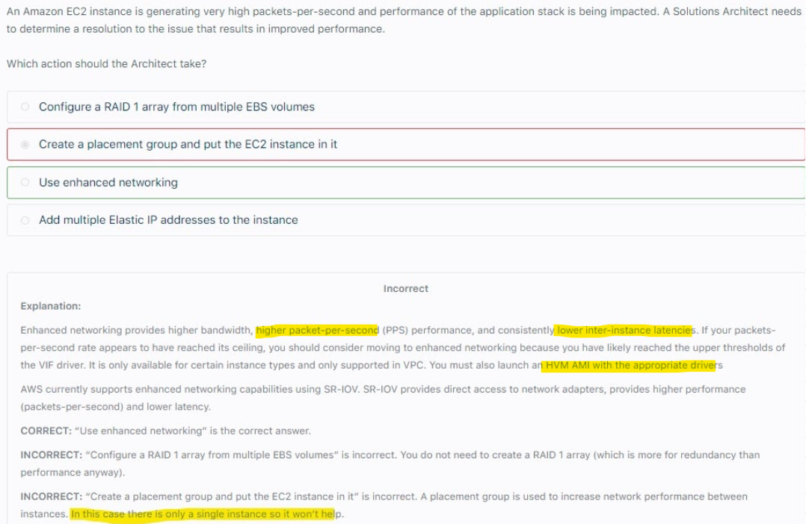

## 19. vCPU based ON DEMAND INSTANCE limit per Region
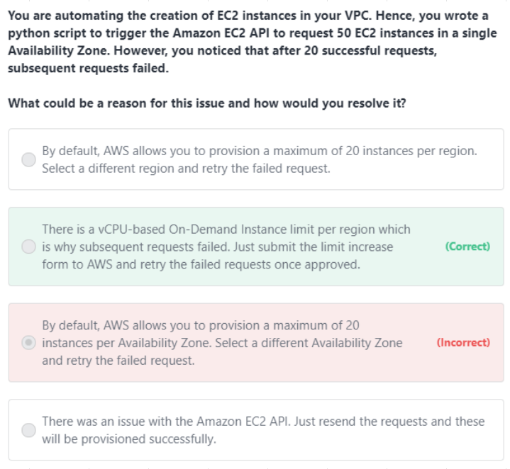

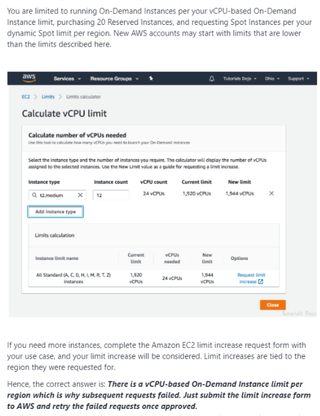
