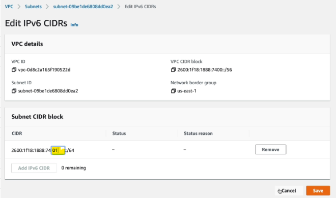
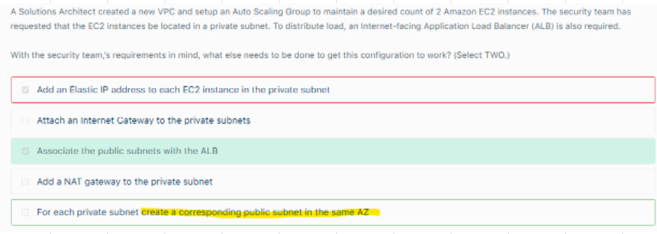

# VPC											
## 1. Subnet		
-  Public Subnet		
-  Private Subnet		
-  Modify Auto Assign Public IP		
-  Newly Created Subnet is AUTOMATICALLY associated with the main route table of VPC		

## 2. Internet Gateway		
-  Attach Internet Gateway to VPC		
## 3. Route Table		
-  Associate Internet Gateway to Route table		
-  Attach Route table to Subnet(s)		
-  Internet Gateway/NAT Gateway/VPC Endpoint/VPC peering Connection		
## 4. NAT		
-  NAT Instance: Must Disable "Source Destination Check" flag		
-  NAT Gateway		
-  Bastion Host		
-  Egress Only		
## 5. DNS Resolution					
-  enableDNSsupport					
-  enableDNShostname					
-  Custom DNS domain name in Private Zone hosted in Route 53					
   - **Private Route 53 hosted zone** enables us to create records that points to external websites (Google) and make them accessible from our VPC					
## 6. NACL					
-  Default NACL: All Inbound Allowed					
-  Default NACL: All Outbound Allowed					
-  Newly created NACL DENY everything					
-  One NACL per Subnet					
-  Blocking IP at Subnet level					
-  NACL is StateLESS so Outbound rules are explicitly evaluated					
-  Setup DENY rule for Ephemeral Ports (1024-65535)					

## 7. Adding Internet Gateway to Main Route table of VPC

# VPC-Defaults
## 1. Default VPC has			
-  3 Subnets			
-  1 Route Table			
-  1 IGW			
-  1 NACL			
## 2. New VPC has by default			
-  1 Route Table			
-  1 NACL			
## 3. New Security Group			
-  All Inbound Blocked			
-  All Outbound Authorized to All IP addresses			

# NAT Gateway Vs NAT Instance

-  NAT instance can be used as a bastion server
-  Security Groups can be associated with a NAT instance
-  NAT instance supports port forwarding"											

### 1. Your EC2 wants to access an application on Internet. This application on Internet allows 2 IPs to be whitelisted per customer, what shall we do?											
Configure a NAT gateway for eac AZ with an Elastic IP											
*Do not get misled to use NLB because of "2 IPs to be whitelisted", as in this case EC2 want to connect to Internet											
											
### 2. Your Application want to access Internet to pull Large amount of, what shall we provision so that there is NO CONSTRAINT on bandwidth?											
Attach an Internet Gateway because NAT gateway imposes a limit of 45Gbps											
											
### 3. How to access an EC2 launched in a NON DEFAULT Subnet?											
As this EC2 will not have a Public IPv4 address so ASSOCIATE an ELASTIC IP with your Instance to communicate over the Internet											
											
### 4. Highly Available NAT											
-  Create a NAT Gateway in each availability zone.											
-  Configure the route table in each private subnet to ensure that instances use the NAT Gateway in the same availability zone.											

# DNS-DHCP options

- Edit DNS hostnames
  - Assign Host name to instances launched in VPC

- Edit DNS resolution
  - When enabled it means instances launched in VPC will use AWS Name Services for DNS reolution

- Edit DHCP option set
  - DHCP is the protocol computers use to obtain an IP address when they boot

## DNS Hostnames

# VPC- IPv4 and IPv6 adressing
1. Dual Stack mode			
2. Attaching IPv6 CIDRs to a subnet			
3. Automatically assign IPv6 address to our launched EC2 Instances			
4. Assign IPv6 address to existing EC2		

## Dual Stack mode											
-   When you create a VPC, you must specify a range of IPv4 addresses for the VPC in the form of a CIDR block.											
-  Each subnet must reside entirely within one Availability Zone and cannot span zones.											
-  You can also optionally assign an IPv6 CIDR block to your VPC, and assign IPv6 CIDR blocks to your subnets.											

VPC can have multiple IPv4 CIDRs but a VPC can only have 1 IPv6 CIDR associated with it											
By default, a new EC2 instance uses an IPv4 addressing protocol.											

-  If you have an existing VPC that supports IPv4 only and resources in your subnet that are configured to use IPv4 only, you can enable IPv6 support for your VPC and resources. 											
-  Your VPC can operate in dual-stack mode — your resources can communicate over IPv4, or IPv6, or both. IPv4 and IPv6 communication are independent of each other.											
-  You cannot disable IPv4 support for your VPC and subnets since this is the default IP addressing system for Amazon VPC and Amazon EC2

By default, a new EC2 instance uses an IPv4 addressing protocol. 
To fix the problem in the scenario, you need to create a new IPv4 subnet and deploy the EC2 instance in the new subnet."											
Hence, the correct answer is: Set up a new IPv4 subnet with a larger CIDR range. Associate the new subnet with the VPC and then launch the instance.											

## Attaching IPv6 CIDRs to a subnet

## 3. Automatically assign IPv6 address to our launched EC2 Instances

## 4. Assign IPv6 address to existing EC2

# Ephemerel Ports										
-  To enable the connection to a service running on an instance, the associated network ACL must allow both inbound traffic on the port that the service is listening on as well as allow outbound traffic from ephemeral ports. 										
-  When a client connects to a server, a random port from the ephemeral port range (1024-65535) becomes the client's source port.										
-  The designated ephemeral port then becomes the destination port for return traffic from the service, so outbound traffic from the ephemeral port must be allowed in the network ACL.										
-  Default Network ACLs allow all inbound and outbound traffi  -  										
-  If your network ACL is more restrictive, then you need to explicitly allow traffic from the ephemeral port range.										

# Create VPC via a Wizard											
-  VPC with Single Public Subnet											
-  VPC with Single Public and Private Subnet											
-  VPC with Single Public and Private Subnet AND Hardware VPN access											
-  VPC with Private Subnet ONLY and Hardware VPN access		

# Three Tier Highly Available Architecture

- If DB is installed on EC2, then replicate database to the other AZ as well											
- You need one public subnet in each AZ where the ELB is defined and the private subnets are located ELB nodes have public IPs and route traffic to the private IP addresses of the EC2 instances.

# Connection Between VPCs												
## 1. VPC Endpoint					
-  Enables us to connect AWS Services using private Network without using IGW or NAT					
-  Gateway Endpoint		
  -  Provisions a Target (Endpoint ARN) as an entry point		
  -  Update Route Table with the Gateway endpoint		
  -  S3 and DynamoDB		
d. VPC endpoint Policies		
-  Interface Endpoint		
  -  Provisions ENI as an entry point		
  -  Must attach ENI to Security Group		
  -  Most AWS services		
### Endpoint Policy
- When you create a VPC endpoint, you can attach an endpoint policy to controls access to the service (for ex: S3) to which you are connecting.	
- You can modify the endpoint policy attached to your endpoint and add or remove the route tables used by the endpoint.
- An endpoint policy does not override or replace IAM user policies or service-specific policies (such as S3 bucket policies).
- It is a separate policy for controlling access from the endpoint to the specified service.											
### VPC endpoint Policy for S3 

### How to Transmit data to 1000s of SERVICE consumers in different VPC accounts
- An organization in the health industry needs to create an application that will transmit protected health data to thousands of service consumers in different AWS accounts. 
- The application servers run on EC2 instances in private VPC subnets. The routing for the application must be fault tolerant.
### Solution
- Create a VPC endpoint service and grant permissions to specific service consumers to create a connection
## 2. VPC Private Link				
- Create NLB in Service VPC (NLB acts as an Endpoint to the service being exposed to another/Customer VPC)				
- Create VPC endpoint in customer VPC (search for the exposed service  which is NLB created in service account, ""Find service by name"" option)
- This Creates an ENI in Customer VPC as we created an Interface endpoint
### How to prevent customer VPC to access our underlying EC2 instances?
- Create a NLB in VPC exposing the resources (EC2 insatnce)										
- Setup Private link by creating Interface endpoint in Customer that wants to consume our resources (Service hosted on EC2)

## 3. VPC Classic Link	
-  Enables to link EC2 classic instance to our VPC	

## 4. [VPC Peering](https://docs.aws.amazon.com/vpc/latest/peering/invalid-peering-configurations.html)
- Private Connection between 2 VPCs (routing via AWS network): Opens a Network connection between participating VPCs					
- VPC peering can be done between INTER REGION, CROSS ACCOUNTs as well										
- Create Peering Connection										
- Must Update Route Table in both VPCs										
- VPC peering Considerations:
  - CIDR should not overlap
  - No Transitive routing
  - No Edge To Edge Routing via Gateway or Private connections
### Question

## 5. AWS Resource Access Manager											
- AWS Resource Access Manager (RAM) is a service that enables you to easily and securely share AWS resources with any AWS account or within your AWS Organization. 											
- You can share AWS Transit Gateways, Subnets, AWS License Manager configurations, and Amazon Route 53 Resolver rules resources with RAM
- If you have multiple AWS accounts, you can create resources centrally and use AWS RAM to share those resources with other accounts.
## 6. Sharing VPC resources together with VPC Peering and RAM											
- If the resources are in different regions, you will generally need to Share the resource subnet from the source region to the destination region using `VPC Peering`
- Than use `RAM` to share the subnet with the child account in the same region

### RAM not an option for sharing APIs
- RAM lets you share resources that are provisioned and managed in other AWS services. However, APIs are not shareable resources with AWS RAM.

### VPC Sharing ~ Sharing via RAM				

## Summary										
1. Exposing Services to Customer VPC privately, `Expose an Endpoint, VPC private link is also exposing an Endpoint`
2. Sharing VPC components/resources with another VPC, `Use VPC peering`
3. Sharing VPC components/resources with another VPC when the resources are in another Region and we are using AWS Organisation `Use RAM or RAM and VPC peering`
4. RAM not an option for sharing APIs	
