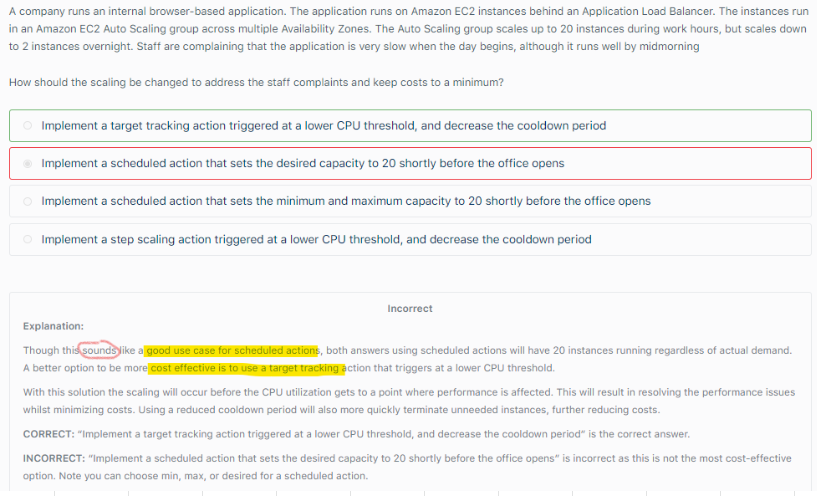
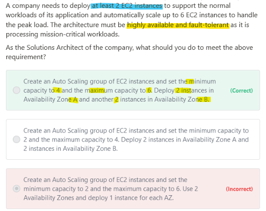
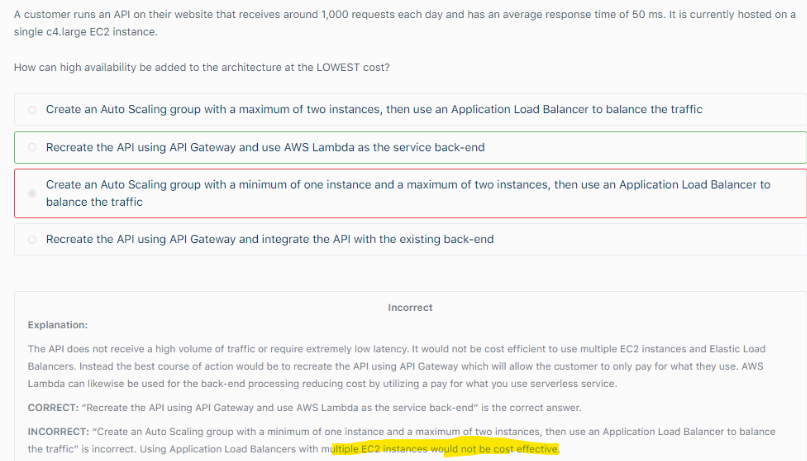
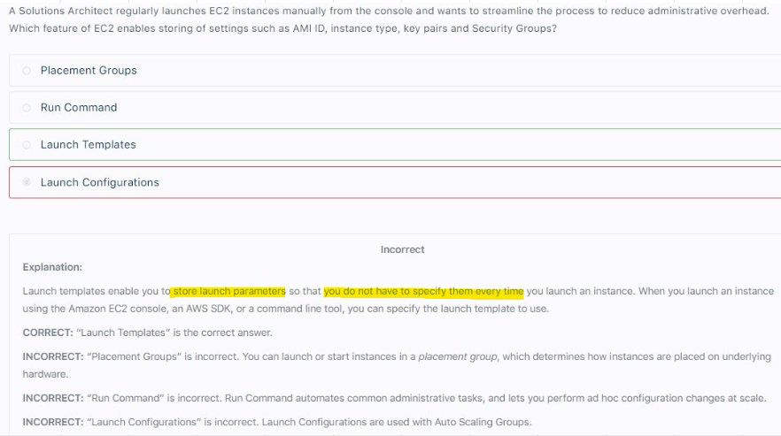
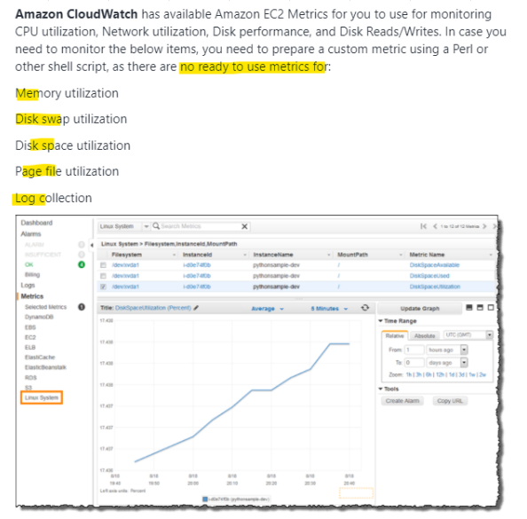
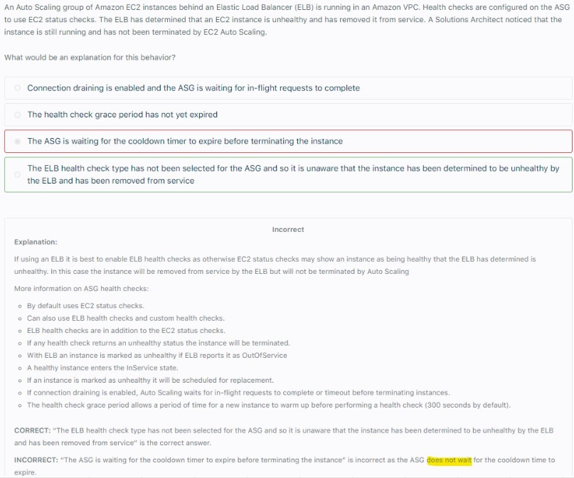
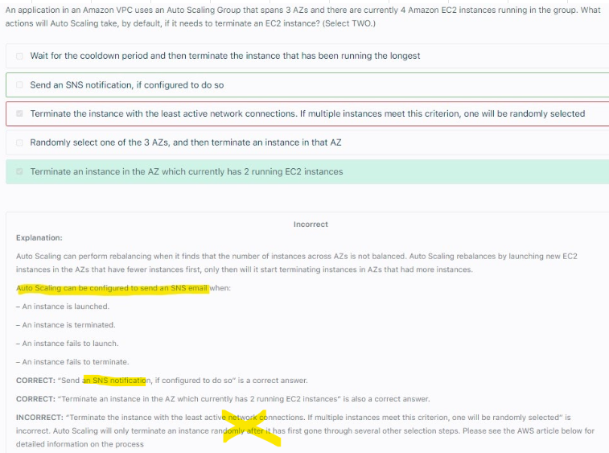
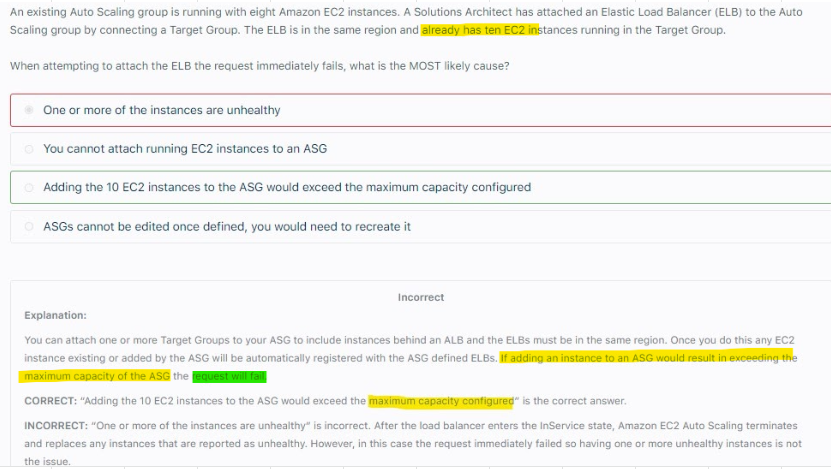

# ASG											
## 1. Launch Configuration		
-AMI + Instance Launch Type		
-EC2 User data		
- EBS Volumes		
- Security Group		
- SSH Key Pair		
## 2. Capacity		
-Min Capacity		
-Max Capacity		
- Desired Capacity		
## 3. Network/Subnet Information		
-Assign VPC		
-Assign Subnets		
## 4. Load Balancer		
-Assign LB for the ASG		
-While setting up ASG, we configure ELB health checks in addition to EC2 health checks		
## 5. Cloudwatch Alarms		
-Alarm rules		
a. Average CPU usage		
b. No of requests on ELB per instance		
c. Average Network In/Out		
-Custom Metrics		
a. Send Custom Metric (PutMetricAPI) from EC2 to Cloudwatch		
- EC2 Reboot Cloudwatch Alarm to reboot instance is recommended for instance Health check failures		
## 6. Scaling Policies		
-Target Tracking (ex: Track CPU or other metric)		
-Step Scaling (Utilises Cloudwatch Alarm to trigger scaling)		
- Simple Scaling (Utilises Cloudwatch Alarm to trigger scaling)		
- Scheduled Action		
*Scaling Policies are also referred as Dynamic Scaling Policies		
## 7. Scale-In		
-AZ with Most Instances		
-If there are multiple AZ to choose from, choose AZ with oldest launch configuration		
## 8. Life cycle Hooks		
-Ability to perform extra steps/actions before		
a. instance goes to Service state		
b. instance is terminated		
## 9. Cooldown					
-Default 300 seconds					

## 10. Step Scaling Vs Simple scaling											
"An application is hosted in an Auto Scaling group of EC2 instances. 
To improve the monitoring process, you have to configure the current capacity to increase or decrease based on a set of scaling adjustments. 
This should be done by specifying the scaling metrics and threshold values for the CloudWatch alarms that trigger the scaling process.

Which of the following is the most suitable type of scaling policy that you should use?"											
Answer: Step Scaling 											
Step Scaling Increase or decrease the current capacity of the group based on a set of scaling adjustments, known as step adjustments, that vary based on the size of the alarm breach											
Simple Scaling Increase or decrease the current capacity of the group based on a single scaling adjustment, known as step adjustments, that vary based on the size of the alarm breach											
											
## 11. How to Troubleshoot Auto Scaling related problems?											
-SUSPEND (and not Disable) the scaling process responsible for launching new instances											
-Place the EC2 instances that are experiencing issues on STAND BY state											
											
## 12. Target Tracking based ASG is CHEAPER compared to Scheduled Action ASG, If question mentions "COST" then focus on cheapest option											

## 13. HA setup	

## 14. Adding HA for API running on EC2, move it to API gateway and use Lambda to handle backend

# Launch Templates											
Launch Templates enables us to set up an ASG with a mix of on-demand and spot instances across multiple instance type											

# EC2 Cloudwatch agent

-Take note that there is a multi-platform CloudWatch agent which can be installed on both Linux and Windows-based instances. 										
-You can use a single agent to collect both system metrics and log files from Amazon EC2 instances and on-premises servers. 										
- This agent supports both Windows Server and Linux and enables you to select the metrics to be collected, including sub-resource metrics such as per-CPU core. 										
- It is recommended that you use the new agent instead of the older monitoring scripts to collect metrics and logs.										

# ELB Health Check for ASG

# ASG-SNS and Instance State Change Events

# If adding an instance to an ASG would result in EXCEEDING MAX Capacity of the ASG, the request will FAIL

