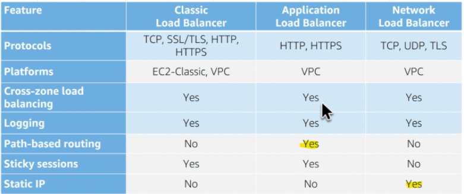
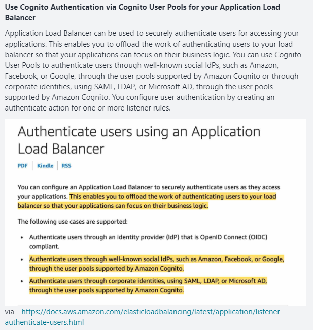
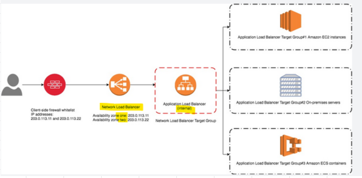
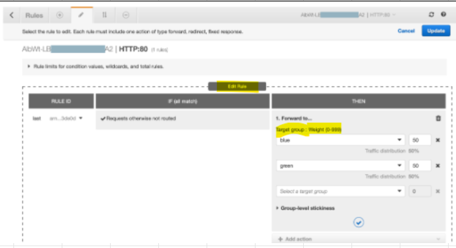
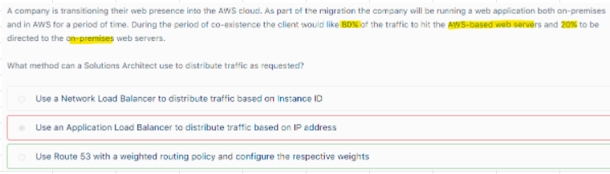

# ELB
## 1. NLB				
- TCP/UDP (Layer 4)				
- Target Groups will provide support for TCP connection/ application across multiple machines				
- No Security Groups				
-One Static IP per AZ, supports assigning Elastic IP				
- Connection "Pass Through" to EC2 instances				
## 2. ALB				
- HTTPS (Layer 7)				
- Target Groups will provide support for HTTP application across multiple machines				
- Requires configuring Security Group				
-Dynamic Port mapping (ECS): for Containers on same machine				
- ""Connection Termination"", use below options to get details of Source
  - X-Forwarded-For
  - X-Forwarded-Port
  - X-Forwarded-Proto"				

## 3. CLB

## 4. ONLY ALB supports path-based routing and host-based routing									
1. Stickiness setting is at Target group level (not at Load balancer)										
2. Cross Zone Load Balancing										
3. SNI										
4. Connection Draining/Deregistration Delay										
"5. Perfect Forward Secrecy: 
- Provides additional safeguard against the evesdropping of encrypted data through the use of unique random session key
- This is supported by ELBs and Cloudfront
**Cloudfront offers ""Field Level Encryption"", this adds EXTRA Level of ENCRYPTION at Cloudfront EDGE Locations"		

## 5. ELB Health checks
- While configuring ASG, we setup ELB health checks in addition to EC2 health checks		
- IF ELB health check fails, the EC2 instance will marked as "Out Of Service" and will be removed from ELB's target group
- ASG will then terminate the instance											

### Scenario: Scaling Problem										
- ASG is using EC2 instance based Health checks (usual case)											
- ALB is using its BUILT IN health check											
#### What can happen here?											
- ASG Health check wil pass											
- ALB health check will fail											
- As ALB health check failed, ALB will remove the EC2 instance											
- ASG will not provision new EC2 because health checks have been successful											
### Routing and IP Addresses										
#### Case 1: If you specify targets using an instance ID, traffic is routed to instances using the primary private IP address specified in the primary network interface for the instance.										
- The load balancer rewrites the destination IP address from the data packet before forwarding it to the target instance.														
#### Case 2: If you specify targets using IP addresses, you can route traffic to an instance using any private IP address from one or more network interfaces. 										
- This enables multiple applications on an instance to use the same port.										
- Note that each network interface can have its security group. 
- The load balancer rewrites the destination IP address before forwarding it to the target.
										
### Registering IP addresses as Targets			
- With ALB and NLB IP addresses can be used to register:										
  - Instances in a peered VPC.
  - AWS resources that are addressable by IP address and port.
  - On-premises resources linked to AWS through Direct Connect or a VPN connectio
										
## 6. NLB-Routing	
- After the load balancer receives a connection request, it selects a target from the target group for the default rule. 
- It attempts to open a TCP connection to the selected target on the port specified in the listener configuration.
## 7. How to distribute traffic between On premise servers and AWS Web servers deployed on EC2?		
- Provision a DX connection between On premise and AWS										
- Create a Target Group on ALB										
- Use IP address based targets for the EC2 instances and On premise Servers										
## 8. Encryption in Transit										
- NLB with TCP listener, then TERMINATE SSL on EC2 instances										
- ALB with an HTTPS listener, install SSL certificates on ALB as well as on EC2 instances	
## 9. How to make an Application running in multi AZ on EC2 instances backed by Aurora DB exposed via ALB resilient to sporadic increase in request rate?
- Improve Read scaling: Add Aurora Read replicas
- Cache content: Use Cloudfront in front of ALB									
## 10. Configure a NAT gateway for each AZ with an Elastic IP
- NLB One STATIC IP per AZ										
- GA Supports 2 ANYCAST IP Globally										
- Your EC2 wants to access an application on Internet. 
- This application on Internet allows 2 IPs to be whitelisted per customer, what shall we do?							
#### Solution
- Configure a NAT gateway for each AZ with an Elastic IP										
- Do not get misled to use NLB/GA because of "2 IPs to be whitelisted", as in this case EC2 want to connect to Internet

## 11.ALB- Authentication via CUP		

## 12. NLB-BYOIP - Static IP											
- A company has developed public APIs hosted in Amazon EC2 instances behind an Elastic Load Balancer. 
- The APIs will be used by various clients from their respective on-premises data centers. 
- A Solutions Architect received a report that the web service clients can only access trusted IP addresses whitelisted on their firewalls.
- What should you do to accomplish the above requirement?"											
### Solution									
- Based on the given scenario, web service clients can only access trusted IP addresses. 
- To resolve this requirement, you can use the Bring Your Own IP (BYOIP) feature to use the trusted IPs as Elastic IP addresses (EIP) to a Network Load Balancer (NLB). 
- Expose your ALB via a NLB and assign Elastic IP (whitelisted IP) to NL  - Now Client will be allowed to talk to NLB and hence the application
- This way, there's no need to re-establish the whitelists with new IP addresses.
- The above option works within ONE REGION, use GA when we need to whitelist IPs across multiple regions				

## 13. ALB - Weighted Routing
- Application Load Balancers support Weighted Target Groups routing. 										
- With this feature, you will be able to do weighted routing of the traffic forwarded by a rule to multiple target groups
- This enables various use cases like blue-green, canary and hybrid deployments without the need for multiple load balancers
- It even enables zero-downtime migration between on-premises and cloud or between different compute types like EC2 and Lambda.	

## 14. Choose wisely, for below case Route 53 is a better choice				

