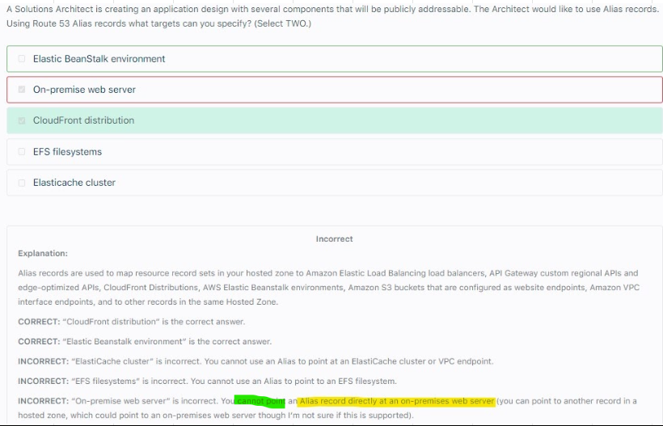
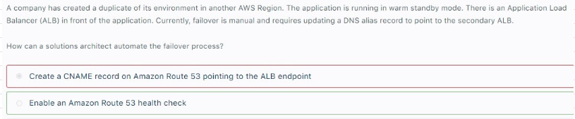

# Route53											
## 1. Overview		
- Managed DNS		
- Common Record types		
  - A: hostname to IPV4		
  - AAAA: hostname to IPV6		
"  - CNAME: 
hostname to hostname 
Works ONLY for NON ROOT Domain"		
"d. Alias: 
hostname to AWS resource
Works for Both NON ROOT and Root domains"		
- Alias can be created for Both "A" and "AAAA" record types		
## 2. TTL		
"- High TTL
Less traffic on DNS
Outdated Records"		
"- Low TTL
More traffic on DNS
Records are outdated for smaller time"		
## 3. Registrar		
- Create a Hosted Zone in Route 53		
- Update NS records on 3rd party website (from where domain was purchased)		
- Now Route 53 name servers can be used		
## 4. Routing Policies		
- Basic		
  - Simple
  - Latency	
- Based on Health Checks		
  - Weighted
  - Failover
  - Multivalue
- Based on Location		
  - Latency
  - Geo Location
  - Geo Proximity

# Routing based on location
## Latency routing										
- Latency routing routes the trafiice based on the geographic location of your users, and WHICH resource can deliver results FASTER
## Geolocation routing										
- Geolocation routing lets you choose the resources that serve your traffic based on the geographic location of your users, meaning the location that DNS queries originate from (BASICALLY HARDCODING where the request should go to)										
- For example, you might want all queries from Europe to be routed to an ELB load balancer in the Frankfurt region.					
- When you use geolocation routing, you can localize your content and present some or all of your website in the language of your users.
- You can also use geolocation routing to restrict distribution of content to only the locations in which you have distribution rights.
- Another possible use is for balancing load across endpoints in a predictable, easy-to-manage way, so that each user location is consistently routed to the same endpoint								
## GeoProximity Routing										
- Similar to GeoLocation but offers more control on Routing by additionally allowing us to also choose to route more traffic or less to a given resource by specifying a value, known as a bias.										
- A bias expands or shrinks the size of the geographic region from which traffic is routed to a resource.				
### GeoProximity Map

## 5. Deciding on which routing to choose
### If Question talks about Routing between different locations of same region, than prefer GeoPROXIMITY	
- Geolocation Routing is incorrect because you cannot control the coverage size

### GeoLocation Routing: Distribution Rights and Localizing Content

- A website exposed via ALB needs to serve customers. 
- Distribution rights for the content REQUIRE that users in different Geographies must be served content from specific REGIONS
- Use Route 53 with Routing policy as Geolocation as it will allow us to CHOOSE Resource that would serve traffic based on Geographic location of users
## 6. Alias records
- We can not create Alias record for On premise server											
- Alias records are used to map resource record sets in your hosted zone to 
  - Amazon Elastic Load Balancing load balancers, 
  - API Gateway custom regional APIs and edge-optimized APIs, 
  - CloudFront Distributions, 
  - AWS Elastic Beanstalk environments, 
  - Amazon S3 buckets that are configured as website endpoints, 
  - Amazon VPC interface endpoints, and to other records in the same Hosted Zone.

## 7. Failovers
### Active-Active Failover					
- When you want all of your resources to be available the majority of the time. 					
- When a resource becomes unavailable, Route 53 can detect that it's unhealthy and stop including it when responding to queries.					
- In active-active failover, all the records that have the same name, the same type (such as A or AAAA), and the same routing policy (such as weighted or latency) are active unless Route 53 considers them unhealthy.					
- Route 53 can respond to a DNS query using any healthy record.					
### Active-Passive Failover					
- When you want a primary resource or group of resources to be available the majority of the time and you want a secondary resource or group of resources to be on standby in case all the primary resources become unavailable.					
- When responding to queries, Route 53 includes only the healthy primary resources.					
- If all the primary resources are unhealthy, Route 53 begins to include only the healthy secondary resources in response to DNS queries.					

Configuring an Active-Active Failover with One Primary and One Secondary Resource is invalid configuration because you cannot set up an Active-Active Failover with One Primary and One Secondary Resource.											
Remember that an Active-Active Failover uses all available resources all the time without a primary nor a secondary resource, so use Active-Active Failover with WEIGHTED Routing											
											
### Use Route 53 Health check for configuring Failovers		

## 8. Supported DNS Record Types
- Amazon Route 53 currently supports the following DNS record types:
  - A (address record)
  - AAAA (IPv6 address record)
  - CNAME (canonical name record)
  - CAA (certification authority authorization)
  - MX (mail exchange record)
  - NAPTR (name authority pointer record)
  - NS (name server record)
  - PTR (pointer record)
  - SOA (start of authority record)
  - SPF (sender policy framework)
  - SRV (service locator)
  - TXT (text record)					
## 9. DNSSEC											
- Domain Name System Security Extensions (DNSSEC) signing lets DNS resolvers validate that a DNS response came from Amazon Route 53 and has not been tampered with. 
- When you use DNSSEC signing, every response for a hosted zone is signed using public-key cryptography.
- Take note that DNSSEC is not a valid DNS record type. It is just a set of protocols that add a layer of security to the domain name system (DNS) lookup
