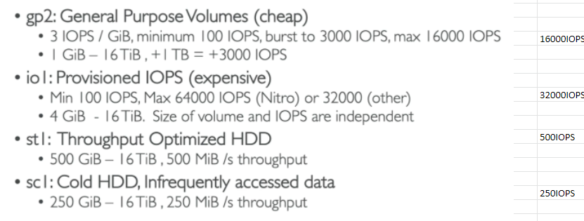
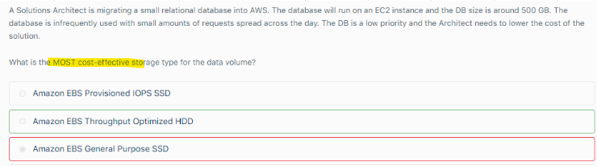
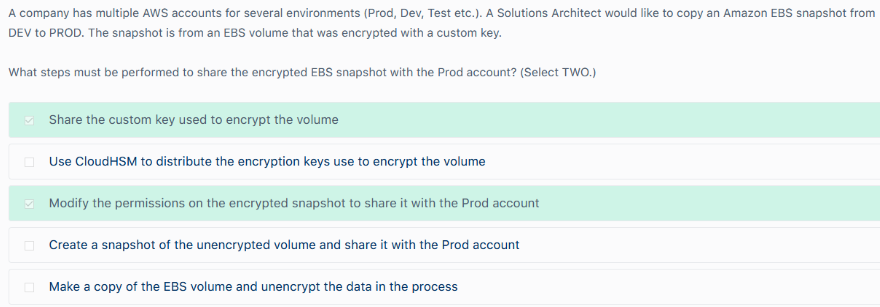

# EBS

## 1. Overview		
- Network Drive attached to an EC2 instance		
- Locked to an AZ		
- We get billed for Provisioned capacity		
- EBS volumes support live configuration changes while in production which means that you can modify the volume type, volume size, and IOPS capacity without service interruptions.		
## 2. Volume Types		
- GP2-SDD		
- IO1-SDD (Databases)		
- ST1-HDD (DWH)		
- SC1-HDD

### Remember
- st1 and sc1 are also referred as MAGNETIC Volumes		

- Volume Characteristics
		

- GP and PIOPS can be used as BOOT VOLUMES										
- MOST COST EFFECTIVE: SC1 and then ST1

- Cheapest option 
  - If question mentions "COST" then focus on cheapest option						
    
	
    

## 3.Snapshots		
- Incremental and can be automated using Data Lifecycle Manager		
- Create Volume in Another AZ - HA		
- Copy snapshot to another Region - DR		

## 4. Data Lifecycle Manager		
- Define Snapshot Lifecycle policy to create snapshots		
## 5. Encryption			

- Uses keys from KMS (AES-256)			
- Encrypt an Unencrypted Volume (using copy)			
- EBS Encrypted volumes and Snapshots			
- Data IN TRANSIT is also ENCRYPTED											

- All attached EBS volumes must share the same encryption state” is incorrect. 
  - You can have encrypted and non-encrypted EBS volumes on a single instance.

- Sharing Snapshot Encrypted with CMK											
  - When an EBS volume is encrypted with a custom key you must share the custom key with the other account
  - You also need to modify the permissions on the snapshot to share it with the PROD account
  - The Other account must copy the snapshot before they can then create volumes from the snapshot
  - Note that you cannot share encrypted volumes created using a default CMK key and you cannot change the CMK key that is used to encrypt a volume

- Enable Encryption as Default For Region
  - You can configure your AWS account to enforce the encryption of the new EBS volumes and snapshot copies that you create

  - Encryption by default has no effect on existing EBS volumes or snapshots.										
  - The following are important considerations in EBS encryption:
    - Encryption by default is a Region-specific setting. If you enable it for a Region, you cannot disable it for individual volumes or snapshots in that Region.
    - When you enable encryption by default, you can launch an instance only if the instance type supports EBS encryption.
    - Amazon EBS does not support asymmetric CMKs.
    - When migrating servers using AWS Server Migration Service (SMS), do not turn on encryption by default. 
    - If encryption by default is already on and you are experiencing delta replication failures, turn off encryption by default. 
    - Instead, enable AMI encryption when you create the replication job.

## 6. RAID			
- RAID 0: Increase Performance			
- RAID 1: Increase fault tolerance			
- RAID: "Instance Storage" in the question

- The option that says: Attach multiple Provisioned IOPS SSD volumes in the instance is incorrect because persistent storage is not needed in the scenario.
- Also, instance store volumes have greater I/O performance than EBS volumes.	

## 7. Instance Store			
- Physically attached to machine (EBS is network drive)			
- Very High IOPS			
- Block Storage (~EBS)			
- Size cannot be increased
# 8. EC2 Status Checks on EBS											
- EC2 Status Checks on EBS may show "Insufficient data", it would mean "Status Checks" are still IN PROGRESS
- Possible value of Status check											
  - OK: All Checks PASSED											
  - Impaired: Checks FAILED, in such cases ASG will wait for instance to recover
- If the instance does not recovers, ASG will mark it for TERMINATION, Terminate it and will launch a replacement Instance
- Insufficient data: "Status Checks" are still IN PROGRESS
- EC2 status check: Impaired											

- If while restarting a stopped EC2 instance changes to a TERMINATED state immediately, then below could be possible reasons
  - You have reached your EBS volume LIMIT											
  - EBS snapshot is corrupt											
  - The ROOT EBS volume is encrypted and you do not have permissions to access the KMS key for Decryption
  - The instance store backed AMI that you used to launch instance is missing a required part "image.part.XX file

## 9. EBS Optimized Instances											
- EBS Optimized Instances can be used with ALL EBS volume types											
- While configuring EC2 Instance at "Storage" option, select the appropriate EBS optimized instance type, which appears with the added **EBS-Optimized** in the instance size description and configure needed IOPS											

