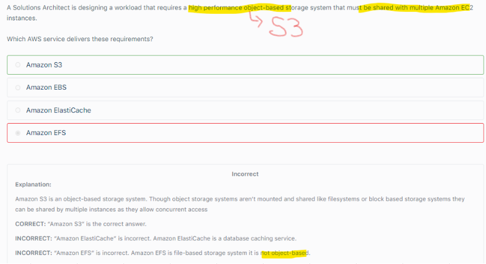

# EFS
## 1.Overview		
- Managed file system that can be mounted on many EC2s across different AZs (Choose VPC and SGs)		
- Supports EC2s in multiple AZs (EFS creates an ENI in each AZ)		
- Expensive (3*GP2)		
- Use Security Group to control access to EFS		
- Pay per Use, no capacity planning		
- Offers Encryption At rest (KMS) and In transit		
## 2. Lifecycle/Storage Tiers		
- Standard		
- EFS-IA		

## 3. Performance and Throughput modes
### Performance mode		
- General purpose (web servers)		
- MAX IO (Big Data, media processing)		

### Throughput mode	
- Bursting	
- Provisioned	

## 4. EFS configuration, Attach VPC, AZ, Subnets and Security groups

## 5. How to configure EFS  which will hold HOME directory for users?										
- Create a subdirectory for each user										
- Grant Read, Write and Execute permission to users										
- MOUNT the subdirectory to the users's HOME directory										
## 6. EFS with EC2
Use EFS with EC2 over EBS when we do not want to do any Management and Configuration

## 7. EFS is Highly available, EBS is not

- “Use Sticky Sessions with the ALB to ensure users are directed to the same EC2 instance in a session” is incorrect as this will just “stick” a user to the same instance. They won’t see documents uploaded to other instances / EBS volumes

## 8. When OBJECT based storage is needed, opt for S3. S3 is best for High Performance OBJECT based storage needs

## 9. EFS offers File System Interface, S3 doesnot

## 10. POSIX permissions											
- While working with EFS, we can control access to files and directories with POSIX compliant USER and GROUP LEVEL permissions- 											
- POSIX permision allows us to restrict access by user and groups											

## 11. EFS Big Data Workloads											
- Deploying a big data and analytics workload											
- The analytics will be run from a fleet of thousands of EC2 instances across multiple AZs											
- Data needs to be stored on a shared storage layer that can be mounted and accessed concurrently by all EC2 instances											
- Extremely high throughput is more important than Latency											
- Amazon EFS file systems in the Max I/O mode can scale to higher levels of aggregate throughput and operations per second with a tradeoff of slightly higher latencies for file operations.											
