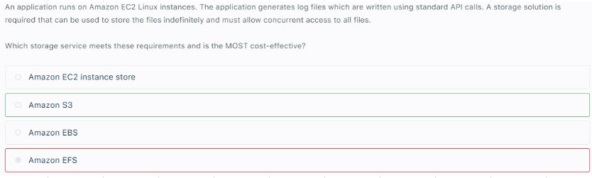
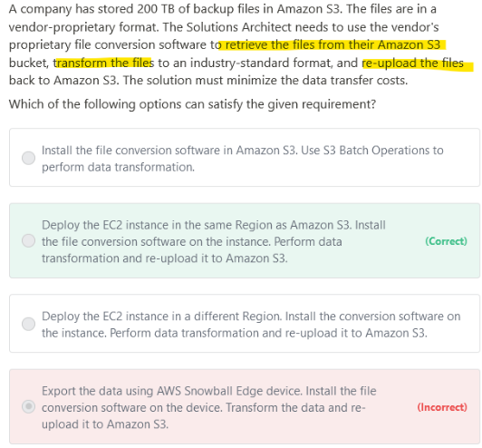

# S3

## 1. Overview		
- Key is composed of prefix + objectName		
- Max object size is 5TB (5000GB)		
- Use multi part Upload for objects > 5GB		
- Virtually Unlimited Storage		
## 2. Versioning		
- Protects against Unintended DELETES (Delete Marker)		
- Versioning is enabled at Bucket level		
- Suspending versioning doesnot deletes previous versions		
## 3. CORS		
- Setup proper CORS header		
a. AllowedHeaders: Authorization		
b. AllowedMethods: GET		
c. AllowedOrigins: "<Origin that wants to access our website>"		
## 4. Consistency Model		
- READ after write consistency for PUTS of new objects		
- Eventual consistency for DELETES and PUTS of existing objects		
## 5. What is the correct indication that an object was successfully stored when you put objects in Amazon S3?											
"If you triggered an S3 API call and got HTTP 200 result code and MD5 checksum, then it is considered as a successful upload. 
The S3 API will return an error code in case the upload is unsuccessful."											
											
## 6. S3 Vs EFS											
"Amazon S3 does not support a hierarchical structure. 
Though you can create folders within buckets, these are actually just pointers to groups of objects. 
The structure is flat in Amazon S3. 

Also, the consistency model of Amazon S3 is read-after-write for PUTS of new objects, but only eventual consistency for overwrite PUTS and DELETES. 
S3 does not support the requirement for strong consistency"											
"EFS support a hierarchical structure. 
EFS offers strong consistency"											
# S3 Encryption											
## 1. SSE-S3		
- Encryption key managed by AWS		
- AES-256		
- Must set Header		
"z-amz-server-side-encryption":"AES256"		
## 2. SSE-KMS		
- Encryption key managed by AWS		
- Offers User control and Audit trail		
- Must set Header		
"z-amz-server-side-encryption":"aws:kms"		
a. AWS managed key(aws/s3)		
b. Choose from your master keys (Customer can have its on keys)		
c. KMS master key ARN (from another account)		
## 3. SSE-C		
- Encryption key FULLY managed by Customer outside AWS		
- S3 doesnot stores the Encryption key		
- Encryption key is in Header		
- Must be over HTTPS		
## 4. Client Side Encryption		
- Encryption key FULLY managed by Customer outside AWS		
- Must ENCRYPT data before uploading to S3		
## 5. Encryption In transit					
- Encryption in Transit/Flight is SSL/TLS					
- Mandatory for SSE-C					
## 6. Cloud HSM					
- AWS offers Hardware for encryption (whereas with KMS AWS offers software for encryption)					
- Customer manages their keys ENTIRELY, Cloud HSM Supports both Symmetric and Asymmetric keys					
- Redshift supports CloudHSM for database encryption and key management					
- Good option to use with SSE-C					
- No free tier					
- HSM device is dedicated for customer and this device is temper resistant					
## 7. KMS with CloudHSM=> Full Control											
A company requires all the data stored in the cloud to be encrypted at rest.											
To easily integrate this with other AWS services, they must have full control over the encryption of the created keys and also the ability to immediately remove the key material from AWS KMS. 											
The solution should also be able to audit the key usage independently of AWS CloudTrail.											
Solution											
The AWS Key Management Service (KMS) custom key store feature combines the controls provided by AWS CloudHSM with the integration and ease of use of AWS KMS.											
You can configure your own CloudHSM cluster and authorize AWS KMS to use it as a dedicated key store for your keys rather than the default AWS KMS key store.											
When you create keys in AWS KMS you can choose to generate the key material in your CloudHSM cluster.											
 CMKs that are generated in your custom key store never leave the HSMs in the CloudHSM cluster in plaintext and all AWS KMS operations that use those keys are only performed in your HSMs.											
											
## 8. Envelope Encryption											
- A customer master key (CMK) is a logical representation of a master key. 											
- The CMK includes metadata, such as the key ID, creation date, description, and key state. 											
- The CMK also contains the key material used to encrypt and decrypt data. 											
- You can use a CMK to encrypt and decrypt up to 4 KB (4096 bytes) of data. 											
- Typically, you use CMKs to generate, encrypt, and decrypt the data keys that you use outside of AWS KMS to encrypt your data.                                                                                											
This strategy is known as envelope encryption.											
- KMS can only encrypt 4KB of data per call, If data>4KB, use ENVELOPE Encryption		

# S3 Security											
## 1. User Based IAM Policies		
- User Level Control		
- IAM Policy controls which API call can be allowed for a specific user from IAM console		
- AWS IAM policies can be used to grant IAM users with fine-grained control to Amazon S3 buckets.		
## 2. Resource based ACL		
- Account level control		
- Object ACL: finer grain		
- Bucket ACL (less common)		
## 3. Bucket Policy		
- User and Account level control		
"- JSON based policies
a. Resource
b. Action
c. Effect
d. Principal"		
- Grant public access to bucket		
- Force Objects to be encrypted at upload		
- Grant access to another ACCOUNT		
## 4. Other		
"- User Security
a. MFA Delete
b. Pre Signed URLs"		
"- Logging and Audit
a. S3 access logs
Cloudtrail to track API calls"		
- VPC Endpoint Policy (example: Restricting access to access S3)		
## 5. ACLs											
"- Access Control Lists (ACLs) - Within Amazon S3, you can use ACLs to give read or write access on buckets or objects to groups of users. 
- With ACLs, you can only grant other AWS accounts (not specific users) access to your Amazon S3 resources. 
- So, this is not the right choice for the controlling access for specific users"											
											
## 6. Type of Access Control											

## 7. How to Restrict third parties from directly accessing the S3 content in the bucket: Use BUCKET POLICY with condition aws:referer key											
Add a bucket policy that allows s3:GetObject permission with a condition, using the aws:referer key, that the get request must originate from specific webpages. 											

"Giving IAM role will ensure EC2 is able to access S3 content, but question is asking about restricting 3rd party access
3rd party access can be restricted by using aws:referer key condition"											

## 8. Use IAM policy to grant programmatic access or AWS Management Console access to AWS resources (S3 etc)		

## 9. How to allow access to S3 bucket to AWS resource (EC2)											
- Create a Bucket Policy											
- Refer Bucket Policy in IAM policy											
- Create an IAM Role and attch above IAM policy											
- Now any Resource will assume this Role to access S3 Bucket												

## EC2ToReadS3
### 1. With EC2 which option to integrate with S3 or EFS? If writing via API calls use S3, S3 is also MOST cost effective											

### 2. How to make API calls to EC2 and S3 bucket: You need Programmatic access and IAM policy (not Bucket Policy)

### 3. Using EC2 to read files from S3, process them and store them back on S3

Export the data using AWS Snowball Edge device. Install the file conversion software on the device. Transform the data and re-upload it to Amazon S3 is incorrect. 

Although this is possible, it is not mentioned in the scenario that the company has an on-premises data center. Thus, there's no need for Snowball

## S3 with Cloudfront: Caching problem											
"There was a new batch of updated images that were uploaded in S3, however, the users were reporting that they were still seeing the old content. You need to control which image will be returned by the system even when the user has another version cached either locally or behind a corporate caching proxy. 

Which of the following is the most suitable solution to solve this issue?: Use Versioning"											
											
"To control the versions of files that are served from your distribution, you can either invalidate files or give them versioned file names. If you want to update your files frequently, AWS recommends that you primarily use file versioning for the following reasons:

- Versioning enables you to control which file a request returns even when the user has a version cached either locally or behind a corporate caching proxy. If you invalidate the file, the user might continue to see the old version until it expires from those caches.
- CloudFront access logs include the names of your files, so versioning makes it easier to analyze the results of file changes.
- Versioning provides a way to serve different versions of files to different users.
- Versioning simplifies rolling forward and back between file revisions.
- Versioning is less expensive. You still have to pay for CloudFront to transfer new versions of your files to edge locations, but you don't have to pay for invalidating files."											
