# S3 Advance
## 1. MFA-DELETE		
- Must Enable Versioning on S3 bucket to use MFA delete		
-  MFA can be configured to 
a. Permanenetly DELETE an Object version
b. Suspend versioning on bucket"		
- MFA-Delete can only be configured using CLI		
- Only Bucket owner and root account can enable- disable MFA-Delete		
## 2. Server/S3 Access Logs		
- Any request made to S3, from any account, authorized or denied will be logged into another S3 bucket		
- These logs can be analysed using Athena		
- Do not set logging bucket to be the Monitored bucket		
-  Information Available with S3 access logs:
a. Requster IP address
b. Requester Request type"		
- Helps in understanding Customer's Traffic patterns		
## 3. S3 Replication		
- Must Enable Versioning in SOURCE and Destination		
"a. Same Region Replication (SRR)
b. Cross Region Replication (CRR)"		
- Buckets can be in DIFFERENT accounts		
- Replication/Copying is ASYNCHRONOUS		
- No chaining of Replication		
- For DELETE operations, if you delete with a version ID, it deletes in SOURCE, not replicated to destination bucket		
## 4. S3 Pre Signed URLS		
- Use SDK or CLI to generate Pre Signed URLs		
- Default Validity: 3600 seconds		
- User given a Pre Signed URL inherits the permission of the person who generated the URL for GET /PUT		
- Allows ALREADY Logged in user to download a PREMIUM video		
- Allows TEMPORARILY a user to UPLOAD a file to precise location in our Bucket		

## 5. CRR: Enable Versioning in destination bucket as well					
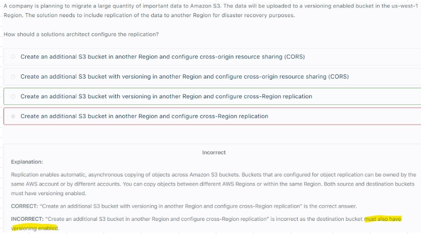

## 6. Object Lock/Vault lock					
-  S3 Object lock
a. WORM Model
b. Blocks an Object version deletion for a specified amount of time"					
-  Galcier Vault Lock
a. WORM Model
b. Has Vault Lock Policy to prevent future Edits for an Object"					
-  Helpful for 
a. COMPLIANCE
b. Data Retention"					
## 7. S3 Event notification					
-  Event types
a. ObjectCreated
b. ObjectRemoved
c. ObjectRestore
d. ObjectReplication etc.."					
- Generate Thumbnails of Images uploaded to S3					
- To Ensure that an event notification is sent for every successful write, ENABLE VERSIONING					
-  Destination can be
a. Lambda
b. SNS Topic
c. SQS queue"					
# S3 Storage Classes
## 1. Standard					
- S3 Standard General Purpose					
- S3 Standard Infrequent Access (IA)					
- S3 One Zone Infrequent Access (IA)					
- S3 Intelligent Tiering					
## 2. Glacier					
-  Glacier
a. Expedited: 1-5 Minutes
b. Standard: 3-5 Hours
c. Bulk: 5-12 Hours

Minimum Storage duration 90 days"					
-  Glacier Deep Archive
a. Standard: 12 Hours
b. Bulk: 48 Hours

Minimum Storage duration 180 days"					
** To access Objects in Glacier first "Initiate Restore"					

## 3. LifeCycle Rules											
- Rules can be created for a certain prefix											
- Rules can be created for certain Objects											
											
-  Objects must be stored at least 30 days in the current storage class before you can transition them to STANDARD_IA or ONEZONE_IA
- Amazon S3 does not transition objects that are smaller than 128 KB to the STANDARD_IA or ONEZONE_IA storage classes because it's not cost effective"											
											
## 4. Company needs to store data for 5 years. It requires Immediate and HA access to the files but files  will be accessed Infrequently											
Use S3 IA and not S3 One Zone IA because S3 IAN has availability of 99.9% whereas S3 One Zone IA has 99.5%											
											
## 5. If HA is not written explicitly in question then choose One Zone IA as it is more Cost effective											
- S3 One Zone-IA stores data in a single AZ and costs 20% less than S3 Standard-IA. 											
- S3 One Zone-IA is ideal for customers who want a lower-cost option for infrequently accessed and re-creatable data but do not require the availability and resilience of S3 Standard or S3 Standard-IA.											
- The minimum storage duration is 30 days before you can transition objects from S3 Standard to S3 One Zone-IA		
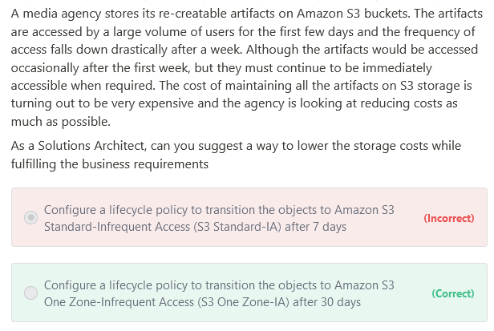

## 6. If Objects uploaded to S3 are not needed after 90 days, then we can set them to EXPIRE after 90 or n number of days											
## 7. Resiliency of Glacier: AZ level				
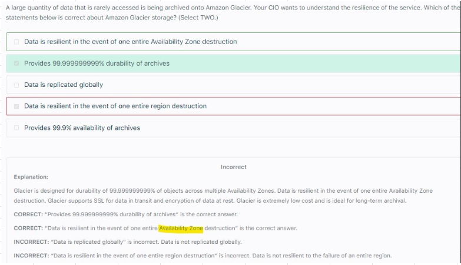

# S3 Retrievals
## 1. Expedited retrievals 					
- Allow you to quickly access your data when occasional urgent requests for a subset of archives are required.					
- For all but the largest archives (250 MB+), data accessed using Expedited retrievals are typically made available within 1–5 minutes.					
- Provisioned Capacity ensures that retrieval capacity for Expedited retrievals is available when you need it.					
- To make an Expedited, Standard, or Bulk retrieval, set the Tier parameter in the Initiate Job (POST jobs) REST API request to the option you want, or the equivalent in the AWS CLI or AWS SDKs.					
- If you have purchased provisioned capacity, then all expedited retrievals are automatically served through your provisioned capacity.					
## 2. Provisioned capacity					
- Ensures that your retrieval capacity for expedited retrievals is available when you need it.					
- Each unit of capacity provides that at least three expedited retrievals can be performed every five minutes and provides up to 150 MB/s of retrieval throughput.					
- You should purchase provisioned retrieval capacity if your workload requires highly reliable and predictable access to a subset of your data in minutes.					
- Without provisioned capacity Expedited retrievals are accepted, except for rare situations of unusually high demand. 					
- However, if you require access to Expedited retrievals under all circumstances, you must purchase provisioned retrieval capacity.					
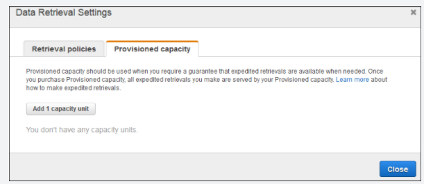

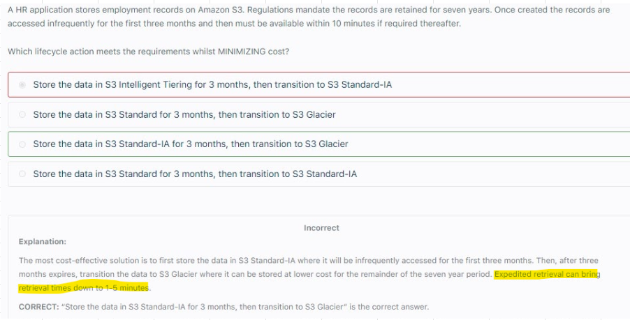

# S3 Performance
## 1. Baseline Performance			
- Baseline: 3500 PUTand 5500 GET requests per second per prefix in a bucket			
-  KMS might limit performance, 
limits of KMS:
Based on region it varies from 5.5k, 10k or 30k requests per second"			
## 2. Upload			
- Multipart Upload: Uses Parallel Uploads (Object size > 5GB)			
- S3 Transfer Acceleration: Transfer/Upload file via PUBLIC INTERNET to Edge Location, Edge Location will upload file S3 bucket via PRIVATE and FAST AWS internal Network			
## 3. Download			
- Byte Range Fetch and Parallel Requests: Improves Parallelized GETS by requesting specific BYTE RANGES			
-  S3 Select / Galicier Select:
Retrieve LESS data by using SQL (SERVER SIDE FILTERING)"			
## 4. Options for Upload											
- Pre signed URLs (via S3 and Cloudfront)											
- Multi part upload											
- S3TA											
- GA											
											
## 5. Multipart Upload TOGETHER WITH S3 transfer acceleration: Great Booster for performance		
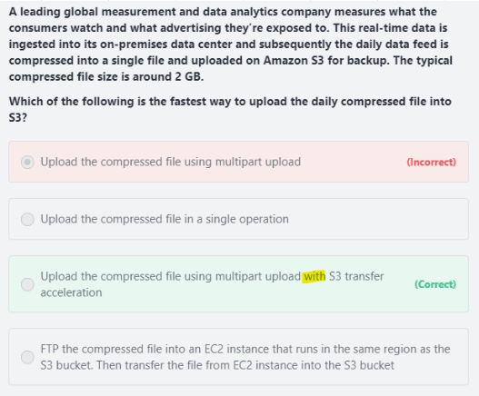

# S3 Transfer Acceleration Vs Global Accelerator										
S3TA is for uploading files to S3 bucket										
GA is for improving performance of Applications (HTTP/HTTPS/TCP/UDP										
										
Question										
"At the end of the financial year, there are thousands of data being uploaded to the central S3 bucket which is in ap-southeast-2 (Sydney) region and a lot of employees are starting to complain about the slow upload times. You were instructed by the CTO to resolve this issue as soon as possible to avoid any delays in processing their global end of financial year (EOFY) reports.   

Which feature in Amazon S3 enables fast, easy, and secure transfer of your files over long distances between your client and your Amazon S3 bucket?"										
										
- Customers who have either web or mobile applications with widespread users or applications hosted far away from their S3 bucket can experience long and variable upload and download speeds over the Internet. 										
- S3 Transfer Acceleration (S3TA) reduces the variability in Internet routing, congestion and speeds that can affect transfers, and logically shortens the distance to S3 for remote applications.										
- S3 TA improves transfer performance by routing traffic through Amazon CloudFront’s globally distributed Edge Locations and over AWS backbone networks, and by using network protocol optimizations.										
										
AWS Global Accelerator is incorrect because GA is primarily used to optimize the path from your users to your applications which improves the performance of your TCP and UDP traffic. Using Amazon S3 Transfer Acceleration is a more suitable service for this scenario										

## 1. Byte Range Fetch											
"Byte Range Fetching a header is primarily used to retrieve an object in parts
Using the Range HTTP header in a GET request, you can retrieve a specific range of bytes in an object stored in Amazon S3. 

With Range HTTP header in a GET request, you can resume fetching other parts of the object whenever your application is ready. 
This resumable download is useful when you need only portions of your object data. 
It is also useful where network connectivity is poor and you need to react to failures"											
											
## 2. S3 Parallel Requests											
- Amazon S3’s support for parallel requests means you can scale your S3 performance by the factor of your compute cluster, without making any customizations to your application.											
- Amazon S3 does not currently support Object Locking.											
- If two PUT requests are simultaneously made to the same key, the request with the latest timestamp wins.											
- If this is an issue, you will need to build an object-locking mechanism into your application											
- Updates are key-based; there is no way to make atomic updates across keys. For example, you cannot make the update of one key dependent on the update of another key unless you design this functionality into your application.											
											
## 3. S3 Parallel Requests may result in OUTDATED data											

## 4. S3 Parallel request and Byte Range Fetches to DOWNLOAD LARGE Object						
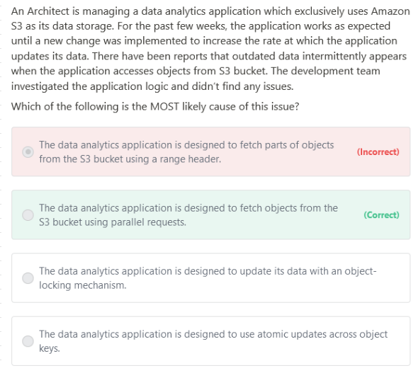

-  Using the Range HTTP header in a GET Object request, you can fetch a byte-range from an object, transferring only the specified portion. 
- You can use concurrent connections to Amazon S3 to fetch different byte ranges from within the same object. 
- This helps you achieve higher aggregate throughput versus a single whole-object request. 
- Fetching smaller ranges of a large object also allows your application to improve retry times when requests are interrupted."											

# S3-Select
## 1. S3 Select operation is based on Bucket name and Object's key		
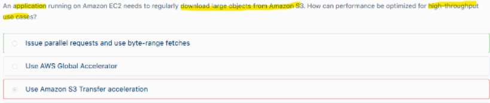

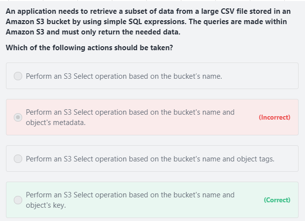

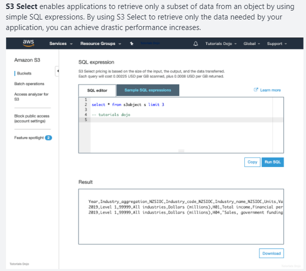

## 2. Query S3 data: Use S3 select or Redshift Spectrum (Kinesis cannot be used to query S3 data)		
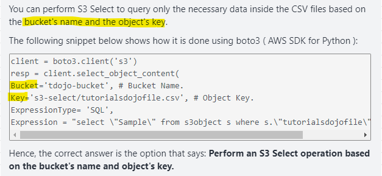

## 3. Firehose processes Streaming data, Firehose cannot process data STORED on S3	
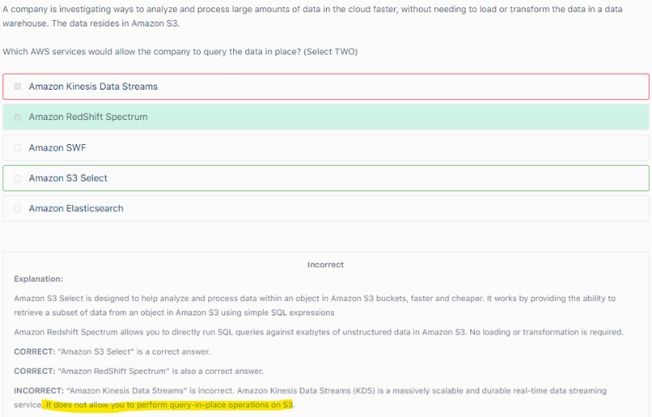

