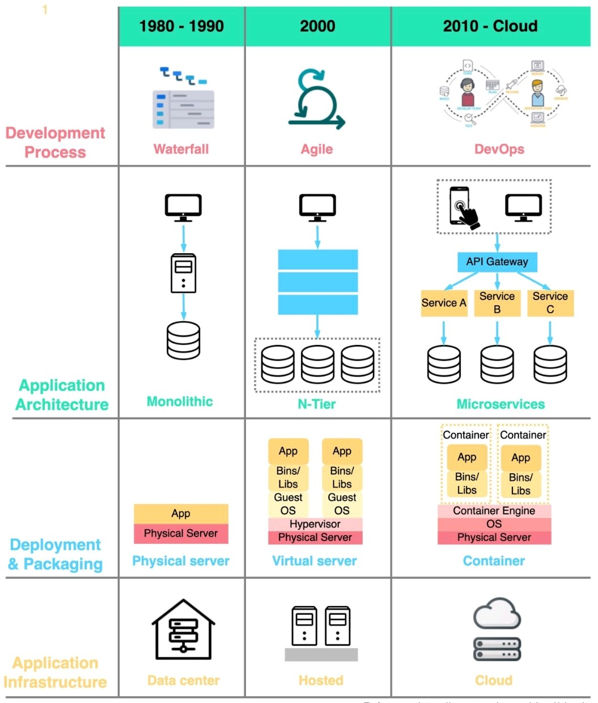
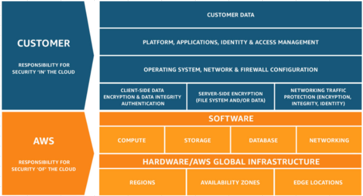

# First things first
- [Design principals](#design-principals)
- [Design concepts](#design-concepts)
- [Security principals](#security-principals)
- [Shared controls](#shared-controls)
- [Data structure and algorithms](𝐃𝐚𝐭𝐚S𝐭𝐫𝐮𝐜𝐭𝐮𝐫𝐞A𝐧𝐝𝐀𝐥𝐠𝐨𝐫𝐢𝐭𝐡𝐦s.pdf)
## Design principals
1. **Operation Excellence**: Ability to run and monitor system to provide business value, and to continually improve supporting processes and procedures
2. **Security**: Protect information/data, systems and assets while delivering business value (risk assessment and mitigation strategies)
3. **Reliability**: Ability of a system to recover from infrastructure or service disruptions
4. **Performance Efficiency**: Ability to use compute resources efficiently (monitoring performance)
5. **Cost optimization**: Ability to avoid or eliminate unneeded cost or suboptimal resources

## Design evolution

## [Design Concepts](https://www.youtube.com/watch?v=SqcXvc3ZmRU)
1. Vertical scaling
2. Horizontal Scaling
3. Microservice Architecture
4. Data preprocessing via Cron job
5. Sharding Database
    - Horizontal Scaling
    - [Database Sharding](https://www.youtube.com/watch?v=5faMjKuB9bc&list=PLMCXHnjXnTnvo6alSjVkgxV-VH6EPyvoX&index=7)
6. Backups and DR (Mater-Slave)
7. Distributed Systems
    - Different AZs
    - Processing and Delivering based on proximity of the user
    - Fault Tolerance
8. Decoupling
9. Load Balancing via Load balancers
10. Logging and Monitoring
    - Auditing
    - Analytics
    - Reporting
    - ML
11. Extensible: Same code to be used for similar use case

## [Security principals](https://github.com/sbhrwl/system_design/blob/main/docs/Security/README.md)
1. Identity federation (principle of least privilege)
2. Automate security best practice
3. Keep people away from data (direct access or manual processing of data)
4. Apply security at all layers
5. Enable traceability
6. Protect data in transit and at rest
7. Prepare for security events

## Shared controls
- Shared Controls are controls which apply to both the infrastructure layer and customer layers, but in completely separate contexts or perspectives. 
- In a shared control, AWS provides the requirements for the infrastructure and the custosmer must provide their own control implernentation  with in their use of AWS services

### Examples include
- **Patch Management**
  - AWS is responsible for patching the underlying hosts and fixing flaws within the infrastructure, but 
  - customers are responsible for patching their guest OS and applications. 
- **Configuration Management**
  - AWS maintains the configuration of its infrastructure devices, but a 
  - customer is responsible for configuring their own guest operating systems, databases, and applications. 
- **Awareness and training**
  - AWS trains AWS employees but a
  - Customer must train their own employees
