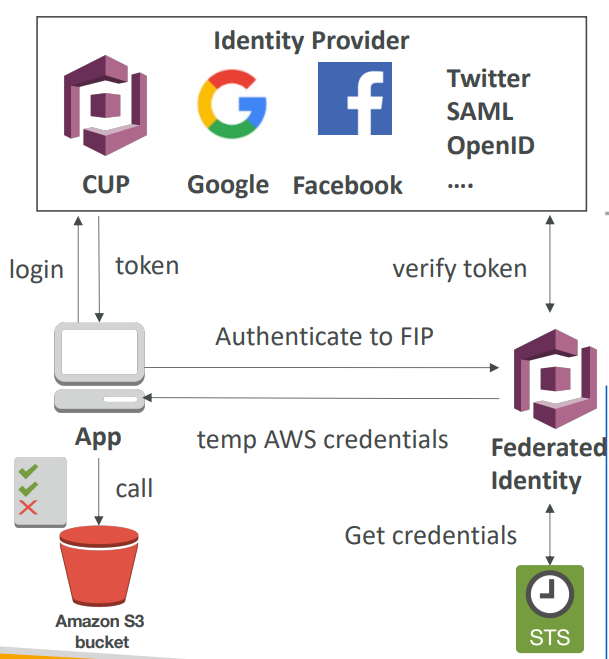
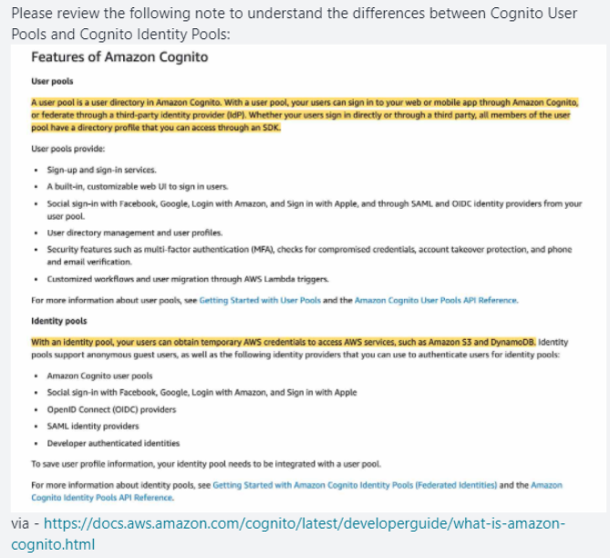

# AWS Cognito
## 1. Cognito User Pool					
- Create a Serverless DB of user for your Mobile Apps					
- Simple log in (Username/Password)					
- CUP sends back JSON Web Token (JWT) containing Cognito ID					
- CUP can be integerated with API Gateway and Application Load Balancer for authentication					
- CUP has direct Integration with Facebook/Google etc					

## 2. Cognito Sync->AppSync					
- Stores preferences, Configuration and State of APP					
- Offers Cross Device Synchronization					
- Requires Federation Identity Pool in Cognito (NOT CUP)					
- Stores data in datasets (upto 1MB) and upto 20 dataset to synchronise					
- Use AWS APPSync instead of Cognito Sync					

## 3. Cognito Identity Pool/Federation											
- Cognito Identity Pool/Federation federates Users and provide them IAM policy to access AWS resources (S3, etc..)
- It is mainly used for Guest users										
- **Goal**
  - Provide direct access to AWS Resources from the Client Side (mobile, web app)
- **Example**
  - Provide (temporary) access to write to S3 bucket using Facebook Login
  - **Problem**
    - We do not want to create IAM users for our app users
- **How**
  - Log in to federated identity provider or **remain anonymous**
    - Get temporary AWS credentials back from the Federated Identity Pool
    - These credentials come with a pre-defined IAM policy stating their permissions

- Get Token from Web Identity provider (CUP/Facebook/Google)											
- Use this Token to Authenticate through Cognito Federated Identity, and get Temp AWS credentials (STS Token)											
- Connect to AWS resource S3 
- Cognito also supports MFA											

## Question

