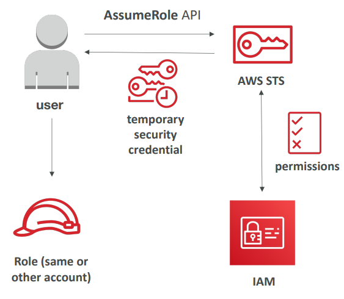

# Identity Federation
- [Where are Users](#where-are-users)
- [Identity Federation](#identity-federation)
- [Identity Federation in AWS](#identity-federation-in-aws)
  - [STS](#sts)
  - [STS Assume Role](#sts-assume-role)
    - [Options for assuming role](#options-for-assuming-role)
    - [STS assume role in action](#sts-assume-role-in-action)
  - [SAML2 Federation](#saml2-federation)
    - [SAML2 and assume role](#saml2-and-assume-role)
  - [Other types of Identity Federation](#other-types-of-identity-federation)
## Where are Users											
- **In organisation**
  - LDAP					
  - AD					
  - Customer Identity broker					
- **On the Web**
  - Facebook					
  - Google					
  - Cognito User Pool (CUP)					

## Identity Federation
- Identity Federation is 
  - process of **authenticating users** via User Pool that you may or may not own (guest users) and then 
  - **providing the needed permission** to access a resource or perform an operation
## Identity Federation in AWS
- Federation lets users outside of AWS to **assume temporary role** for accessing AWS resources.
- These users assume **identity provided access role**
- Federations can have many flavors
  1. SAML 2.0
  2. Custom Identity Broker
  3. Web Identity Federation with Amazon Cognito
  4. Web Identity Federation without Amazon Cognito
  5. Single Sign On
  6. Non-SAML with AWS Microsoft AD
- Using federation, you don’t need to create IAM users (user management is outside of AWS)
- **IAM and Cognito can be used for Identity federation**

### STS
- AWS offers [Security Token Service](https://docs.aws.amazon.com/STS/latest/APIReference/welcome.html)
  - AWS provides AWS Security Token Service (AWS STS) as a web service that enables you to request **temporary, limited-privilege credentials** for users

## STS Assume Role
- Allows temporary, limited access to AWS resources	
- Token is valid for 1 hour	
- AssumeRole within your account for enhance security
- For Cross Account Access **assume role in target account to perform actions there**
### Options for assuming role
1. **AssumeRole with SAML**	
   - Return credentials for user, who is logged in with SAML	
2. **AssumeRole with WebIdentity**
   - Return credentials for users logged in with IdP (Facebook, Google)	
   - Instead of using WebIdentity use Cognito	
3. **GetSession Token**
   - GetSession token via MFA	
   - For AWS user or Root account user	
### STS assume role in action
- **Using STS to Assume a Role**
  - Define an IAM Role within your account or cross-account
  - Define which principals can access this IAM Role
  - Use AWS STS (Security Token Service) to retrieve credentials and impersonate the IAM Role you have access to (AssumeRole API)
  - Temporary credentials can be valid between 15 minutes to 1 hour

## SAML2 Federation
- To integrate Active Directory / ADFS with AWS (or any SAML 2.0)
- Provides access to AWS Console or CL- (through temporary creds)
- No need to create an IAM user for each of your employees
### [API access to AWS](https://docs.aws.amazon.com/IAM/latest/UserGuide/id_roles_providers_saml.html)

### [Access the AWS Management Console](https://docs.aws.amazon.com/IAM/latest/UserGuide/id_roles_providers_enable-console-saml.html)

### SAML2 and assume role
- SAML2 LDAP					
  - To Integrate LDAP based Identity store with AWS					
  - Provides access to AWS console and CLI					
  - No need to create IAM users for the employees of the organisation					
- **SAML2 ADFS**
  - To Integrate AD based Identity store with AWS					
  - Provides access to AWS console and CLI					
  - No need to create IAM users for the employees of the organisation					

## Other types of Identity Federation
- Via **Custome Identity Broker**
  - Any other Identity store except LDAP or AD, It must also make AP- call to AWS to generate Token
- Via **Web Identity Broker**
  - Use Cognito instead
- IAM and Cognito can be used for Identity federation											
- Federation through SAML is OLD way of doing things, use Amazon SSO instead										
	
## Question

## Question

