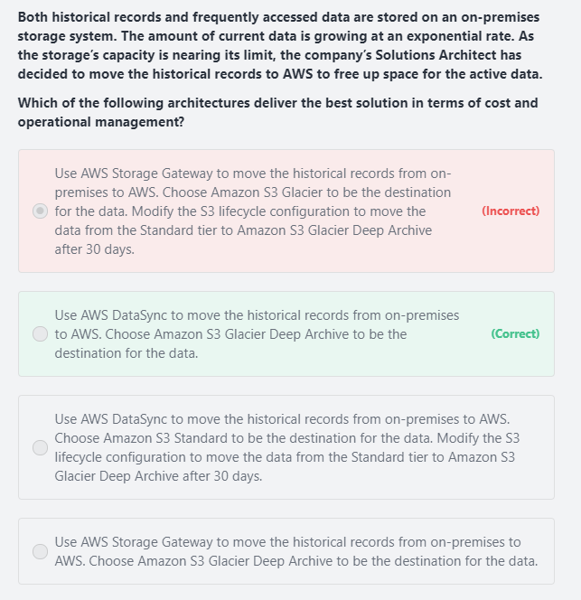

# DataSync
- AWS DataSync allows you to copy large datasets with millions of files, without having to build custom solutions with open source tools, or license and manage expensive commercial network acceleration software. 
- You can use DataSync to migrate active data to AWS, transfer data to the cloud for analysis and processing, archive data to free up on-premises storage capacity, or replicate data to AWS for business continuity."											
- AWS DataSync enables you to migrate your on-premises data to Amazon S3, Amazon EFS, and Amazon FSx for Windows File Server. 
- You can configure DataSync to make an initial copy of your entire dataset, and schedule subsequent incremental transfers of changing data towards Amazon S3.
- Enabling S3 Object Lock prevents your existing and future records from being deleted or overwritten."											
											
- AWS DataSync is primarily used to migrate existing data to Amazon S3. 											
- On the other hand, AWS Storage Gateway is more suitable if you still want to retain access to the migrated data and for ongoing updates from your on-premises file-based applications											

