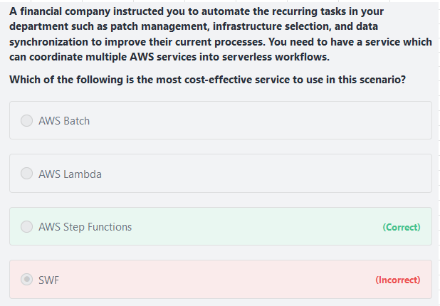

# Step Functions

## 1. Serverless Orchestration										
- AWS Step Functions provides serverless orchestration for modern applications.										
- Orchestration centrally manages a workflow by breaking it into multiple steps, adding flow logic, and tracking the inputs and outputs between the steps.			
- As your applications execute, Step Functions maintains application state, tracking exactly which workflow step your application is in, and stores an event log of data that is passed between application components.										
- That means that if networks fail or components hang, your application can pick up right where it left off.																			
- Application development is faster and more intuitive with Step Functions, because you can define and manage the workflow of your application independently from its business logic.										
- Making changes to one does not affect the other. You can easily update and modify workflows in one place, without having to struggle with managing, monitoring and maintaining multiple point-to-point integrations										
- Step Functions frees your functions and containers from excess code, so your applications are faster to write, more resilient, and easier to maintain.										
## 2. Steps function Vs SWF										
- SWF is a fully-managed state tracker and task coordinator service. 
- SWF does not provide serverless orchestration to multiple AWS resources.								
										
## 3. Serverless Workflows

