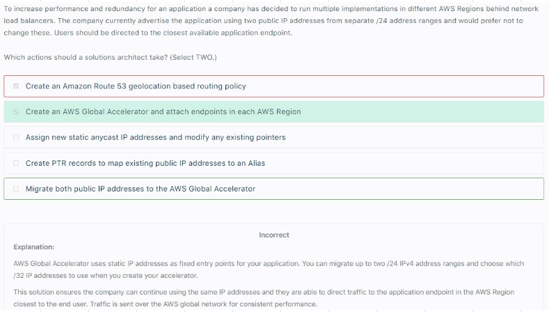

# Global Accelerator
## 1. Overview		
- Creates 2 AnyCast IP for our Application, you can use IP address that was used to access EXISTING application		
- AnyCast IP send Traffic directly to Edge Location		
- Edge location send the traffic directly to the application		
## 2. Consistent Performance		
- Intelligent Routing to LOWEST Latency		
- Fast regional failover		
- Internal AWS network		
## 3. Health Checks		
- GA performs Health checks to our Application		
- Makes Application GLOBAL		
- FAILOVER < 1 minute		
## 4. Security		
- ONLY 2 IP to be Whitelisted		
- DDoS protection with AWS Shield		
## 5. Steps
- Launch an Instance in US
- Launch an Instance in India 
- Create GLobal accelerator
- Add "listener (Port 80-HTTP traffic) 
- Add Endpoint Group 
  - One endpoint group for US 
  - One endpoint group for India 
- Add EC2 instance (or LB) to endpoint group 

## 6. AWS Global Accelerator vs CloudFront 
- They both use the AWS global network and its edge locations around the world
- Both services integrate with AWS Shield for DDoS protection. 
### CloudFront
- Improves performance for both cacheable content (such as images and videos)
- Dynamic content (such as API acceleration and dynamic site delivery)
- Content is served at the edge 
### Global Accelerator
- Improves performance for a range of applications over TCP or UDP
- Proxying packets at the edge to applications running in one or more AWS Regions.
- Good fit for non-HTTP use cases, such as gaming (UDP), loT (MQTT), Voice over IP
- Good for HTTP use cases that require 
  - Static IP addresses
  - Deterministic fast regional failover 

## 7. Traffic traverses the AWS global network
- A web application is deployed in multiple regions behind an ELB Application Load Balancer. 
- You need deterministic routing to the closest region and automatic failover. 
- Traffic should traverse the AWS global network for consistent performance.										
### 
- CORRECT: Configure AWS Global Accelerator and configure the ALBS as targets" is the correct answer. 
- INCORRECT: Place an EC2 Proxy in front of the ALB and configure automatic (fallover is incorrect. Placing an EC2 proxy in front of the ALB does not meet the requirements. This solution does not ensure deterministic routing the closest region and failover is happening within a region which does not protect against regional failure. Also, this introduces a potential bottleneck and lack of redundancy. 
- INCORRECT: Use a Cloud front distribution with multiple custom origins in each region and configure for high availability is incorrect. You can use  CloudFront with multiple custom origins and configure for HA. However, the traffic will not be traverse the **AWS global network**
## 8. Why GA
- When the application usage grows, the number of IP addresses and endpoints that you need to manage also increase.											
- AWS Global Accelerator allows you to scale your network up or down											
- AWS Global Accelerator lets you associate regional resources, such as load balancers and EC2 instances, to two static IP addresses. 											
- You only whitelist these addresses once in your client applications, firewalls, and DNS records.																						
## 9. Use cases											
- With AWS Global Accelerator, you can 
  - add or remove endpoints in the AWS Regions, 
  - run blue/green deployment, and 
  - A/B test without needing to update the IP addresses in your client applications.										
- This is particularly useful for IoT, retail, media, automotive, and healthcare use cases in which client applications cannot be updated frequently.																
## 10. How does GA helps to reduce number of IP addresses? Use Endpoint group											
- If you have multiple resources in multiple regions, you can use AWS Global Accelerator to reduce the number of IP addresses. 											
- By creating one endpoint group, you can add all of your EC2 instances in different regions in that group.											
- The created accelerator would have two static IP addresses that you can use to create a security rule in your firewall device.											
- Instead of regularly adding the Amazon EC2 IP addresses in your firewall, you can use the static IP addresses of AWS Global Accelerator to automate the process and eliminate this repetitive task.											
											
## 11. GA and NLB											
- NLB is not suitable to route traffic to your ALBs across multiple Regions. 
- You have to use AWS Global Accelerator instead.
