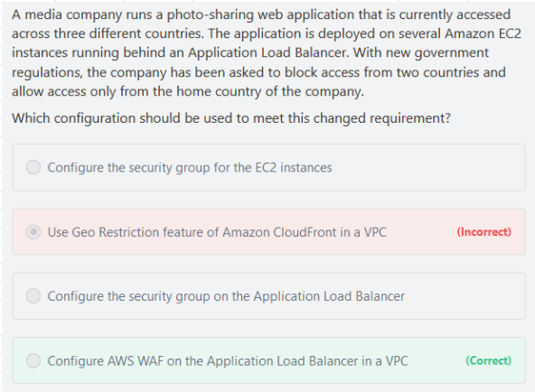

# Distributing content
## 1. Overview		
- Caches content at Edge (216 edge locations)		
- DDoS protection, integration with WAF		
- Exposes HTTPS endpoints and can talk to internal HTTP/HTTPS backends		

## 2. Origins		
- S3 Bucket		
  - Distributing files		
  - Enhance Security with Cloudfront OAI		
  - Cloudfront as INGRESS to upload files to S3		
- Custome Origin (HTTP)		
  - ALB (must allow Public IP of Edge locations)		
  - EC2 (must allow Public IP of Edge locations)		
  - S3 website		
  - Any HTTP endpoint 		
- You can't set Lambda@Edge functions as part of your origin group in CloudFront		
## 3. Geo Restriction		
- Whitelist		
Allow user to access content only if they are in approved list of countries		
- Blacklist		
Block user to access content only if there are in blacklist of banned countries		
### 3.1 Geo Restriction WAF offers Geo Match condition

#### AWS WAF
- AWS WAF is a web application firewall service that lets you monitor web requests and protect your web applications from malicious requests. 
- Use AWS WAF to block or allow requests based on conditions that you specify, such as the IP addresses. 
- You can also use AWS WAF preconfigured protections to block common attacks like SQL injection or cross-site scripting. 
- Configure AWS WAF on the Application Load Balancer in a VPC You can use AWS WAF with your Application Load Balancer to allow or block requests based on the rules in a web access control list (web ACL). 
- Geographic (Geo) Match Conditions in AWS WAF allows you to use AWS WAF to restrict application access based on the geographic location of your viewers. - With geo match conditions you can choose the countries from which AWS WAF should allow access. 
- Geo match conditions are important for many customers. 
- For example, legal and licensing requirements restrict some customers from delivering their applications outside certain countries. 
- These customers can configure a whitelist that allows only viewers in those countries. 
- Other customers need to prevent the downloading of their encrypted software by users in certain countries. 
- These customers can configure a blacklist so that end-users from those countries are blocked from downloading their software. 
- Incorrect options: 
  - Use Geo Restriction feature of Amazon CloudFront in a VPC 
  - Geo Restriction feature of CloudFront helps in restricting traffic based on the user's geographic location.
  - But, CloudFront works from edge locations and diS MP Mlle Hence, this option itself is incorrect
## 4. HTTPS Support		
- Exposes HTTPS endpoints and can talk to internal HTTPS backends		
- We can associate certificate (generated using ACM etc) with our Web Distribution		
- Enable the SNI support as well when using HTTPS		
## 5. How to restrict users to circumvent Cloudfront
1. When distributing from S3  via Cloudfront
- Use OAI to restrict users to circumvent Cloudfront											
2. When distributing from ELB											
- Create a VPC security Group for the ELB to ALLOW traffic only from Cloudfront internal service IP											
- As Cloudfront Intenal SERVICE IP change also, so use Lambda to UPDATE security group for ELB											
## 6. How long can an Object stay in the cache?											
- You can control how long your objects stay in a CloudFront cache before CloudFront forwards another request to your origin. 
- Reducing the duration allows you to serve dynamic content. 
- Increasing the duration means your users get better performance because your objects are more likely to be served directly from the edge cache. 
- A longer duration also reduces the load on your origin
- The Cache-Control and Expires headers control how long objects stay in the cache. 
- The Cache-Control max-age directive lets you specify how long (in seconds) you want an object to remain in the cache before CloudFront gets the object again from the origin server.

- The minimum expiration time CloudFront supports is 0 seconds for web distributions and 3600 seconds for RTMP distributions
- Typically, CloudFront serves an object from an edge location until the cache duration that you specified passes — that is, until the object expires. 
- After it expires, the next time the edge location gets a user request for the object, CloudFront forwards the request to the origin server to verify that the cache contains the latest version of the object. 

## 7. Origin Failover		
- Create an Origin Group with 2 Origins		
- Specify One Origin as PRIMARY and another Origin as Failover		
- When Primary Origin return HTTP FAILURE codes, Cloudfront Automatically switches to Second Origin		
## 8. Cloudfront Signed URL/Cloudfront Signed Cookies		
- Signed URL: One Signed URL per file		
- Signed Cookie: One Signed Cookie for Multiple files		
- AWS has Trusted Signers to generate Signed URL/Cookies		
- Use SDK or CLI to generate Signed URLs		
  - URL Expiration period
  - IP ranges to access data from
## 9. Field Level Encryption		
- Adds EXTRA Level of ENCRYPTION at Cloudfront EDGE Locations		
## 10. Customize Content		
- Customize the content that is delivered to End Users by using Lambda@Edge		
- Allows us to Execute Authentication Functions/Process in AWS locations CLOSE to the end users		

## 11. Cloudfront Signed URL Vs S3 Pre Signed URL

## 12. Cloudfront Vs S3 Cross Region Replciation
### CloudFront
- Global Edge network
- Files are cached for a TTL (maybe a day) • Great for static content that must be available everywhere 
### S3 Cross Region Replication
- Must be setup for each region you want replication to happen
- Files are updated in near real-time • Read only
- Great for dynamic content that needs to be available at low-latency in few regions 
