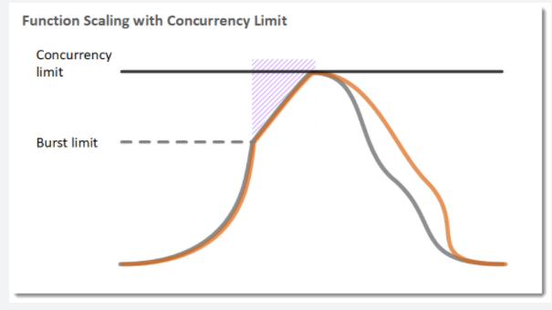
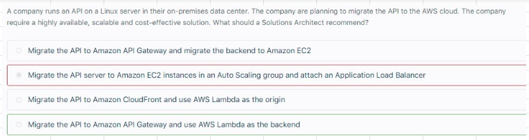
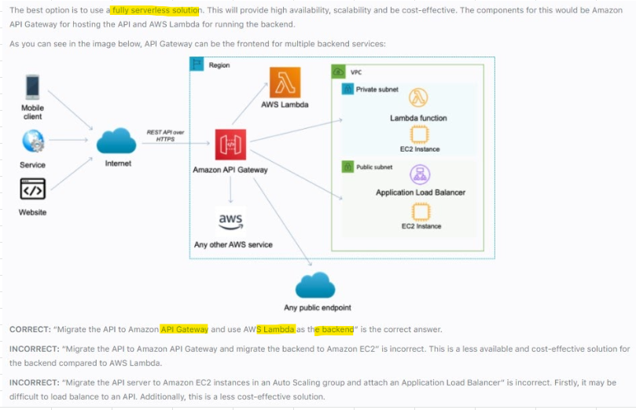

# API Gateway

## 1. Overview
- Proxies Request		
- Caches API repsonses, Enable Caching for a STAGE to improve performance and set TTL, default TTL is 300 seconds and can be increased upto 3600 seconds		
- Transform and validate Requests and Responses		
- Generate SDK and API specifications		
- Enables you to build RESTful APIs and WebSocket APIs that are optimized for serverless workloads		
- Offers Authentication and Authorization		
- You pay only for the API calls you receive and the amount of data transferred out		

## 2.Integration		
- Lambda + API gateway: No infrastructure to manage		
- HTTP Endpoints
  - Internal On Premise HTTP app
  - ALB
- AWS services Expose all AWS API via API Gateway

## 3. Endpoints		
- Edge Optimized (Default)		
  - Request are routed through Cloudfront Edge locations		
  - API gateway still lives in ONE REGION		
- Regional		
  - For Clients within same region		
  - Could manually combine with Cloudfront to offer control over caching and distribution of content		
- Private		
  - Can be accessed only from your VPC by creating INTERFACE endpoint		
  - Define Resource policy to provide access		
### 3.1. API Gateway expose HTTPS endpoints only 

## 4. Throttling		
- Offers Throttling Limits to control spikes in Traffic, ex: 1000 request/seconds 		
- We can also configure to handle burst, ex: 2000 request/second for few seconds		

### 4.1. Throttling: 429 Too Many Requests

## 5. Usage plan					
- Usage Plan defines
  - Who can access API
  - How much and How fast they can access APIs
  - Quota Limit can be applied to Usage plan to limit number of requests"					
- Create API Keys					
- Import API keys					
- Distribute API keys to customers					
- After creating a Usage Plan, Usage plan must be associated with
  - DEPLOYMENT stage
  - API keys
## 6. Client Certificates					
- To ensure HTTP requests to your BE services are originating from API gateway, use Client certificates to VERIFY Requester'a Authenticity

# API Gateway Security
## 1. IAM Permission			
- For Users and Roles already in our AWS account			
- Handles Authentication and Authorization			
- Leverages Sig v4			

## 2. Lambda Authorizer			
- Use AWS Lambda to verify the 3rd party tokens passed in the request header			
- Lambda must return an IAM Policy for the user			
- Helps to use OAuth/SAML/3rd party type of Authentication			
- Can cache result of Authentication			
- Pay per Lambda invocation			

## 3. Cognito User Pool (CUP)			
- Cognito manages User life cycle of users in the user pool (backed by Facebook/Google)			
- API Gateway verifies identity automatically from AWS Cognito			
- Must implement Authorization in the backend			

# API Gateway with Lambda
## Use API Gateway and Lambda to handle Burst of traffice instead of API gateway with ASG of EC2 instances
- AWS Lambda lets you run code without provisioning or managing servers. 
- You pay only for the compute time you consume. 
- With Lambda, you can run code for virtually any type of application or backend service - all with zero administration. 
- Just upload your code, and Lambda takes care of everything required to run and scale your code with high availability. 
- You can set up your code to automatically trigger from other AWS services or call it directly from any web or mobile app. 
- The first time you invoke your function, AWS Lambda creates an instance of the function and runs its handler method to process the event. 
- When the function returns a response, it stays active and waits to process additional events. 
- If you invoke the function again while the first event is being processed, Lambda initializes another instance, and the function processes the two events concurrently. 
- As more events come in, Lambda routes them to available instances and creates new instances as needed. 
- When the number of requests decreases, Lambda stops unused instances to free up the scaling capacity for other functions. 

 
## Migrating On Premise Linux API server to AWS and making it HA

- Your functions concurrency is the number of instances that serve requests at a given time. 
- For an initial burst of traffic your functions' cumulative concurrency in a Region can reach an initial level of between 500 and 3000, which varies per Region. 
- Based on the given scenario, you need to create a solution that will satisfy the two requirements. 
- The first requirement is to create a solution that will allow the users to access the data using an API. 
  - To implement this solution, you can use Amazon API Gateway. 
- The second requirement is to handle the burst of traffic within seconds. 
  - You should use AWS Lambda in this scenario because Lambda functions can absorb reasonable bursts of traffic for approximately 15-30 minutes. 
  - Lambda can scale faster than the regular Auto Scaling feature of Amazon EC2, Amazon Elastic Beanstalk, or Amazon ECS. 
  - This is because AWS Lambda is more lightweight than other computing services. 
  - Under the hood, Lambda can run your code to thousands of available AWS-managed EC2 instances (that could already be running) within seconds to accommodate traffic. 
  - This is faster than the Auto Scaling process of launching new EC2 instances that could take a few minutes or so. 
  - An alternative is to overprovision your compute capacity but that will incur significant costs. 
  - The best option to implement given the requirements is a combination of AWS Lambda and Amazon API Gateway. 
  - Hence, the correct answer is: **Create an API using Amazon API Gateway and use AWS Lambda to handle the bursts of traffic. **
- The option that says: Create an API using Amazon API Gateway and use the Amazon ECS cluster with Service Auto Scaling to handle the bursts of traffic in seconds is **incorrect**. AWS Lambda is a better option than Amazon ECS since it can handle a sudden burst of traffic within seconds and not minutes. 
- The option that says: Create an API using Amazon API Gateway and use Amazon Elastic Beanstalk with Auto Scaling to handle the bursts of traffic in seconds is **incorrect** because Just like the previous option, the use of Auto Scaling has a delay of a few minutes as it launches new EC2 instances that will be used by Amazon Elastic Beanstalk. 
- The option that says: Create an API using Amazon API Gateway and use an Auto Scaling group of Amazon EC2 instances to handle the bursts of traffic In seconds is **incorrect** because the processing time of Amazon EC2 Auto Scaling to provision new resources takes minutes. Take note that in the scenario, a burst of traffic within seconds is expected TO happen. 

