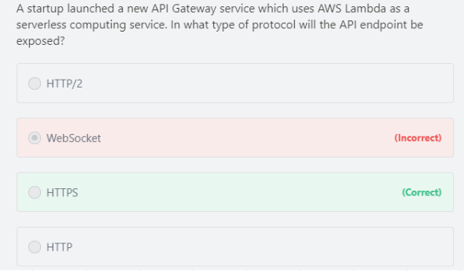
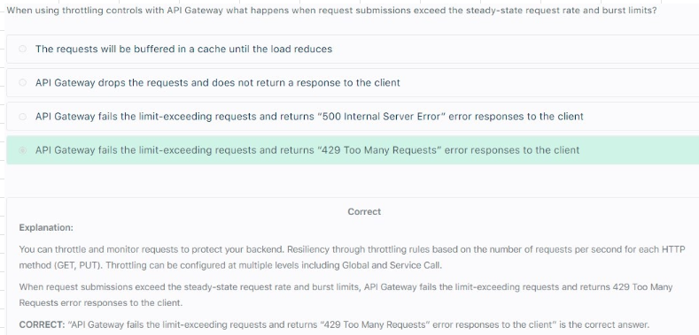

# API Gateway

## 1. Overview
- Proxies Request		
- Caches API repsonses, Enable Caching for a STAGE to improve performance and set TTL, default TTL is 300 seconds and can be increased upto 3600 seconds		
- Transform and validate Requests and Responses		
- Generate SDK and API specifications		
- Enables you to build RESTful APIs and WebSocket APIs that are optimized for serverless workloads		
- Offers Authentication and Authorization		
- You pay only for the API calls you receive and the amount of data transferred out		

## 2.Integration		
- Lambda + API gateway: No infrastructure to manage		
- HTTP Endpoints
  - Internal On Premise HTTP app
  - ALB
- AWS services Expose all AWS API via API Gateway

## 3. Endpoints		
- Edge Optimized (Default)		
  - Request are routed through Cloudfront Edge locations		
  - API gateway still lives in ONE REGION		
- Regional		
  - For Clients within same region		
  - Could manually combine with Cloudfront to offer control over caching and distribution of content		
- Private		
  - Can be accessed only from your VPC by creating INTERFACE endpoint		
  - Define Resource policy to provide access		
### 3.1. API Gateway expose HTTPS endpoints only 

## 4. Throttling		
- Offers Throttling Limits to control spikes in Traffic, ex: 1000 request/seconds 		
- We can also configure to handle burst, ex: 2000 request/second for few seconds		

### 4.1. Throttling: 429 Too Many Requests

## 5. Usage plan					
- Usage Plan defines
  - Who can access API
  - How much and How fast they can access APIs
  - Quota Limit can be applied to Usage plan to limit number of requests"					
- Create API Keys					
- Import API keys					
- Distribute API keys to customers					
- After creating a Usage Plan, Usage plan must be associated with
  - DEPLOYMENT stage
  - API keys
## 6. Client Certificates					
- To ensure HTTP requests to your BE services are originating from API gateway, use Client certificates to VERIFY Requester'a Authenticity

# API Gateway Security
## 1. IAM Permission			
- For Users and Roles already in our AWS account			
- Handles Authentication and Authorization			
- Leverages Sig v4			

## 2. Lambda Authorizer			
- Use AWS Lambda to verify the 3rd party tokens passed in the request header			
- Lambda must return an IAM Policy for the user			
- Helps to use OAuth/SAML/3rd party type of Authentication			
- Can cache result of Authentication			
- Pay per Lambda invocation			

## 3. Cognito User Pool (CUP)			
- Cognito manages User life cycle of users in the user pool (backed by Facebook/Google)			
- API Gateway verifies identity automatically from AWS Cognito			
- Must implement Authorization in the backend			
