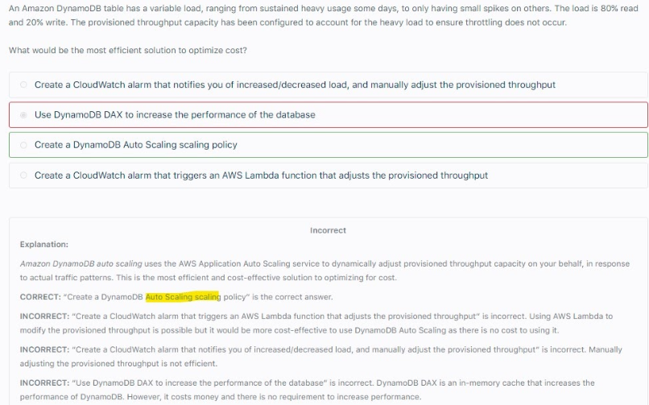
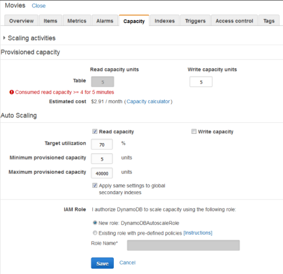
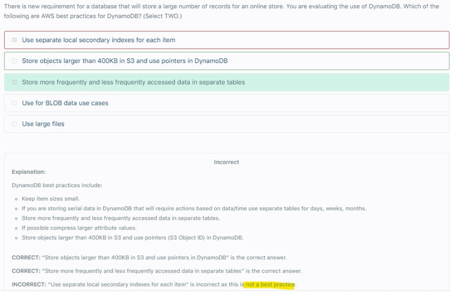
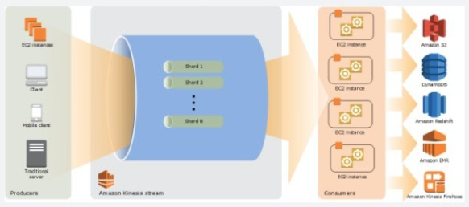

# Dynamo DB
## 1. Overview		
- Fully Managed, HA, Replication across 3 AZ		
- NoSQL Database		
- Scales to massive workloads and supports Distributed DBs		
- Millions of Request/sec, 100s TB of Storage		
- Event Driven Programing with DynamoDB streams		
- Integrated with IAM for security, authorization and administration		
- Each table has a Primary Key
  - Use HIGH CARDINALITY partition key (Each Distinct value has Large number of items)
- Max size of an item is 400KB		
- Auto Scaling is not enabled in a DynamoDB table which is created using the AWS CLI		
## 2. Provisioned Throughput		
- RCU Read Capacity Units: $0.00013 per RCU
  - 1 RCU= 1 strongly consistent read of 4kb per second
  - 1 RCU= 2 eventually consistent read of 4kb per second
- WCU Write Capacity Units: $0.00065 per RCU
  - 1 WCU = 1 write of 1kb per second		
- Throughput (RCU and WCUs) can be increased temporarily using BURST Credit		
- If BURST Credit is empty, it will raise PrivisionedThroughputExceeded Exception		
- In such cases do "Exponential Backoff Try"

## 3. Capacity Planning		
- Plan RCU and WCU needed for your application (use calculator on DynamoDB console)		
- Provisioned Capacity together with Auto Scaling keeps RCUs and WCUs withing provisioned limits		

## 4. On Demand Capacity		
- Scales Automatically, no capacity planning needed		
- 2.5X more expensive
- Helpful when loads are unpredictable
## 5. Use DynamoDB AutoScaling if we want to utilize provisioned capacity efficiently and save on cost

## 6. Security			
- Encryption:
  - In flight: HTTPS
  - At rest: KMS
  - CSE also supported
- Access Controls: IAM policies to restrict access to DynamoDB			
## 7. Backup and Restore			
- Point in time restore like RDS			
- Use DMS to migrate from MongoDB, Oracle, MySQL, S3 to DynamoDB			
## 8. Transactions			
- Coordinated Insert, Update and Delete across Multiple tables			
- Include upto 10 unique items or upto 4MB of data			
## 9. DaX
- Amazon DynamoDB Accelerator (DAX) is a fully managed, highly available, in-memory cache for DynamoDB that delivers up to a 10x performance improvement — from milliseconds to microseconds — even at millions of requests per second. 
- DAX does all the heavy lifting required to add in-memory acceleration to your DynamoDB tables, without requiring developers to manage cache invalidation, data population, or cluster management. 

## 10. DaX Cluster			
- DaX Caches the Most Frequent Read values, MICRO second latency			
- DaX Offloads heavy reads on "Hot Keys" from DynamoDB itself, hence prevent PrivisionedThroughputExceeded exception			
- WRITES Go through DaX to DynamoDB			
- Default 5 min TTL			
- 10 Nodes in a cluster			
## 11. DynamoDB Streams			
- Changes (CUD) in DynamoDB end up in DynamoDB streams			
- Lambda can read DynamoDB streams and 
  - React to changes in real time
  - Perform Analytics
  - Insert into Elastic Search
  - Insert into another table"			
- Helps in Implementing CRR			
- 24 hour Data retention			
## 12. Global Table			
- Serves the purpose of CRR			
- Must enable DynamoDB streams			
- Solves Low Latency DR problems			

## 13. Aurora Globa DB Vs DynamoDB Global Table
- Amazon Aurora Global Database provides read access to a database in multiple regions									
- Amazon Aurora Global Database offers failover to your read-only DBs and promote them to writable							
- Amazon Aurora Global Database does not provide active-active configuration with bi-directional synchronization.											
- Amazon DynamoDB global tables provide a fully managed solution for deploying a multi-region, multi-master database
- Amazon DynamoDB global tables provides an active-active configuration where reads and writes can take place in multiple regions with full bi-directional synchronization											

## 14. Best Practices
- Keep Item size small											
- Store more freqently and less frequently accessed data in separate tables											
- Supports compressing of values											
- Use pointer to S3 for larger objects (>400KB)											
- If Data is queried based on date-time, use separate tables to query data based on Days, Weeks and Months											

## 15. DynamoDB with Kinesis
- A company has a data analytics application that updates a real-time, foreign exchange dashboard and another separate application that archives data to Amazon Redshift. 
- Both applications are configured to consume data from the same stream concurrently and independently by using Amazon Kinesis Data Streams. 
- However, they noticed that there are a lot of occurrences where a shard iterator expires unexpectedly. 
- Upon checking, they found out that the DynamoDB table used by Kinesis does not have enough capacity to store the lease data. 
- Which of the following is the most suitable solution to rectify this issue? 
[ ] **Increase the write capacity assigned to the shard table. **

### Explanation
- A new shard iterator is returned by every GetRecords request (as NextShardIterator which you then use in the next GetRecords request (as ShardIterator ). - Typically, this shard iterator does not expire before you use it. 
- However, you may find that shard iterators expire because you have not called GetRecords for more than 5 minutes, or because you've performed a restart of your consumer application. 
- If the shard iterator expires immediately before you can use it, this might indicate that the DynamoDB table used by Kinesis does not have enough capacity to store the lease data. 
- This situation is more likely to happen if you have a large number of shards. To solve this problem, increase the write capacity assigned to the shard table. 
- Hence, increasing the write capacity assigned to the shard table is the correct answer. 
