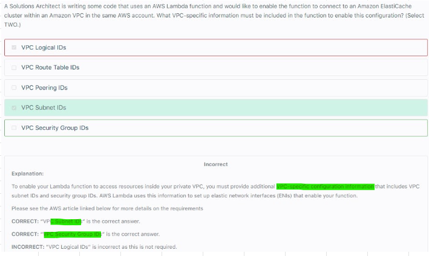
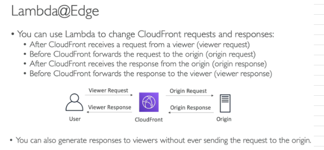
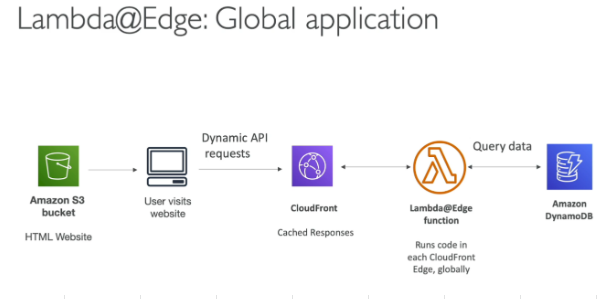

# Lambda
## 1. Overview			
- Virtual FUNCTIONS in cloud			
- Run On Demand, Scaling is AUTOMATED			
- Easy to get more resources per function, Increasing RAM improves CPU and network			
- When Lambda scales and if VPC doesnot have sufficient ENIs or subnet IPs it would throw EC2ThrottledException			
- You must specify atleast ONE subnet in each AZ attached to your Lambda function			
## 2. Use cases			
- New Image Push to S3 triggers Lambda			
  - Lambda creates and pushes Thumbnail to S3
  - Lambda pushes Metadata of Image to DynamoDB
- Serverless CRON Job			
  - Cloudwatch Events triggers Lambda every hour to perform some tasks			
## 3. Limits			
- Execution Limits			
  - Memory Allocations 128 MB To 3008 MB (64 MB increments)
  - Environment variables: 4KB
  - Disk Capacity in function container (in /tmp): 512MB
  - Concurrent Executions: 1000 (can be increased)
- Deployment Limits			
  - Compressed (.zip) deployment size: 50MB
  - Uncompressed deployment size: 250MB"			
  - Environment variables: 4KB
  - Lambda can use /tmp to load other files at STARTUP
## 4. Lambda Metrices that Cloudwatch can track
- Latency per request
- Total Number of requests											

## 5. How to do network setup for Lambda

## 6. Lambda@Edge											
- Global Lambda											
- Lambda function alongside Cloudfront											
- Helps to Build more responsive Apps by Customizing CDN content											
- Lambda is deployed globally, we do not need to manage servers											
- Pay only for what you use											
- You can't set Lambda@Edge functions as part of your origin group in CloudFront											
- Use cases
  - User Authentication and Authorization
  - User Priortization
  - User Tracking and Analytics
### 6.1. Change Cloudfront Request and Response

### 6.2. Global Application

