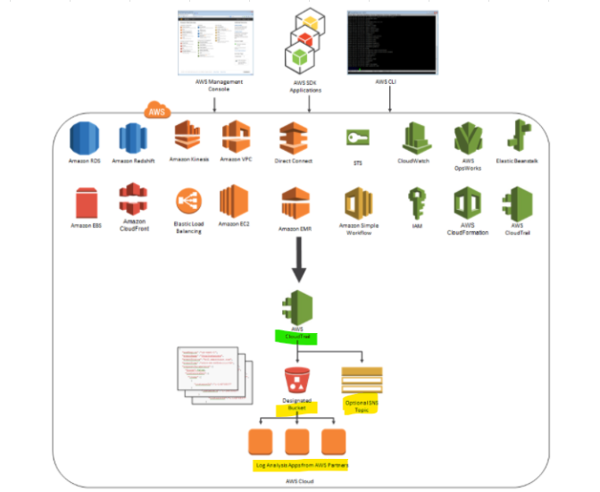
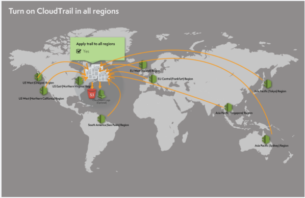

# Cloudtrail
## 1. Object Level Logging

## 2. Encryption and Cloudtrail
- By default, CloudTrail event log files are encrypted using Amazon S3 server-side encryption (SSE). 
- You can also choose to encrypt your log files with an AWS Key Management Service (AWS KMS) key. 
- You can store your log files in your bucket for as long as you want. 
- You can also define Amazon S3 lifecycle rules to archive or delete log files automatically. 
- If you want notifications about log file delivery and validation, you can set up Amazon SNS notifications.

## 3. Cloudtrail in all Regions
- An event in CloudTrail is the record of an activity in an AWS account. 
- This activity can be an action taken by a user, role, or service that is monitorable by CloudTrail. 
- CloudTrail events provide a history of both API and non-API account activity made through the AWS Management Console, AWS SDKs, command line tools, and other AWS services. 
- There are two types of events that can be logged in CloudTrail
  - Management events and 
  - Data events.
- By default, trails log management events, but **not data events**
### Turn on CloudTrail in all regions 

- A trail can be applied to all regions or a single region. 
- As a best practice, create a trail that applies to all regions in the AWS partition in which you are working. 
- This is the default setting when you create a trail in the CloudTrail console. 
- For most services, events are recorded in the region where the action occurred. For global services such as AWS Identity and Access Management (IAM), AWS STS, Amazon CloudFront, and Route 53, events are delivered to any trail that includes global services, and are logged as occurring in US East (N. Virginia) Region.
- In this scenario, the company requires a secure and durable logging solution that will track all of the activities of all AWS resources on all regions
- CloudTrail can be used for this case with multi-region trail enabled, however, it will only cover the activities of the regional services (EC2, S3, RDS etc.) and not for global services such as IAM, CloudFront, AWS WAF, and Route 53. 
- In order to satisfy the requirement, you have to add the **--include-global-service-events** parameter in your AWS CLI command. 
- The option that says: Set up a new CloudTrail trail in a new 53 bucket using the AWS CL1 and also pass both the **--is-muLti-region-trail** and **--include-global-service-events** parameters then encrypt log files using KMS encryption. 
- Apply Multi Factor Authentication (MFA) Delete on the 53 bucket and ensure that only authorized users can access the logs by configuring the bucket policies is **correct** because it provides security, integrity, and durability to your log data and in addition, 
  - it has the **--include-global-service-events** parameter enabled which will also include activity from global services such as IAM, Route 53, AWS WAF, and CloudFront. 
