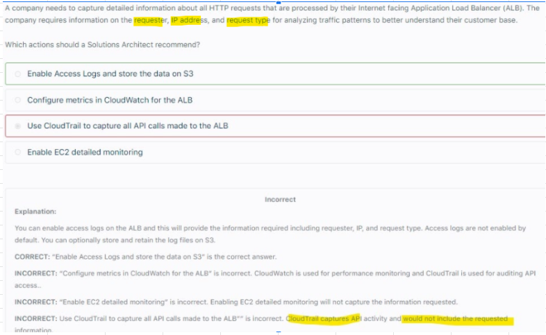
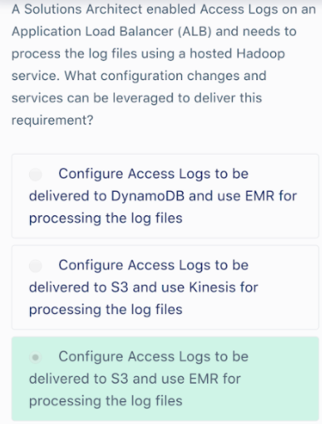

# ELB Access Logs											
- Elastic Load Balancing provides access logs that capture detailed information about requests sent to your load balancer.											
- Each log contains information such as the 
  - Time the request was received, 
  - Client's IP address, 
  - Latencies, 
  - Request paths, and 
  - Server responses.										
- You can use these access logs to analyze traffic patterns and troubleshoot issues.											
- After you enable access logging for your load balancer, Elastic Load Balancing captures the logs and stores them in the Amazon S3 bucket that you specify as compressed files. 
You can disable access logging at any time."											
- Each access log file is automatically encrypted using SSE-S3 before it is stored in your S3 bucket and decrypted when you access it. 
You do not need to take any action; the encryption and decryption is performed transparently.											
- There is no additional charge for access logs. You are charged storage costs for Amazon S3, but not charged for the bandwidth used by Elastic Load Balancing to send log files to Amazon S3.											
											
## 1. ELB access logs: Capture information about HTTP requests											

## 2. Analysing logs with EMR/Hadoop				

