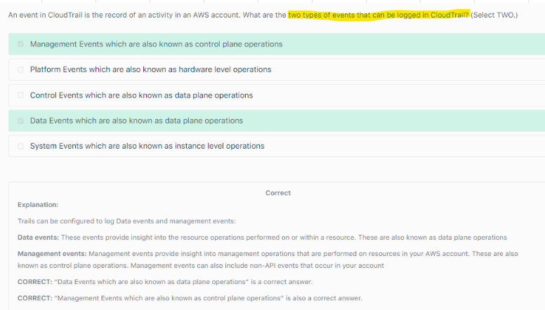
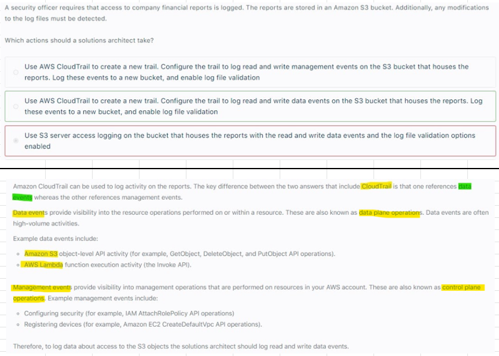

# S3 Access Logs
- CloudTrail logs provide you with detailed API tracking for Amazon S3 bucket-level and object-level operations, while 
- Server access logs for Amazon S3 provide you visibility into object-level operations on your data in Amazon S3.
## S3 Access Logs Vs Cloudtrail			
## 1. Cloudtrail and S3: Logging Operations										
- CloudTrail logs provide you with detailed API tracking for Amazon S3 bucket-level and object-level operations, while 
- Server access logs for Amazon S3 provide you visibility into object-level operations on your data in Amazon S3.									
## 2. Cloudtrail and S3: Logging Events										
- Cloudtrail References Data events as well as Management events
- S3 access logs: References management events"										
										
### 2.1 Data events										
- Data events provide INSIGHT into the RESOURCE operations that are performed on or within a resource
- These are also known as data plane operations. 
- Example data events include
  - Amazon S3 object-level API activity (for example, GetObject, DeleteObject, and PutObject API operations).
  - AWS Lambda function execution activity (the Invoke API)
										
### 2.2 Management events										
- Management events provide visibility into MANAGMENT operations that are performed on resources in your AWS account. 
- These are also known as control plane operations. 
- Example management events include
  - Configuring security (for example, IAM AttachRolePolicy API operations)
  - Registering devices (for example, Amazon EC2 CreateDefaultVpc API operations)
										
**S3 Access Logs - Cloudtrail can be used together as well**
										
## 3. Cloud trail logs Managment as well as Data events	

## 4. Data plane and Control plane operations		

