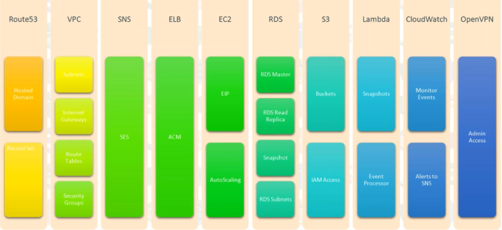
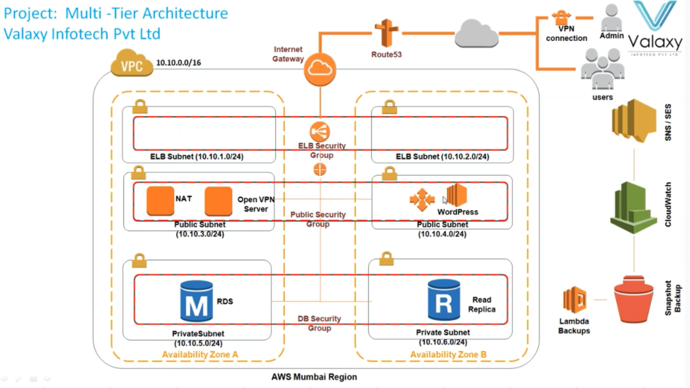

# [2 Tier web application](https://www.youtube.com/watch?v=E-WdMk7_IQo)

## Service


## Architecture


## Steps
1. Create VPC, Public and Private Subnets, IGW, NAT Gateway, etc.. 
2. Create EC2 instance with below Userdata/Bootstrapping script 
```
#! /bin/bash 
yum install httpd -y 
service httpd start 
chkconfig httpd on 
yum install wget -y 
yum install php php-mysql mysql -y 
```
3. Create RDS Security Group and RDS Subnet group with Private Subnets.
4. **Launch RDS instance in Multi-AZ**
```
Check Point 1: Try to access RDS instance from EC2. it should work 
```
5. Install word press wget https://wordpress.org/latest.tar.gz 
6. edit httpd conf
```
cd /etc/httpd/conf 
edit httpd conf 
```
- Search for **AllowOverride None** change None to **All**
- It is **/var/www/html** directory 
7. Change permissions on html directory 
```
chown -R apache:apache har/www/html 
```
8. Create new IAM Role and S3 bucket
9. Assign IAM role to EC2 instance and copy application date to S3 bucket.
10. Create Route53 hosted zones to map with domain
11. Create AMI for EC2 instance 
```
Check Point 2: Access application with route53 
```
12. Create ELB
13. Create Launch Configuration and AutoScaling
14. Enable ACM in ELB 
15. Secure infra at Security Group and VPC level 
```
Check Point 3: try to access website from Browser it should work.
```
```
Check Point 4 : terminate all instances. Your Auto Scaling should able to create new EC2 instances ( it may take upto 10 mins) 
```
