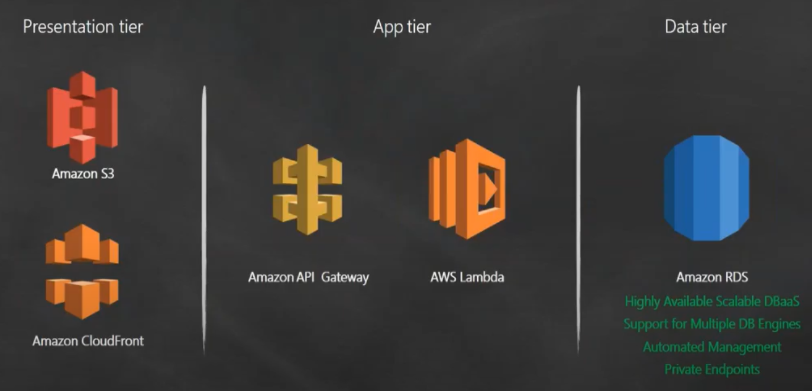
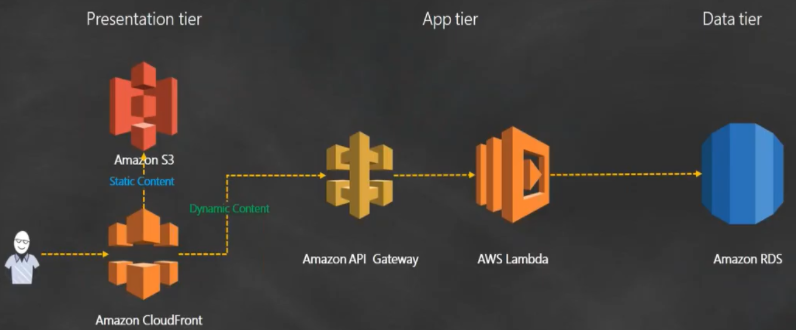
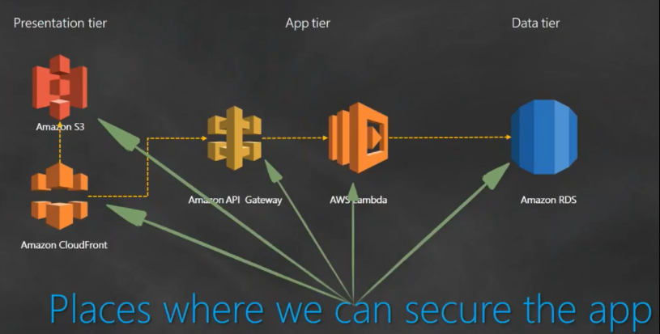
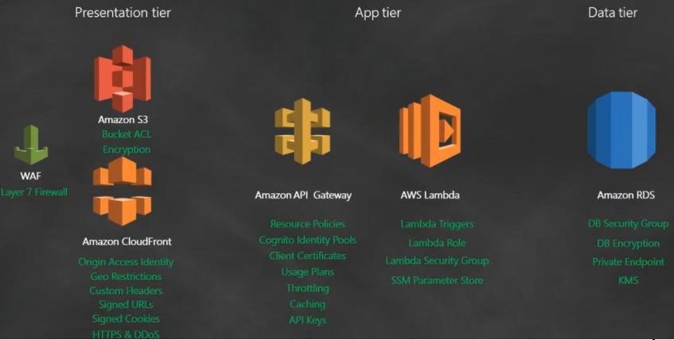
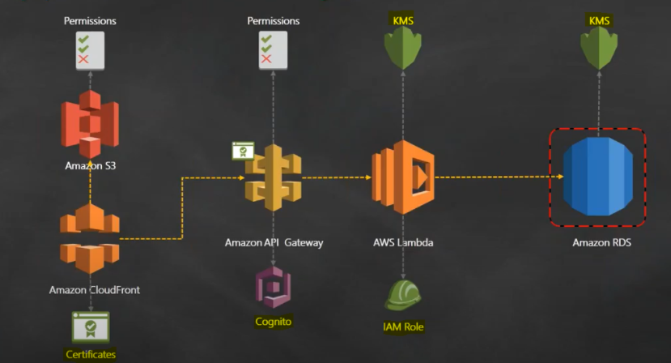
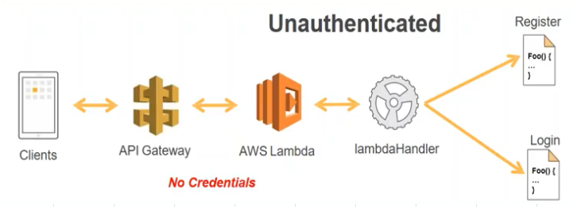
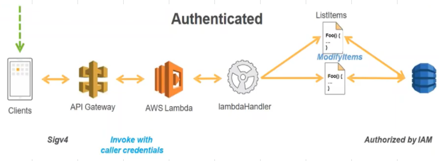
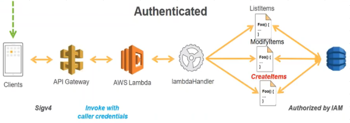
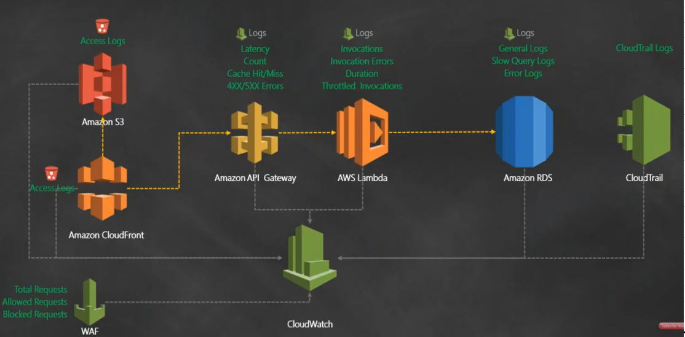
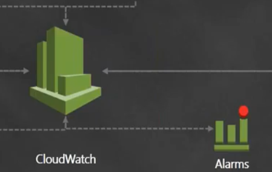

# [3 Tier web application](https://www.youtube.com/watch?v=B21XKotGZWs)
- [Acceptance criteria](#acceptance-criteria)
- [Requirements](#requirements)
- [Application Tiers](#application-tiers)
- [Security Design](#security-design)
- [Privileges](#privileges)
- [Logging](#logging)
- [Monitoring](#monitoring)

## Acceptance criteria
- [ ] 3 Tier web application to built in AWS
- [ ] Use higher stack aka use XaaS where possible
- [ ] Enable 3rd parties to call API securely
- [ ] Security in all elements of the architecture
- [ ] E2E encryption is required
- [ ] AuthZ - support users with multiple privileges

## Requirements
1. Build a 3 tier web application on AWS										
2. Use AWS components where possible (use Database as a service/ use logging or monitoring as a service/ use AWS provided identity store)
3. Application should be accesible by other 3rd party APIs (from their vendors and partners). It could connect to 3rd party APIs to send and receive data from other sources.
4. Every piece of architecture should be secure. Ex: Database connection should be encyrpted and connections should be made over SSL
5. 5. End to End encryption, data moving from client's browser all the way upto the database inlcuding middle components to be encrypted
6. Should support different priviledges for different users

## Application Tiers
### 1. Presentation tier
- S3										
  - Enables us to Host statis pages, images and files.
  - Offers high availability
- Cloudfront
  - Offers content caching (useful in cases where we have lot of media [images of high resolution and videos] and we want to distribute this content across different locations) resulting in Lower latency
  - Offers HTTPS support (S3 doesnot supports HTTPS)
  - Enables us to use Lambdas, for ex: incoming users can be authenticated using Lambda function before giving them access to the content								
### 2. APP tier										
- Amazon API Gateway
  - Will work as frontend for our APIs
  - Enables us to offer Staging, we can have dev/test/prod version of APIs all running in the same set up but named with different stages. This will help us in early release of our offerings
  - Offers throttling, for ex we can offere first 100 requests to the Application for free and start charging afterwards
  - Offers Multiple Security Options, a. Resource based policy b. IAM based policy										
- Lambda
  - Serves as Compute Engine/Application tier backend
  - As our application constantly grow and there are more requests coming in API gateway will forward the request to Lambda
  - Lamdba has **Event driven architecture**, as more and more requests will be coming, lambda will grow (or more lambda will beinvoked) to handle the incoming requests automatically.
    - **This will save our effort of scaling the infrastructure, AWS will do that in the background (no autoscaling/ no need to manage AMIs, updating AMIs/patching, amazon will take care of all of this."										
  - Lambda access is governed with IAM (we can control what access to give to lambda)									
### 3. Data tier
- Amazon RDS
  - Offers Database as a service
  - Supports multiple Database engines (Oracle/MySQL/POSGRES/MariaDB etc

### Application in Action										
- If request is for accessing static content, request is forwarded to S3
- If request is for accessing dynamic content, it will go all the way to RDS and user will be presented the requested data

## Security Design
- Enabling end to end encryption
- Securing all components that are part of our architecture
- How to enable 3rd party access to our APIs in secure way

### S3										
- Who is allowed to read from or write to our bucket: Managed by Bucket ACL (Access Control List)
  - Write a JSON policy
  - Attach policy to the bucket
- Enable encryption for the Objects in the bucket
  - Cutsom encryption key or
  - Amazon default encryption key
### Cloudfront
- **Origin Access Identity**
  - When OAI is enabled access to content of S3 bucket is allowed only via cloudefront and hence the content of S3 will be streamed to the website WITHOUT enabling public access to S3 bucket.
  - CloudFront can access the bucket on behalf of requesters.
  - Users can't access the objects in other ways, such as by using Amazon S3 URLs."										
- Geo Restrictions, to enforce compliance restriction so that data access is not allowed across cross borders when and where needed.
- Cloudfront also enables us to use Custome Headers, Signed URLs, Signed cookies, HTTPS to prevent attack from hackers

### Amazon API Gateway										
- Who can access API Gateway? Define **Fine Grained Policies** for
  - Only certain resources within the VPC can access API gateway
  - Only certain users or user groups can access API gateway
  - Only certain IP addresses can access API gateway									
- Set Up Cognito Identity Pools
- Usage of Client certificates to connect to other services (for example connecting to Lambda)
- Offers Throttling
- API Keys, we can rotate our keys in a periodic manner so that only people with legitimate key can access the account

### Lambda
- Lambda Triggers, only the resources which are confgured in the triggers will be able to execute Lambda function
- In this case the Lambda canonly be triggered by API Gateway (Lambda has event driven architecture)
- Lambda Role, Lambda will be given access to RDS
- SSM Parameter store (SSM Parameter Store will have all required details needed to connect to the Database)

### RDS
- Configure Security Group, only IP addresses with in this Security group are allowed access to RDS (or only Lambda function can connect to it)
- Supports DB encryption										
- Using RDS as private Endpoint, so that it is not publicly accessible
- Using KMS										
										
### WAF	Web Application Firewall (offers layer 7 firewall capabilities)
- Enables us to look at the URL and then decide weather it should be allowed access to my website or not

### Additional checks
- Custom Certificate at Cloudfromt for my Domain name
- Client Certificate at API Gateway to connect to Lambda
- API gateway is also connected to Cognito Identity Pool

### This completes below acceptance criterias
- [x] 3 Tier web application to built in AWS
- [x] Use higher stack aka use XaaS where possible
- [x] Enable 3rd parties to call API securely
- [x] Security in all elements of the architecture
- [x] E2E encryption is required
- [ ] AuthZ - support users with multiple privileges

## Privileges
### New user
- User tries to access content of the website
- The request is passed to API gateway
  - API gateway invokes Lambda
  - As this is a new user (no credentials), so Lambda is invoked with credentials
- Lambda passes request to Lambda handler
  - After Lambda handler processes the request, it will present user 2 options
    - Register
    - Log in

### User Logs in with credentials to view content
- User tries to access content of the website
- The request comes with a signature (because the credentials are passed to the browser)
  - Browser knows what keys to sign the request with
  - Browser adds custom headers to add to the request so that API gateway could process the request
  - With the Authenticated request, API gateway will invoke Lambda
- Lambda will check Roles associated with the request and it will necessary resources with those credentials
- Lamdba handler will provide user with requested information (ListItems)

### User has modification privileges
- User will now be allowed to modify records as well

### User has ADMIN privileges
- User will now be allowed to create new records, delete existing records as well

### Summary
- This is how application will allow different users (with different credentials) to access Website and enable them to perform different actions.
- This can be achieved with IAM together with Cognito Identity Pools

## Logging

- Each of these component generate different logs
- These logs can be collected and centrailised so that we could build a dashboard on top of it to gain insight on what is happening in our environment										
### Cloudwatch offers a centrailised mecahnism to store all the logs.
- We can create Cloudwatch log streams.
- With Cloudwatch log streams, we can build a Dashboard
### S3										
- S3 Access Logs
  - Create another S3 bucket for storing access logs, this information will be fed to Cloudwatch
										
### Cloudfront
- Cloudfront Access Logs: This will enable us gain Insight about
  - What are the hits coming for the website
  - What are misses happening for the website
  - This information will be fed to Cloudwatch
										
### Amazon API Gateway						
- API Gateway enables us to collect different type of logs
  - Latency logs: how soon or slow API gateway is responding
  - Count of Requests: How many requests are coming in, How many are resulting in errors (404/malformed request)
  - This information will be fed to Cloudwatch
				
### Lambda
- Lambda offers 7 metrices to collect logs
  - Invocation logs
  - Invocation Errors/Success
  - Duration: How long lambda functions are running: Helps us to decide if we have over or under provisioned resources in Lambda
  - Throttled Invocations: To check if throttle limit is reached and accordingly scale up resources as needed.
  - etc..
									
### RDS										
- Offers 3 types of logs
  - General logs: General information about the state of Database
  - Slow Query logs
  - Error logs: If something goes wrong in the Databse, it will be logged here

### WAF										
- Enable Logs for 
  - Total Request coming in
  - Allowed requests
  - Blocked requests
								
### CloudTrail
- Every AWS account SHOULD enable Cloudtrails logs. 
- This enables us to watch logs of all the API activities happening in AWS account and this should be fed to Cloudwatch so that we could have an OPERATIONAL insight over AWS account
										
#### Now we have all the logs collected in Cloudwatch										

## Monitoring
- Based on the collected logs, we can now configure ALARMS
- We can create our custom metric, for ex if there are many 404  from Cloudfront, send an alarm to notify about it
- These alarms can notify Security team via Notifications built in SNS or use SLACK channel										

