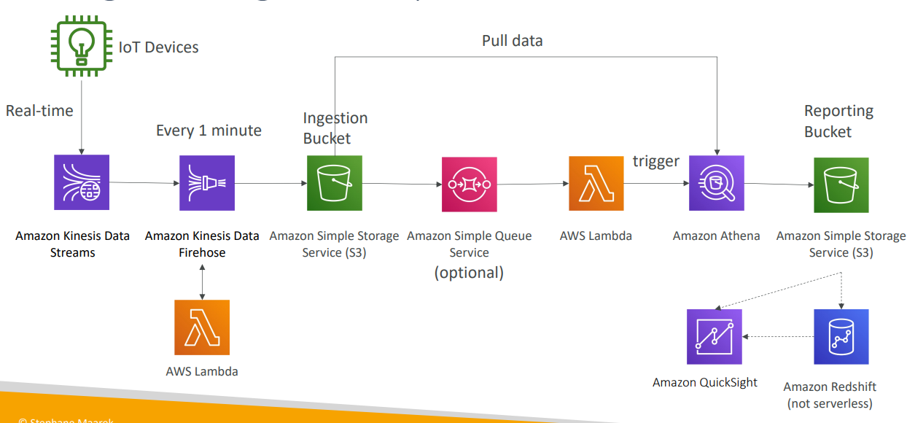

# Big Data Ingestion Pipeline
- We want the ingestion pipeline to be fully serverless
- We want to collect data in real time
- We want to transform the data
- We want to query the transformed data using SQL
- The reports created using the queries should be in S3
- We want to load that data into a warehouse and create dashboards

## Big Data Ingestion Pipeline

## Summary
- IoT Core allows you to harvest data from IoT devices
- Kinesis is great for real-time data collection
- Firehose helps with data delivery to S3 in near real-time (1 minute)
- Lambda can help Firehose with data transformations
- Amazon S3 can trigger notifications to SQS
- Lambda can subscribe to SQS (we could have connecter S3 to Lambda)
- Athena is a serverless SQL service and results are stored in S3
- The reporting bucket contains analyzed data and can be used by reporting tool such as AWS QuickSight, Redshift, etc… 
