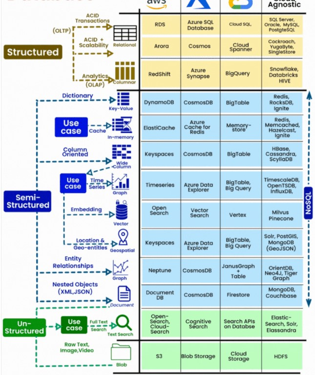
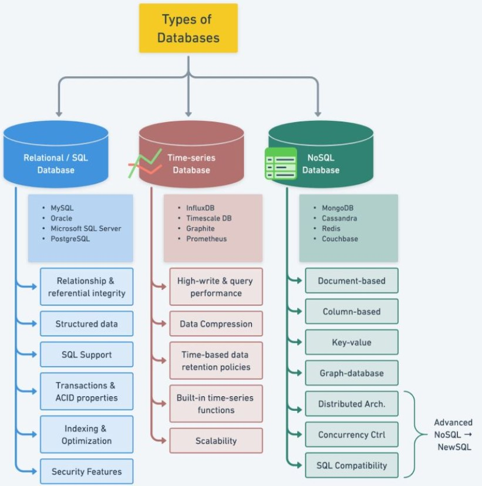

# [Choosing the Right Database](StorageOptions.pdf)
- [Factors](#factors)
- [Database Types](#database-types)
- [Options](#options)
## Factors
- Nature of Data: Structured/Unstructured
- Processing of Data: Real time/Batch
- Types of Transactions: Write Intensive/Read Intensive
- Modification of data: Frequency of updates to data
- Read-heavy, write-heavy, or balanced workload? 
  - Throughput needs? 
  - Will it change, does it need to scale or fluctuate during the day?
- How much data to store and for how long? 
  - Will it grow? 
  - Average object size? 
  - How are they accessed?
- Data durability? 
  - Source of truth for the data?
- Latency requirements? 
  - Concurrent users?
- Data model? 
  - How will you query the data? 
  - Joins? 
  - Structured? Semi-Structured?
- Strong schema? 
  - More flexibility? 
  - Reporting? 
  - Search? 
  - RDBMS / NoSQL?
- License costs? 
  - Switch to Cloud Native DB such as Aurora?

## Database Types
- RDBMS (= SQL / OLTP)
  - RDS, Aurora – great for joins
- NoSQL database
  - DynamoDB (~JSON), 
  - ElastiCache (key / value pairs), 
  - Neptune (graphs) – no joins, no SQL
- Object Store
  - S3 (for big objects)
  - Glacier (for backups / archives)
- Data Warehouse (= SQL Analytics / BI)
  - Redshift (OLAP), Athena
- Search
  - ElasticSearch (JSON) – free text, unstructured searches
- Graphs
  - Neptune – displays relationships between data
- Timeseries
  - InfluxDB
## Options

