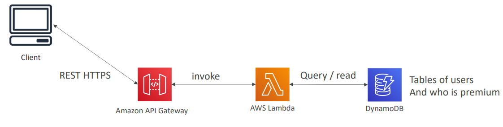
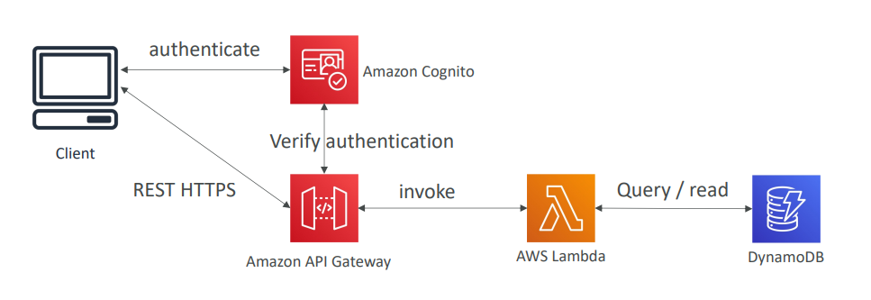
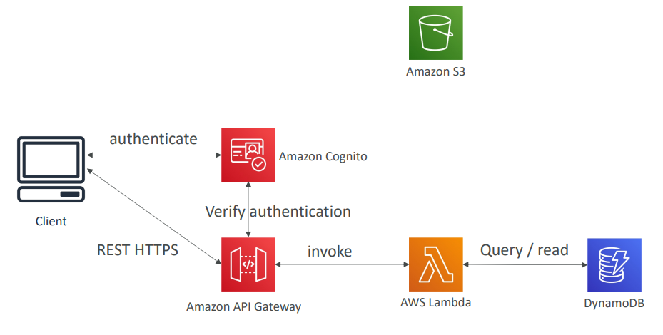
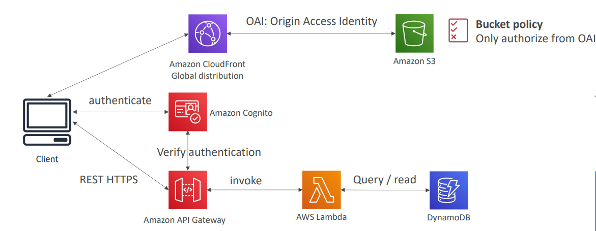
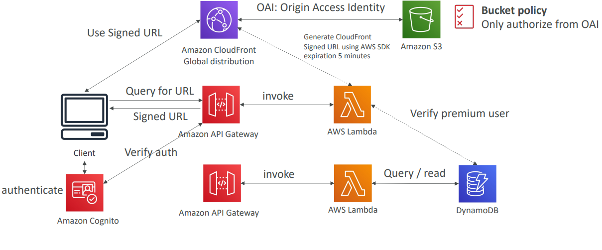

# Distributing paid content
## Requirements
- We sell videos online and users have to paid to buy videos
- Each videos can be bought by many different customers
- We only want to distribute videos to users who are premium users
- We have a database of premium users
- Links we send to premium users should be short lived
- Our application is global
- We want to be fully serverless

## Premium user service

## Add authentication

## Add Videos Storage Service

## Distribute Globally and Secure

## Distribute Content only to premium users

## Summary
We have implemented a fully serverless solution:
- Cognito for authentication
- DynamoDB for storing users that are premium
- 2 serverless applications
  - Premium User registration
  - CloudFront Signed URL generator
- Content is stored in S3 (serverless and scalable)
- Integrated with CloudFront with OAI for security (users can’t bypass)
- CloudFront can only be used using Signed URLs to prevent unauthorized users
- What about S3 Signed URL? They’re not efficient for global access
