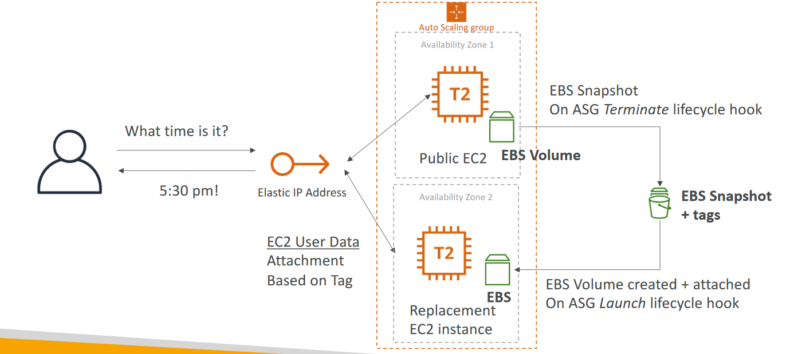
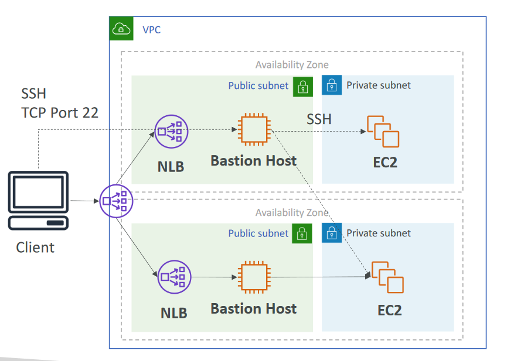

# High Availability architectural designs

## Creating a highly available EC2 instance with ASG + EBS

## High Availability for a Bastion Host
- HA options for the bastion host
  - Run 2 across 2 AZ
  - Run 1 across 2 AZ with 1 ASG 1:1:1
- Routing to the bastion host
  - If 1 bastion host, use an elastic IP with ec2 user-data script to access it
  - If 2 bastion hosts, use an Network Load Balancer (layer 4) deployed in multiple AZ
  - If NLB, the bastion hosts can live in the private subnet directly
- Note: Can’t use ALB as the ALB is layer 7 (HTTP protocol)

