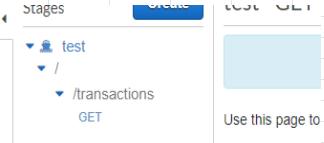
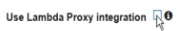
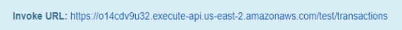
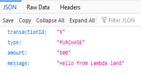
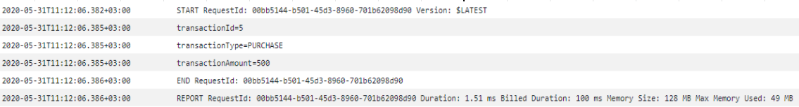

# [Invoke Lambda from API](https://www.youtube.com/watch?v=uFsaiEhr1zs)

## Lambda
```
import json							
							
print('Loading function')							
							
def lambda_handler(event, context):							
	#1. Parse out query string params						
	transactionId = event['queryStringParameters']['transactionId']						
	transactionType = event['queryStringParameters']['type']						
	transactionAmount = event['queryStringParameters']['amount']						
							
	print('transactionId=' + transactionId)						
	print('transactionType=' + transactionType)						
	print('transactionAmount=' + transactionAmount)						
							
	#2. Construct the body of the response object						
	transactionResponse = {}						
	transactionResponse['transactionId'] = transactionId						
	transactionResponse['type'] = transactionType						
	transactionResponse['amount'] = transactionAmount						
	transactionResponse['message'] = 'Hello from Lambda land'						
							
	#3. Construct http response object						
	responseObject = {}						
	responseObject['statusCode'] = 200						
	responseObject['headers'] = {}						
	responseObject['headers']['Content-Type'] = 'application/json'						
	responseObject['body'] = json.dumps(transactionResponse)						
							
	#4. Return the response object						
	return responseObject
```
## API setup
- Create **GET** request


- Link Lambda
  - Use Lambda Proxy Integration as checked


- Invoke URL


## Test


## Verify Cloudwatch logs

