# 1. Receiving and persisting data using AWS best practices
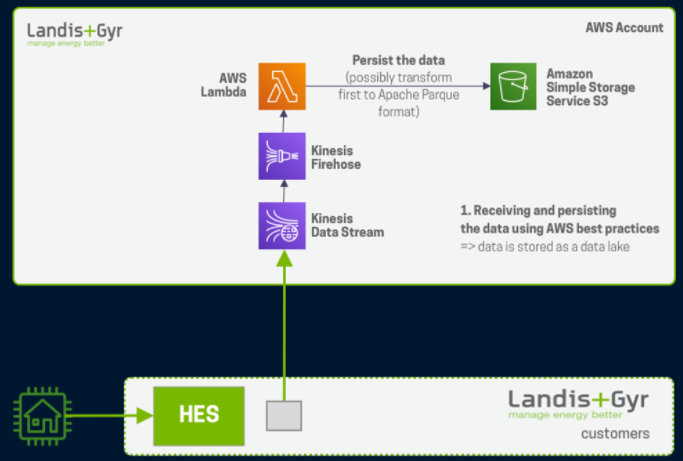

# 2. Real Time Analysis of data
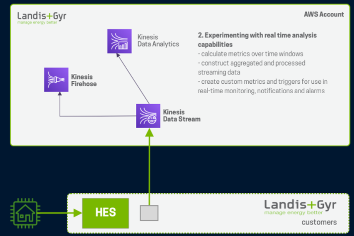

# 3. Dashboard capabilities using data in S3 data lake
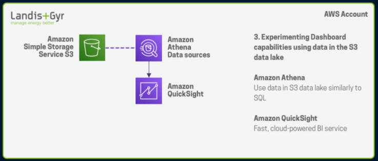

# 4. Data lake and Data ware house
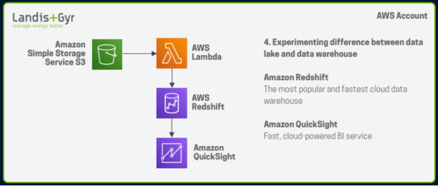

# 5. Custom Dashboard
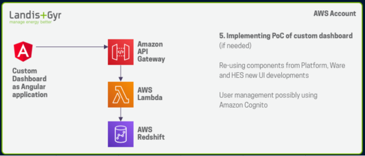

# 6. ML capabilities
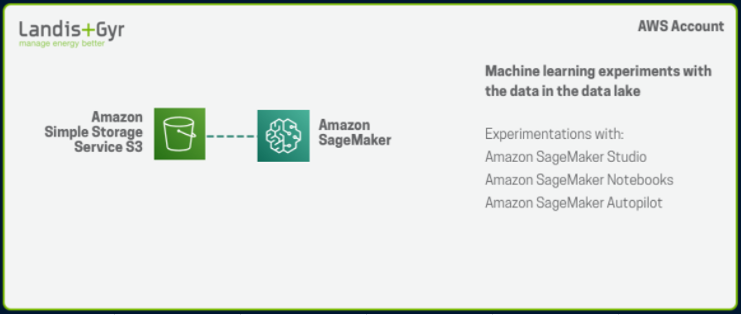

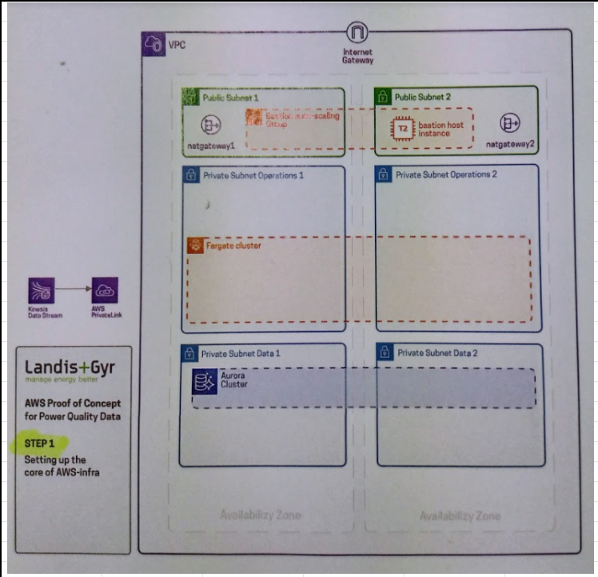

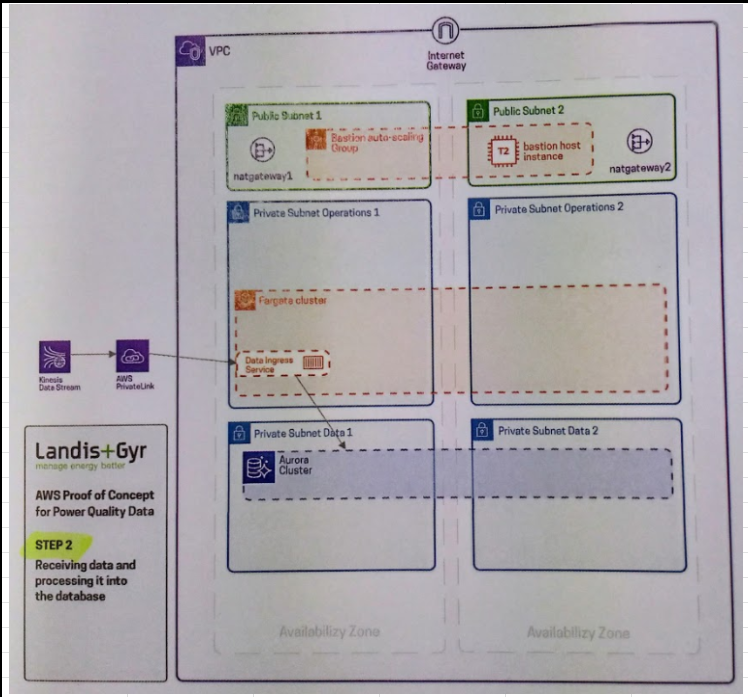

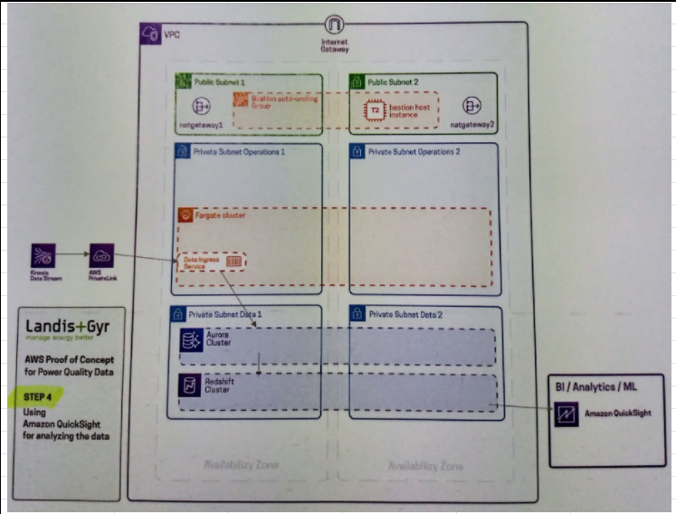

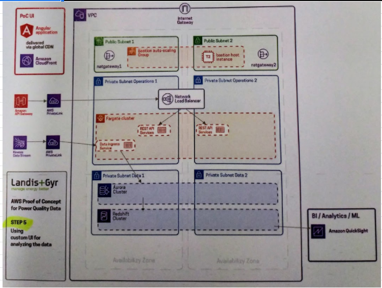

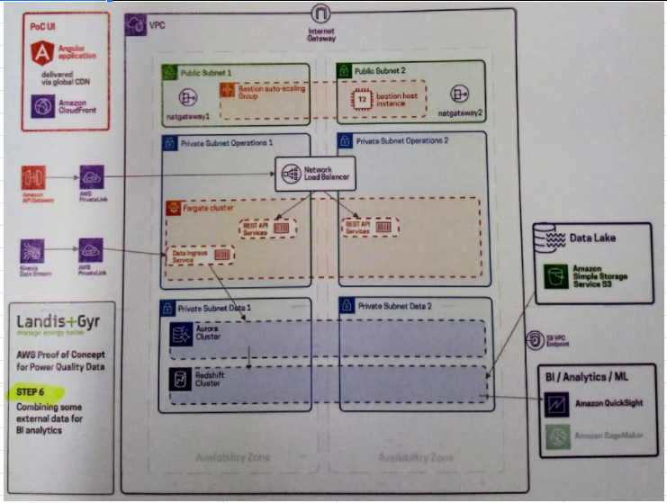
