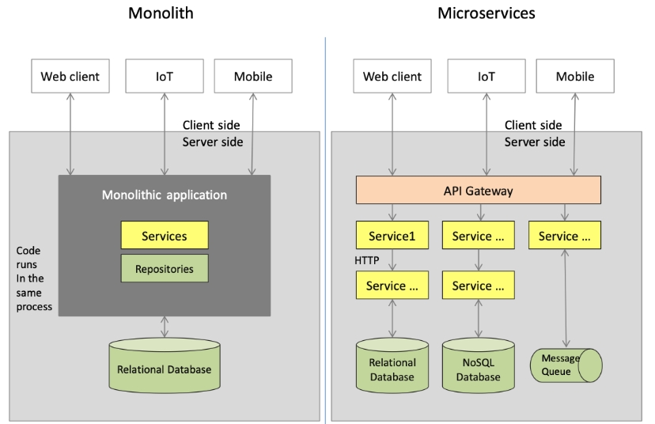
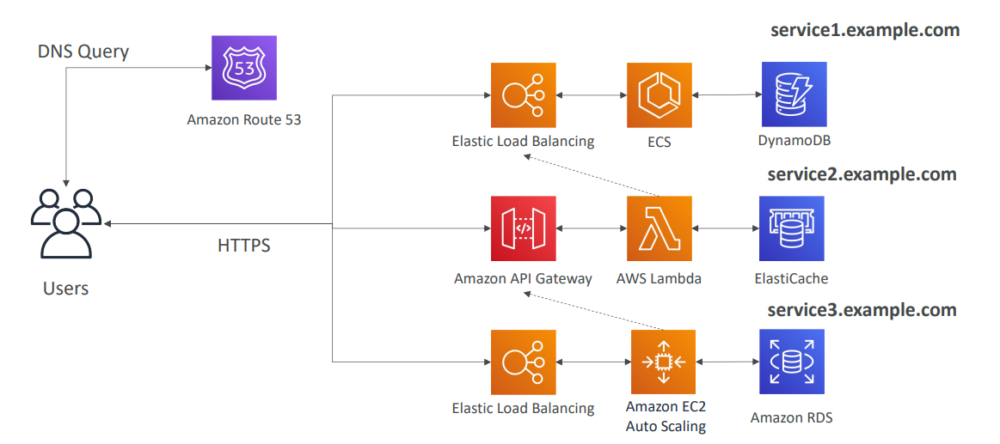

# Micro Services architecture
- [Overview](#verview)
- [Micro Services Environment](#micro-services-environment)
- [Benefits](#benefits)
- [Challenges with micro services](#challenges-with-micro-services)
## Overview
- Each microservice has its **own data model and manages its own data**.
- Data moves between microservices using “dumb pipes” such as an **event broker and/or a lightweight protocol like REST**.
- Small scope that **encompasses a single piece of business functionality**
- Internal operations are a **black box**, accessible to external programs only via API

## Benefits
- Microservices are **independently deployable** and allow for more team autonomy
  - Each microservice can be deployed independently, as needed, enabling continuous improvement and faster app updates.
- Microservices are **independently scalable**.
- Microservices **reduce downtime through fault isolation**
- The smaller codebase enables teams to more easily understand the code, making it simpler to maintain.
## Micro Services Environment
- We want to switch to a micro service architecture
- **Many services interact with each other directly using a REST API**
- Each architecture for each micro service may vary in form and shape
- We want a micro-service architecture so we can have a **leaner development lifecycle** for each service

- You are free to design each micro-service the way you want
- Synchronous patterns: API Gateway, Load Balancers
- Asynchronous patterns: SQS, Kinesis, SNS, Lambda triggers (S3)

## Challenges with micro services
- **Debugging** becomes more challenging with microservices. With an application consisting of multiple microservices and with each microservice having its own set of logs, tracing the source of the problem can be difficult.
- While unit testing may be easier with microservices, **integration testing is not**. 
  - The components are distributed, and developers can’t test an entire system from their individual machines.
- Issues with optimizing server density/utilization
- Complexity of running multiple versions of multiple microservices simultaneously
- Proliferation of client-side code requirements to integrate with many separate services.
- Some of the challenges are solved by **Serverless patterns**
  - API Gateway, Lambda scale automatically and you pay per usage
  - You can easily clone API, reproduce environments
  - Generated client SDK through Swagger integration for the API Gateway
