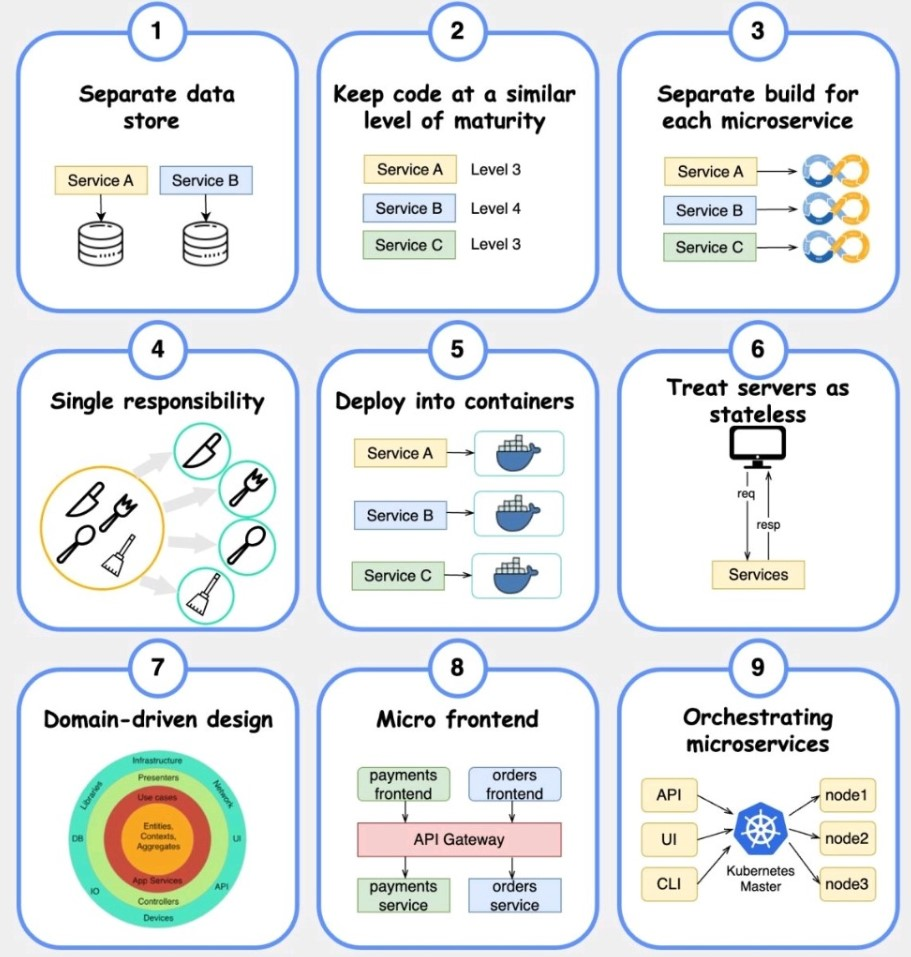
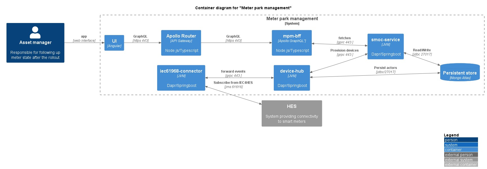

# Micro services architecture
- [Overview](#verview)
- [Benefits](#benefits)
- [Best practices](#best-practices)
- [Micro services examples](#micro-services-examples)
- [Challenges with micro services](#challenges-with-micro-services)
- [Securing microservices](#securing-microservices)
## [Overview](https://youtu.be/lTAcCNbJ7KE)
- Each microservice has its **own data model and manages its own data**.
- Data moves between microservices using “dumb pipes” such as an **event broker and/or a lightweight protocol like REST**.
- Small scope that **encompasses a single piece of business functionality**
- Internal operations are a **black box**, accessible to external programs only via API


## Benefits
- Microservices are **independently deployable** and allow for more team autonomy
  - Each microservice can be deployed independently, as needed, enabling continuous improvement and faster app updates.
- Microservices are **independently scalable**.
- Microservices **reduce downtime through fault isolation**
- The smaller codebase enables teams to more easily understand the code, making it simpler to maintain.
## Best practices


## Micro services examples 
- We want to switch to a micro service architecture
- **Many services interact with each other directly using a REST API**
- Each architecture for each micro service may vary in form and shape
- We want a micro-service architecture so we can have a **leaner development lifecycle** for each service


- You are free to design each micro-service the way you want
- Synchronous patterns: API Gateway, Load Balancers
- Asynchronous patterns: SQS, Kinesis, SNS, Lambda triggers (S3)

## Challenges with micro services
- **Debugging** becomes more challenging with microservices. With an application consisting of multiple microservices and with each microservice having its own set of logs, tracing the source of the problem can be difficult.
  - [Prometheus can help](https://github.com/sbhrwl/system_design/blob/main/docs/Middleware/prometheus/README.md)
- While unit testing may be easier with microservices, **integration testing is not**. 
  - The components are distributed, and developers can’t test an entire system from their individual machines.
- Issues with optimizing server density/utilization
- Complexity of running multiple versions of multiple microservices simultaneously
- Proliferation of client-side code requirements to integrate with many separate services.
- Some of the challenges are solved by **Serverless patterns**
  - API Gateway, Lambda scale automatically and you pay per usage
  - You can easily clone API, reproduce environments
  - Generated client SDK through Swagger integration for the API Gateway
## Securing microservices
- The SMOC application is running on GKE cluster.
- The cluster will run a user interface and microservices.
- API calls are made between backend and frontend.
  - HTTPS (443)
-	The services will be secured by [mTLS](https://docs.dapr.io/operations/security/mtls/).
    -	smoc_service has certificate of device_hub
    -	device_hub has certificate of smoc_service
-	JWT tokens (Keycloak) for endpoints (smoc_service)
    -	if token has expired during the flow through the application, **`refresh`** token from keycloak
    -	smoc_service writes or read data from/to MongoDB, based on `role/permissions associated with the JWT token`
- ACL in service-to-service invocation.
  - iec_connector can talk to device_hub
  - device_hub can talk to smoc_service
  - iec_connector can **not** talk to smoc_service 
-	K8 security, IP whitelisting, CORS, rate-limiting at the API gateway level. 
-	Limit building block API exposure
-	OWASP based dependency checker against CVEs and upgrade and/or exclude transitive dependencies.
-	Firewall, Network security on GCP
  - The security of networking in SMOC environment relies on those of the underlying LZ, which will include Firewall rules protecting the VPC network from internal and external accesses and isolating customers.


```
@startuml

!include <C4/C4_Container>

' See more https://github.com/plantuml-stdlib/C4-PlantUML

' uncomment the following line and comment the first to use locally
' !include C4_Container.puml' LAYOUT_TOP_DOWN()
' LAYOUT_AS_SKETCH()
LAYOUT_WITH_LEGEND()

title Container diagram for "Meter park management"

left to right direction

Person(assetManager, "Asset manager", "Responsible for following up meter state after the rollout")
System_Boundary(mpm, "Meter park management") {
    Container(ui, "UI", "Angular")
    Container(supergraph, "Apollo Router", "API Gateway","Node.js/Typescript")
    Container(subgraph, "mpm-bff", Apollo GraphQL", "Node.js/Typescript")
    Container(activemqconsumer, "iec61968-connector", "JVM", "Dapr/Springboot")
    Container(devicehub, "device-hub", "JVM", "Dapr/Springboot")
    Container(smocservice, "smoc-service", "JVM", "Dapr/Springboot")
    ContainerDb(store, "Persistent store" , "Mongo Atlas")
}

System_Ext(hes, "HES", "System providing connectivity to smart meters")
BiRel(activemqconsumer, hes, "Subscribe from IEC4HES", "jms 61616" )
BiRel(activemqconsumer, "devicehub", "forward events", "grpc 443 ")
BiRel("devicehub", "smocservice", "Provision devices", "grpc 443 ")
BiRel("devicehub", "store", "Persist actors", "jdbc/27017")
BiRel(subgraph, smocservice, "fetches", "gprc 443 ")
BiRel(smocservice, store , "Read/Write", "jdbc 27017")
Rel(ui, supergraph, "GraphQL", "https 443")
Rel(supergraph, subgraph, "GraphQL", "https 443")

Rel(assetManager, ui, "app", "web interface")
@enduml
```
