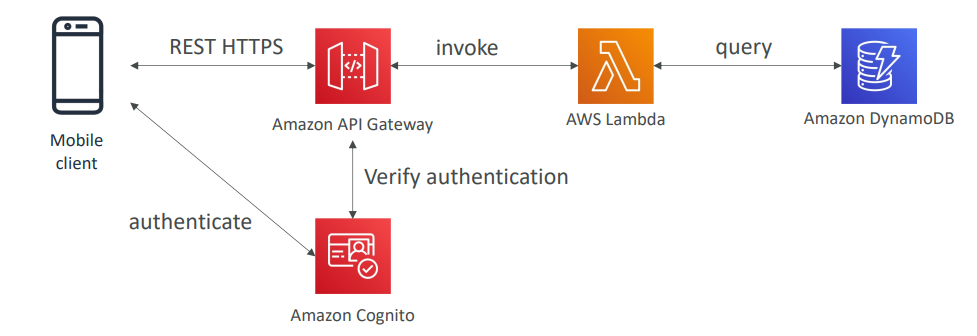
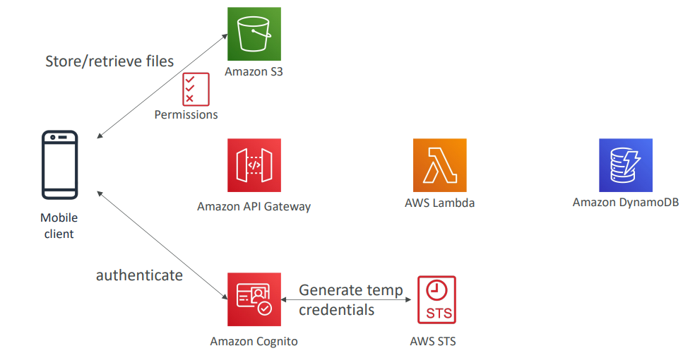
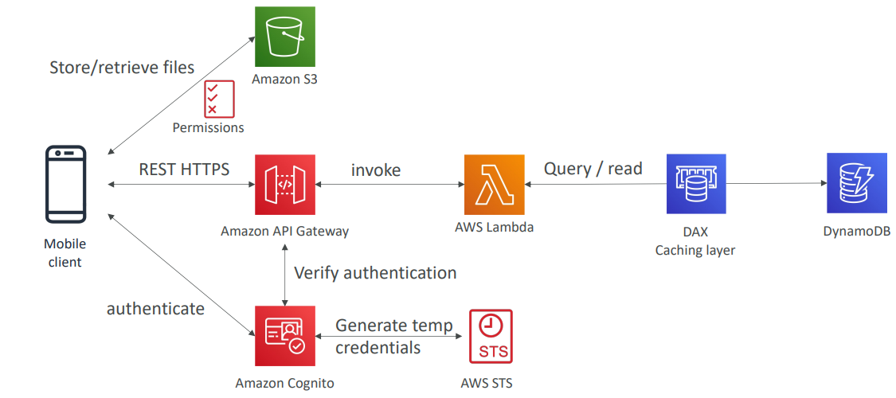
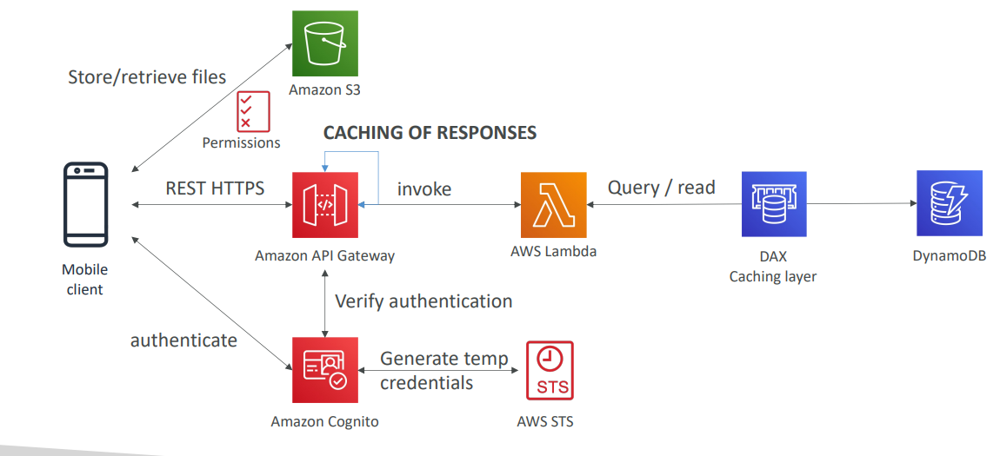

# My Todo list
We want to create a mobile application with the following requirements
- Expose as REST API with HTTPS
- Serverless architecture
- Users should be able to directly interact with their own folder in S3
- Users should authenticate through a managed serverless service
- The users can write and read to-dos, but they mostly read them
- The database should scale, and have some high read throughput

## REST API layer

## Giving users access to S3

## High read throughput, static data

## Caching at the API Gateway

## Summary
- Serverless REST API: HTTPS, API Gateway, Lambda, DynamoDB
- Using Cognito to generate temporary credentials with STS to access S3 bucket with restricted policy. 
  - App users can directly access AWS resources this way. 
  - Pattern can be applied to DynamoDB, Lambda…
- Caching the reads on DynamoDB using DAX
- Caching the REST requests at the API Gateway level
- Security for authentication and authorization with Cognito, STS
