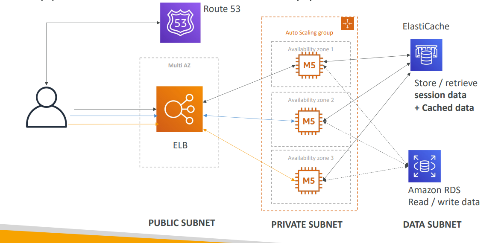
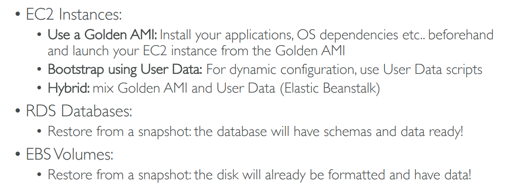

# Projects
- [Stateless Web App- What time is it?](StatelessWebApp/README.md)
- [Stateful Web App- MyClothes.com](StatefulWebApp/README.md)
- [Stateful Web App- MyWordPress.com](StatefulWebAppPictures/README.md)
- [Metering infra on cloud](MeteringInfraOnCloud/README.md)
- [2 Tier web application](2TierWebApp/README.md)
- [3 Tier web application](3TierWebApp/README.md)
  - APP tiers, Security Design, Privileges, Logging, Monitoring
- [Invoke lambda from API](InvokeLambdaFromAPI/README.md)
  - Lambda code, API gateway setup
- [Secure file upload](https://drive.google.com/drive/u/0/folders/109yWGA_es3a9MekffBQ6s3x81o1QycPX)
- Serverless Architectures
  - [Mobile application- MyTodoList](MyTodoList/README.md)
  - [Serverless hosted website- MyBlog.com](MyBlog/README.md)
  - [Serverless your Machine Learning Model](https://medium.com/analytics-vidhya/serverless-your-machine-learning-model-with-pycaret-and-aws-lambda-c33334ee6011)
  - [API-Kinesis-S3](https://drive.google.com/drive/u/0/folders/109yWGA_es3a9MekffBQ6s3x81o1QycPX)
- [Micro Services architecture](MicroServicesArchitecture/README.md)
- [Distributing paid content](DistributingPaidContent/README.md)
- [SoftwareUpdatesOffloading](SoftwareUpdatesOffloading/README.md)
- [Big Data Ingestion Pipeline](BigDataIngestionPipeline/README.md)
- [Choosing the Right Database](ChoosingTheRightDatabase/README.md)
## 3Tier-Architecture

## Instantiating Apps Quickly

