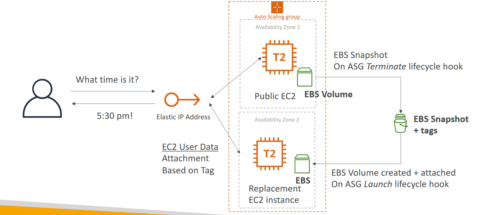
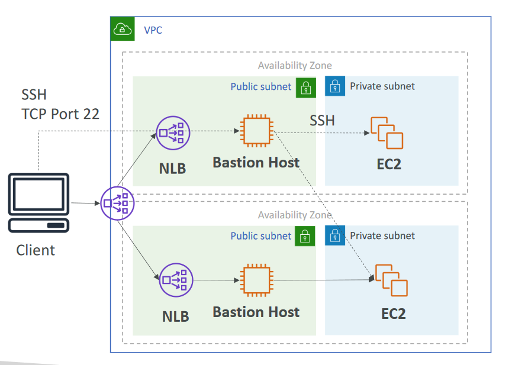

# Projects
- [Big Data Ingestion Pipeline, Data lake, Hybrid cloud architectures, Streaming data Processing, Caching Strategies, High Availability architectural designs and Containerisation with EKS]()
- [3 Tier-Architecture](3TierWebApp/README.md)
  - APP tiers, Security Design, Privileges, Logging, Monitoring
- [Stateless Web App- What time is it?](StatelessWebApp/README.md)
- [Stateful Web App- MyClothes.com](StatefulWebApp/README.md)
- [Stateful Web App- MyWordPress.com](StatefulWebAppPictures/README.md)
- Serverless Architectures
  - [Mobile application- MyTodoList](MyTodoList/README.md)
  - [Serverless hosted website- MyBlog.com](MyBlog/README.md)
  - [Serverless your Machine Learning Model](https://medium.com/analytics-vidhya/serverless-your-machine-learning-model-with-pycaret-and-aws-lambda-c33334ee6011)
  - [API-Kinesis-S3](https://drive.google.com/drive/u/0/folders/109yWGA_es3a9MekffBQ6s3x81o1QycPX)
  - [Invoke lambda from API](InvokeLambdaFromAPI/README.md)
    - Lambda code, API gateway setup
- [Micro Services architecture](MicroServicesArchitecture/README.md)
- [Distributing paid content](DistributingPaidContent/README.md)
- [Offloading software updates](SoftwareUpdatesOffloading/README.md)
- [Big Data Ingestion Pipeline](BigDataIngestionPipeline/README.md)
- [Event driven architectures](EventDrivenArchitectures/README.md)
- [Caching Strategies](CachingStrategies/README.md)
- [Blocking an IP address](BlockingIP/README.md)
- [Metering infra on cloud](MeteringInfraOnCloud/README.md)
- [Secure file upload](https://drive.google.com/drive/u/0/folders/109yWGA_es3a9MekffBQ6s3x81o1QycPX)
- [Choosing the Right Database](ChoosingTheRightDatabase/README.md)
- [Tech companies architecture](https://www.linkedin.com/posts/rajendrauppal_softwarearchitecture-softwaredesign-softwareengineers-activity-6984804253202571264-41Ln?utm_source=share&utm_medium=member_android)

## Instantiating Apps Quickly

## Creating a highly available EC2 instance with ASG + EBS

## High Availability for a Bastion Host
- HA options for the bastion host
  - Run 2 across 2 AZ
  - Run 1 across 2 AZ with 1 ASG 1:1:1
- Routing to the bastion host
  - If 1 bastion host, use an elastic IP with ec2 user-data script to access it
  - If 2 bastion hosts, use an Network Load Balancer (layer 4) deployed in multiple AZ
  - If NLB, the bastion hosts can live in the private subnet directly
- Note: Can’t use ALB as the ALB is layer 7 (HTTP protocol)

## HPC
- The cloud is the perfect place to perform HPC
- You can create a very high number of resources in no time
- You can speed up time to results by adding more resources
- You can pay only for the systems you have used
- Perform genomics, computational chemistry, financial risk modeling, weather prediction, machine learning, deep learning, autonomous driving
- Which services help perform HPC?
  - Elastic Fabric Adapter (EFA)
    - Improved ENA for HPC, only works for Linux
    - Great for inter-node communications, tightly coupled workloads
    - Leverages Message Passing Interface (MPI) standard
    - Bypasses the underlying Linux OS to provide low-latency, reliable transport
