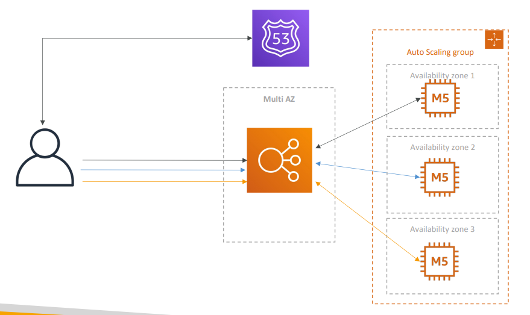
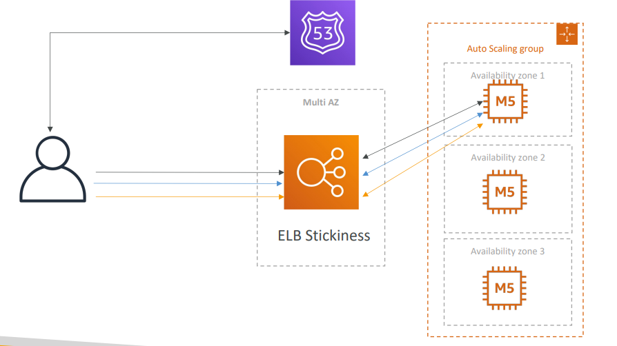
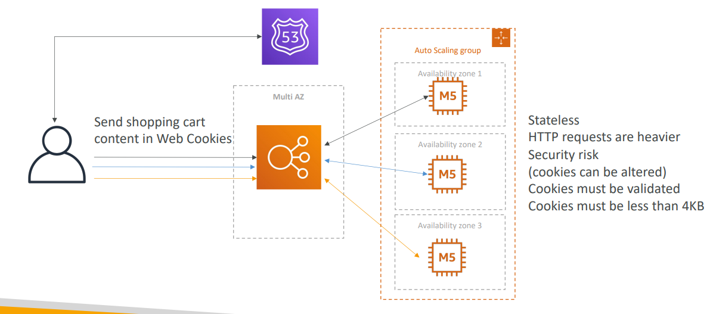
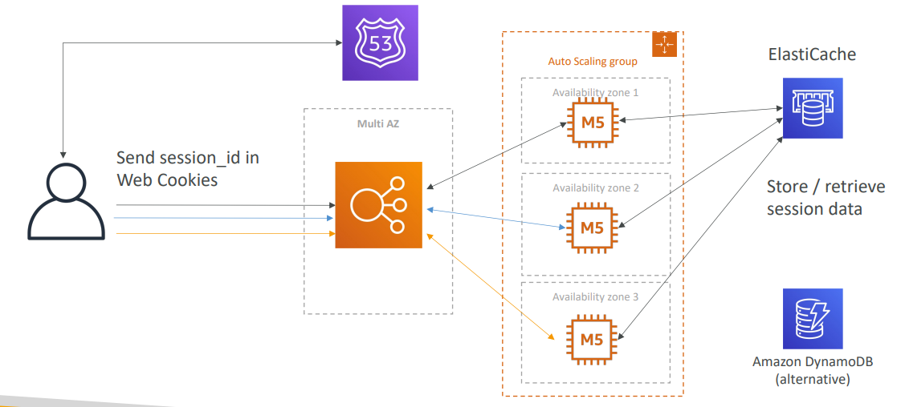
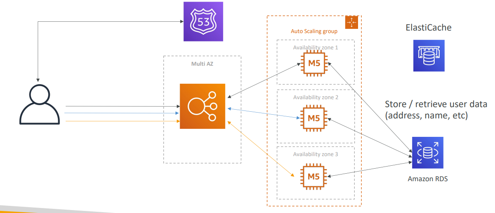
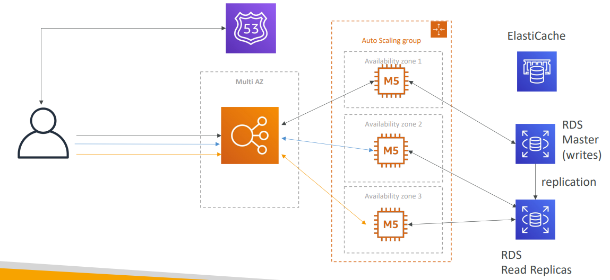
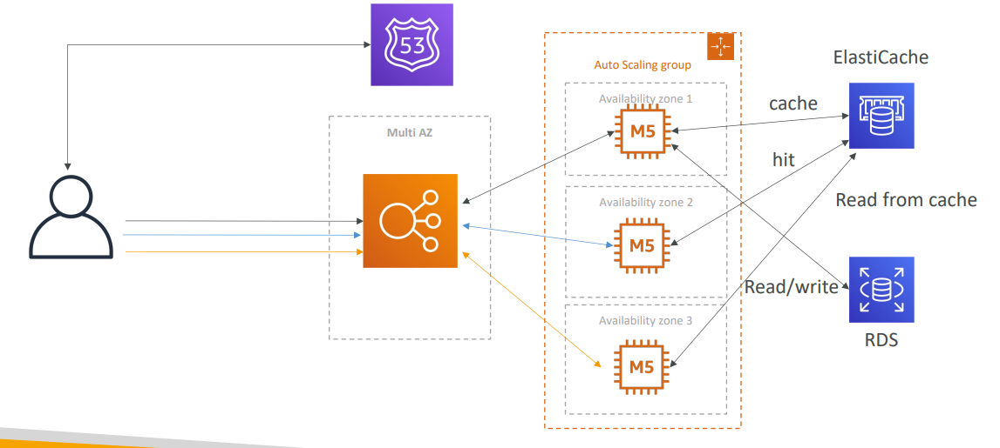
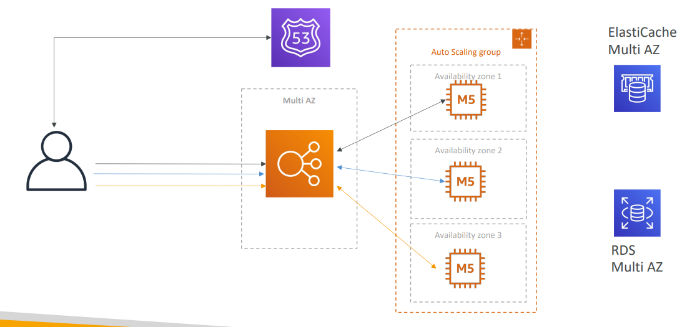
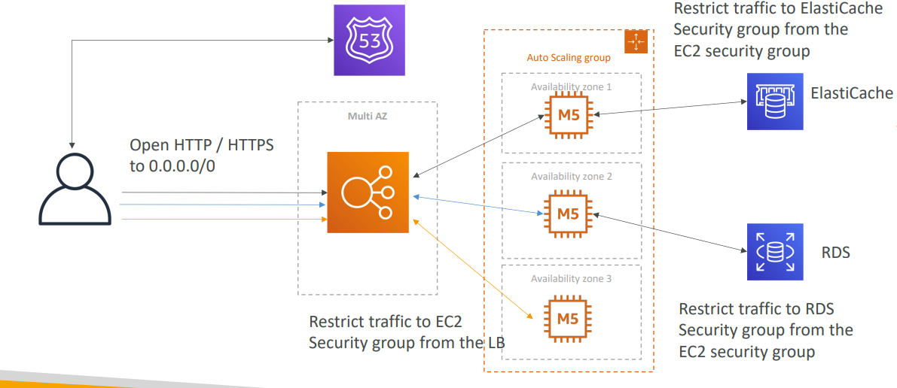

# Statefull web app
- Consider a web app behind a Multi AZ ELB exposed via Route53

  
## Introduce Stickiness (Session Affinity)

## Introduce User Cookies

## Introduce Server Session

## Storing User Data in a database

## Scaling Reads

### Scaling Reads (Alternative) – Write Through

## Multi AZ to Survive disasters

## Securing via Security Groups

## Summary
- 3-tier architectures for web applications
- ELB sticky sessions
- Web clients for storing cookies and making our web app stateless
- ElastiCache
  - For storing sessions (alternative: DynamoDB)
  - For caching data from RDS
  - Multi AZ
- RDS
  - For storing user data
  - Read replicas for scaling reads
  - Multi AZ for disaster recovery
- Tight Security with security groups referencing each other
