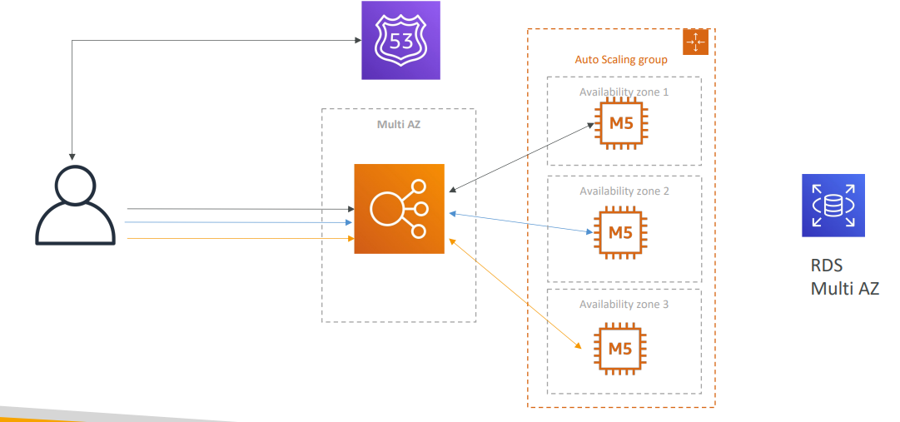
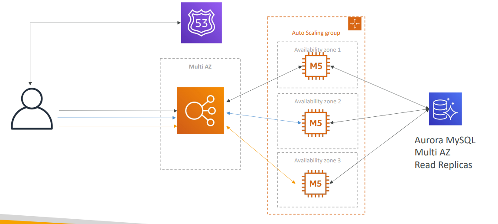
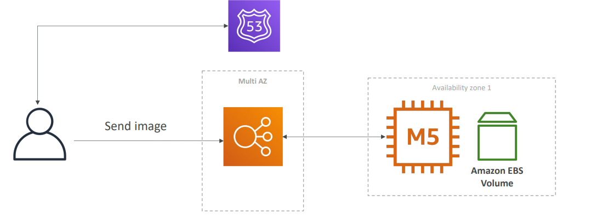
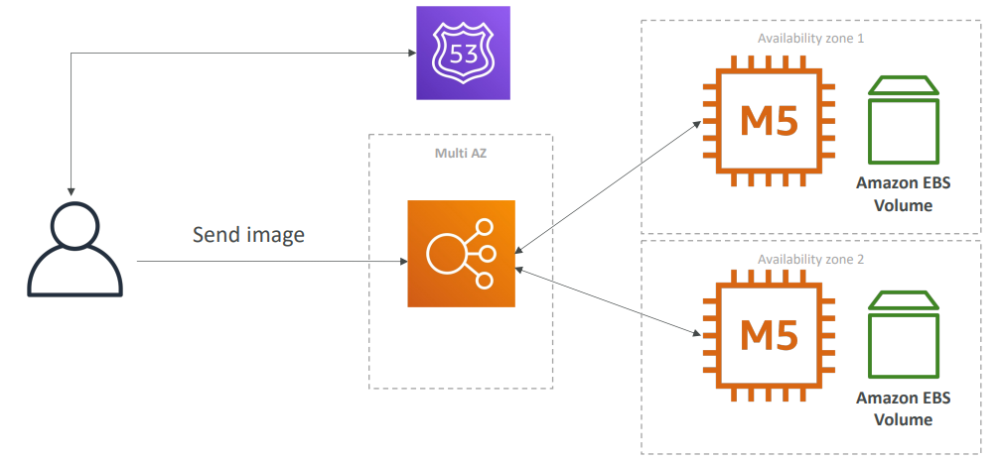
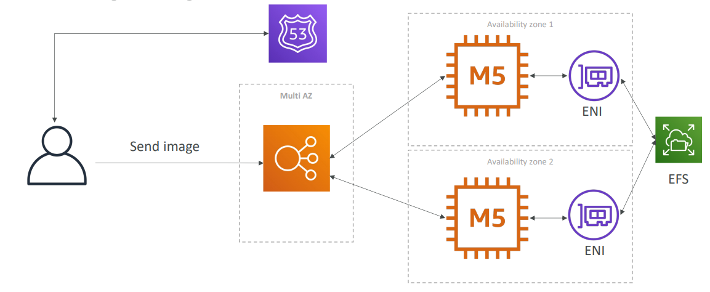

# MyWordPress.com
- We are trying to create a fully scalable WordPress website
- We want that website to access and correctly display picture uploads
- Our user data, and the blog content should be stored in a MySQL database.

## RDS layer

## Scaling with Aurora: Multi AZ & Read Replicas

## Storing images with EBS

## Storing images with EFS

## Summary
- Aurora Database to have easy Multi-AZ and Read
- Replicas
- Storing data in EBS (single instance application) • Vs Storing data in EFS (distributed application)
