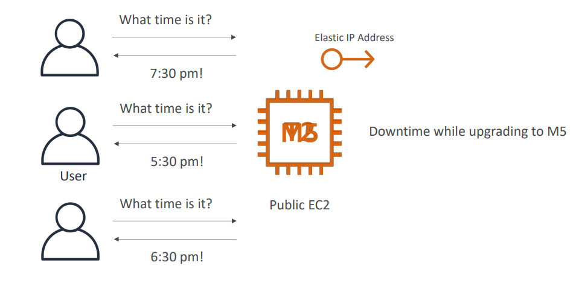
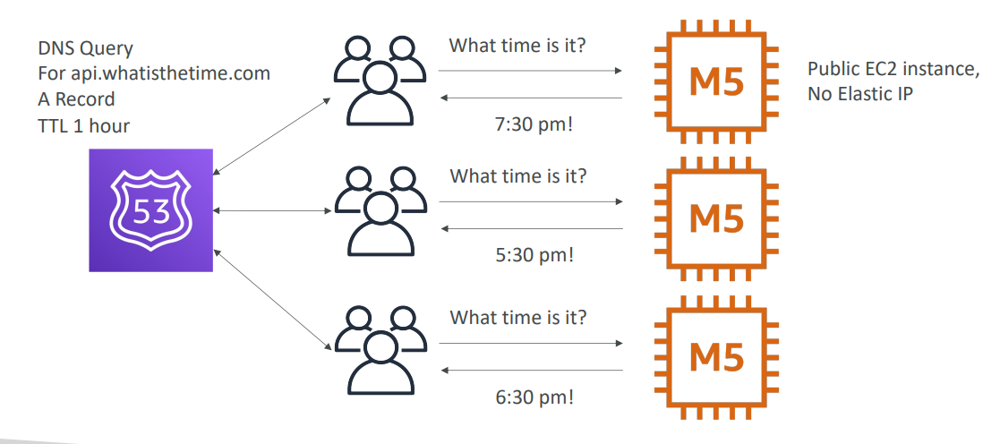
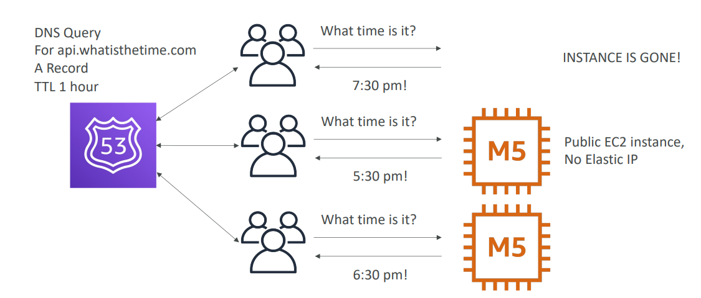
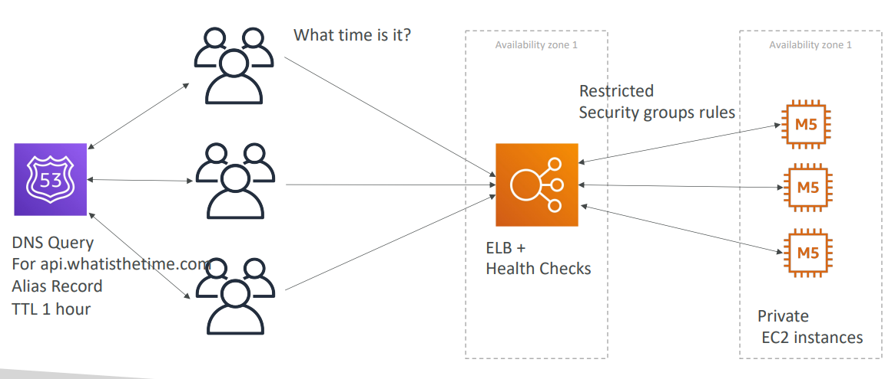
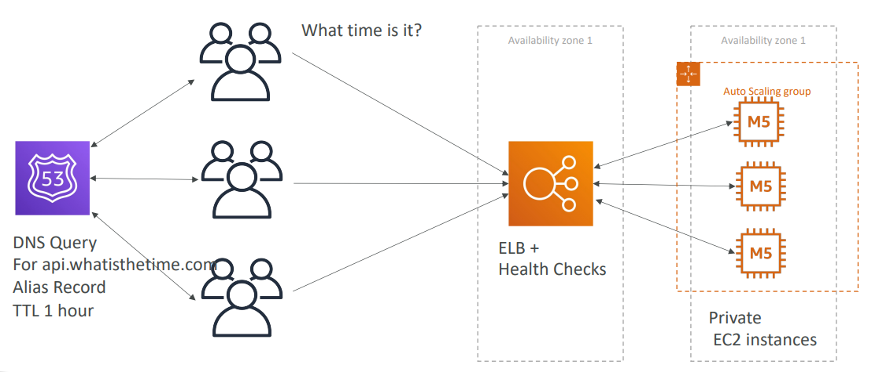
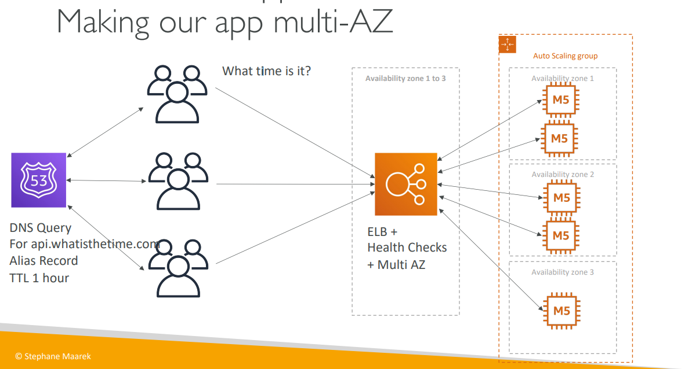
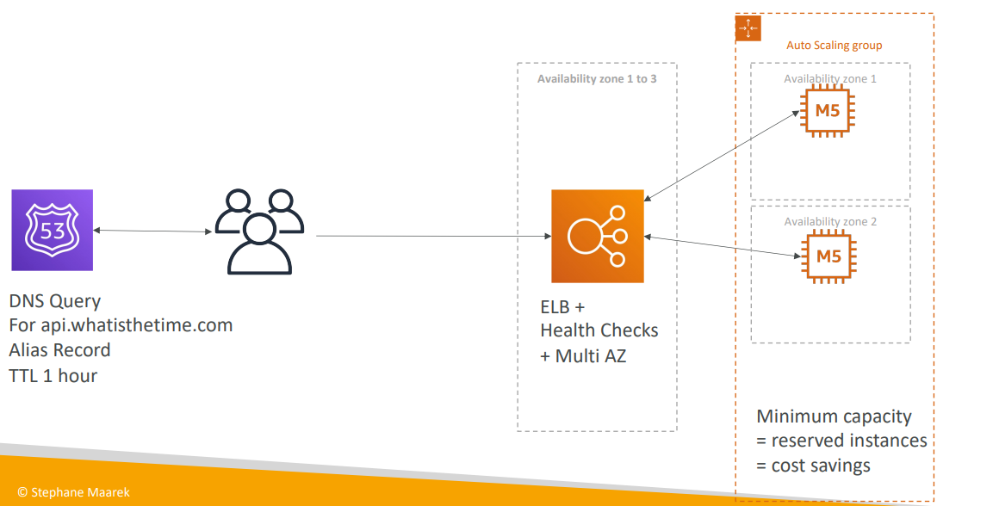

# What time is it

## Use case
- **Stateless web app**
- We want to start small and can accept downtime
- We want to fully scale vertically and horizontally, no downtime

### Starting simple

### Scaling vertically

### Scaling horizontally

#### Adding and removing instances

#### Scaling horizontally with a load balancer

#### Scaling horizontally, with an auto-scaling group

#### Making our app multi-AZ

##### Reserving capacity

## Summary
- Public vs Private IP and EC2 instances
- Elastic IP vs Route 53 vs Load Balancers
- Route 53 
  - TTL, 
  - `A` records and 
  - `Alias` Records
- Maintaining EC2 instances manually vs Auto Scaling Groups
- Multi AZ to survive disasters
- ELB Health Checks
  - Security Group Rules
- Reservation of capacity for costing savings when possible
- We’re considering 5 pillars for a well architected application:
  - costs, 
  - performance, 
  - reliability, 
  - security, 
  - operational excellence
