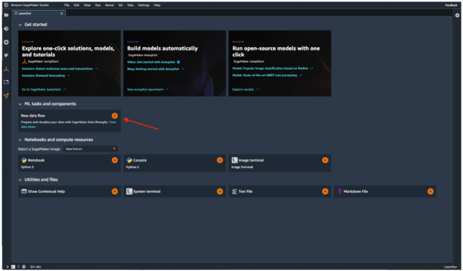
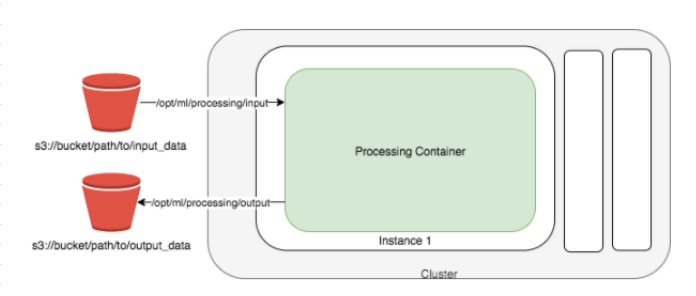

# Data pre-processing

## 1.DataWrangler
- Data Wrangler provides an end-to-end solution to 
  - Import, 
  - Prepare, 
  - Transform, 
  -  Featurize, and 
  -  Analyze data										
- You can Integrate a Data Wrangler data flow into your machine learning (ML) workflows to simplify and streamline 
  - Data pre-processing and 
  - Feature engineering using little to no coding										
										
### Import
- Connect to and import data from Amazon Simple Storage Service (Amazon S3), Amazon Athena (Athena), and Amazon Redshift.				
#### Data Flow
- Create a data flow to define a series of ML data prep steps. 
- You can use a flow to 
  - Combine datasets from different data sources, 
  - Identify the number and types of transformations you want to apply to datasets, and 
  - Define a data prep workflow that can be easily integrated into an ML pipelin- 										
### Transform
- Clean and transform your dataset using standard transforms like string, vector, and numeric data formatting tools. 
- Featurize your data using transforms like text and date/time embedding and categorical encoding.										
### Analyze
- Analyze features in your dataset at any point in your flow. 
- Data Wrangler includes built-in 
  - Data visualization tools like scatter plots and histograms, as well as 
  - Data analysis tools like target leakage analysis and quick modeling to understand feature correlation.										
### Export
- Data Wrangler offers export options to other SageMaker services, including 
  - Data Wrangler jobs, 
  - Feature Store, and 
  - Pipelines, 
- Above options makes it easy to integrate your data prep flow into your ML workflow. 
- You can also export your **Data Wrangler** flow to Python code										
- **Sagemaker Studio** -> Data Flow		

## 2.FeatureStore
- Amazon SageMaker Feature Store makes it easy 
  - for data scientists, machine learning engineers, and general practitioners 
  - to create, share, and manage features for machine learning (ML) development										
- Feature Store is a centralized store for features and associated metadata so features can be easily discovered and reuse- 				
- You can create an online or an offline stor- 
  - The Online Store is used for low latency real-time inference use cases, and 
  - The Offline Store is used for training and batch inferenc-   										

### Feature Store Modes										
#### Online										
- In online mode, features are read with low latency (milliseconds) reads and used for high throughput predictions. 
- This mode requires a feature group to be stored in an online stor-  										
										
#### Offline										
-  In offline mode, large streams of data are fed to an offline store, which can be used for training and batch inferenc-  
- This mode requires a feature group to be stored in an offline stor-  
- The offline store uses your S3 bucket for storage and can also fetch data using Athena queries.										
#### Online and Offline										
- This includes both online and offline modes										

### Ingesting Data in Feature Store										
#### Streaming 										
-  A collection of records are pushed to Feature Store by calling a synchronous PutRecord API call. 
- This API enables you to maintain the latest feature values in Feature Store and to push new feature values as soon an update is detecte- 									
#### Ingest data in batches										
- Author features using Amazon SageMaker Data Wrangler, 
- Create feature groups in Feature Store and 
- Ingest features in batches using a SageMaker Processing job with a notebook exported from Data Wrangler. 	
- This mode allows for batch ingestion into the offline stor-  
- It also supports ingestion into the online store if the feature group is configured for both online and offline use										
## 4.DataProcessingJob
-  Amazon SageMaker spins up a Processing jo- 
- Amazon SageMaker 
  - Copies your script, 
  - Copies your data from S3 and then 
  - Pulls a Processing Container. 
- The Processing Container image can either be an Amazon SageMaker built-in image or a custom image that you provid- 					

### Processing Job										
-  The underlying infrastructure for a Processing job is fully managed by Amazon SageMaker. 
- Cluster resources are provisioned for the duration of your job, and cleaned up when a job completes. 
- The output of the Processing job is stored in the Amazon S3 bucket you specifie- 
### Option for Processing Job										
- Data Processing with Apache Spark										
- Data Processing with scikit-learn										
- Use Your Own Processing Code										
