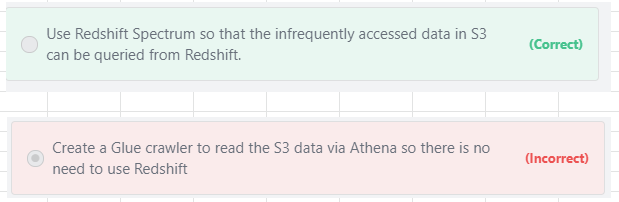

# Analyze-Query data
## InPlace Query
- InPlace query enables us to run SQL queries on S3 storage without having to store data in Database or Data Ware House
- This approach makes Vast amount of data stored in Data Lake accessible to the SQL users

### [Athena](https://tutorialsdojo.com/amazon-athena/)
- Amazon Athena is an **interactive query service** that makes it easy to analyze data in Amazon S3 using standard SQL. 
- Athena is **serverless**, so there is no infrastructure to manage, and you pay only for the queries that you run"										
- Pay only for the queries that you run										
- Charges are based on amount of data scanned										
- Supported data formats										
  - CSV/TSV										
  - JSON										
  - Parquet										
  - ORC										
  - Avro										
#### Recommendation										
- Use Athena for Ad-hoc data discovery and SQL querying

#### Query Options
- Adhoc query
- Query aggregated data										

#### Supported Data Formats										
- Amazon Athena supports a wide variety of data formats like CSV, TSV, JSON, or Textfiles and also supports open-source columnar formats such as Apache ORC and Apache Parquet
- Athena also supports compressed data in Snappy, Zlib, LZO, and GZIP formats. 
  - By compressing, partitioning, and using columnar formats you can improve performance and reduce your costs.
#### How does Parquet and ORC improve Query performance?										
- Parquet and ORC file formats both support predicate pushdown (also called predicate filtering). 
- Parquet and ORC both have blocks of data that represent column values. 
- Each block holds statistics for the block, such as max/min values. 
  - When a query is being executed, these statistics determine whether the block should be read or skipped"										
### Redshift Spectrum										
- Has sophisticated query optimisation mechanism
- Distributes query to 1000s of Nodes										
- Support SQL syntax of AWS Redshift product										
- Enables us to use existing BI tools										
										
#### Recommendation										
- Use Redshift spectrum when 										
  - We have Complex queries										
  - Support for Large number of users is needed										
#### Query data on S3 when you also have Redshift DWH										
- An ecommerce company wants to optimize the cost structure for its Redshift data warehouse by moving out some of the infrequently accessed data to S3. 
- What solution would you recommend so that the company can still access this infrequently accessed data from Redshift whenever required?

- Using Athena is not an option as the query needs to be done in Redshift. 
- Using Redshift Spectrum is the correct choice for this use-case.

## Streaming Query
### Kinesis Data Analytics	
- Enables to query Streaming data via SQL										
- This SQL is a continuous running query										
  - Monitors streaming data										
  - Sends the results to the configured destination
img src="images/5.png">

### RANDOM_CUT_FOREST function
- Use Amazon Kinesis Data Streams to stream transaction data and Amazon Kinesis Data Analytics RANDOM_CUT_FOREST function to detect anomalies.								
### HotSpots function										
- HotSpots Detection can be used by Kinesis Data Anlaytics,  
- HOTSPOTS function just detects relatively dense regions in your data (**NOT ANAMOLIES**)
## Analytics Portfolio

- All of the above servcies support S3 Data Lakes
- Quicksight can connect to Redshift, Athena, Relational Databases and S3 data lakes
